[TOC]

# STM32

STM32命名规制

## Contex-M介绍

ARM公司: 只做内核设计和IP授权,不参与芯片设计

### ARM架构

### 数据手册查看

手册下载:

- ST中文社区网：https://www.stmcu.org.cn/
- ST官网：https://www.st.com

STM32F103开发板的参数

在我们开发的过程中,重点关注两个模块

1.  引脚模块
2. 电气特征

这两个单元能方便我们去了解这个开发板的特征,以及引脚的分布图

电源引脚分布:

引脚类型:

1. 电源引脚, 带V的基本都是
2. 晶振引脚:23-24, 晶振引脚
3. 复位引脚: 25, NRST
4. 下载引脚: 三类下载引脚
   - JTAG: 占用5个IO口
   - SWD:占用2个IO口, 可以仿真调试
   - 串口下载:占用两个IO口, 只能下载程序不能调试
   - 
5. BOOT引脚
   - 138:BooT0
   - 48: BooT1
6. GPIO引脚

## STM32的最小系统

### 电源部分

> [!NOTE]
>
> 这里使用了一个电压稳压器,为了将电源控制在3.3V左右,防止5V电压直接击穿电路

这里经过稳压后,给多组电源供电,方便提供给不同设备供电

当我们开发板断电的时候,由下面部分的纽扣电池来供电,以维持一些数据的存储 ,额定电压为3V

### 复位电路

STM32复位引脚NRST保持低电平状态时间1~4.5ms即可复位

- 没按下RESET之前,是3.3v直接供电,处于高电平状态, 按下按键后,并联分流,这时NRST就是处于低电平状态,就会复位了
- 也可以直接通电复位,当我们直接供电的时候,C12电容(10**4 PF)还未满,需要充电,这时候是导通的,也起到分流作用,此时NRST也是低电平, 充满时间是满足1-4.5ms的

### BOOT启动电路

M3和M4内核

使用了一个短路帽来进行控制,如果按下就是接在13, 24, 这时候通的是高电压。35,46则是接地,也就是关机

M7内核

### 晶振电路

### 下载电路

### IO分配原则

优先特点设备IO,如SPI, 下载串口等,然后分配通用IO口,最后微调

通用IO: GPIO

## 环境配置

### 安装MDK

第三步下载算法对于F103的板子不需要

注意点:

1. 安装目录及路径不要有任何中文汉字，且路径越短越好
2. 电脑系统名和用户名最好都不要有任何中文

### 安装仿真器

直接下载CH340串口即可,用来使用串口下载

CH340C是在开发板上面的,所以我们要在PC下载CH340串口协议,这样才能正确下载

### MDK5编译例程

1. 全局编译: 编译全部文件
2. 部分编译: 只编译部分修改过的文件

### 串口下载程序

1. 串口下载程序须知
2. 串口下载程序的硬件连接
3. 配置下载工具(ATK-XISP.exe 正点原子自研)
4. STM32启动模式(M3和M4)

#### 下载须知

1. M3、M4、M7开发板支持串口下载程序， 但是ATK-XISP.exe软件只支持下载到内部FLASH
2. STM32的ISP下载，常用串口1下载程序
3. 因为使用USB虚拟串口，所以事先得安装CH340 USB虚拟串口驱动（搭建开发环境视频）

#### 下载程序的硬件连接

- 串口1之所以要进行短路帽连接,是因为PA9在stm32相当于TX, PA10相当于RX
- B0,B1通过短路帽连接到GND,低电平
- 电源关闭

#### 串口调试软件

1. 串口选择CH340
2. 选择Hex文件
3. 选择编译选项
4. 选择模式
5. 开始编程

在编程前可以先获取芯片信息看看是否有效,获取不了就换个波特率之类的

> [!NOTE]
>
> 每次重新下载或者获取芯片信息时都需要按下复位键:RESET

#### STM32的启动模式

ISP下载步骤:

1. BOOT0接高电平，BOOT1接低电平
2. 按复位键

执行步骤

1. BOOT0接低电平，BOOT1接任意
2. 按复位键

实际上,我们下载时是吧B0和B1都接0, 然后直接用一键下载电路进行下载的

一键下载电路，是利用串口的DTR和RTS信号，分别控制STM32的复位和BOOT0引脚，配合ATK-XISP.exe软件，设置：DTR低电平复位，RTS高电平进BootLoader，这样， BOOT0和STM32的复位引脚，完全由下载软件自动控制，从而实现一键下载。

不使用一键下载的电路:

可以看出RTS和DTR是没有接任何电路的

### DAP下载电路

DAP仿真下载器:

#### KEIL5配置DAP

我这里用的是F103,使用的ST-Link, 不是DAP,具体配置如下:

****

### JTAG/SWD调试模块

Cortex-M内核含有硬件调试模块，该模块可在取指(指令断点)或访问数据(数据断点)时停止。内核停止时，可以查询内核的内部状态和系统的外部状态。完成查询后，可恢复程序执行。

#### 断点调试

#### 查看程序段执行的时间

1. 设置开发板内核的时钟

F1开发板的时钟频率是72MHZ

这样就可以在调试的过程中看程序执行的时间了

#### 仿真结束可能出现的报错

#### Debug过程中工具栏常用功能

##### command

##### 反汇编窗口

##### 符号窗口

 

##### Registers寄存器窗口

##### Call Stack窗口

查看函数调用关系和局部变量

##### watch窗口

查看函数首地址或者变量的值

通过点击变量:add_watch来查看变量在调试过程中的值

**注意**: 有时候修改后,需要编译后再调式

##### memory窗口

可以通过这个窗口,看到数组内存的情况

M3/M4/M7内核是小端模式，内存的值得倒着读

##### Peripheral窗口：查看寄存器的值

调试时，使用该功能可以确定配置寄存器是否有问题

#### 仿真时注意的点

1. 仿真时，使用MDK的Level 0等级优化
2. 调试停止在断点处时，只是内核停止，外设会继续运行
3. 断点的设置要有时间观念，考虑是否会打断正常通信

## F1的系统架构

F1架构可以理解为下面的几个单元:

对于我们学习来说,最重要的是AHB系统总线, APB1和2总线,这几个总线负责了全部的外设

总线时钟频率：

1. AHB：72MHz (Max)
2. APB1：36MHz (Max)
3. APB2：72MHz (Max)

##  存储器映射

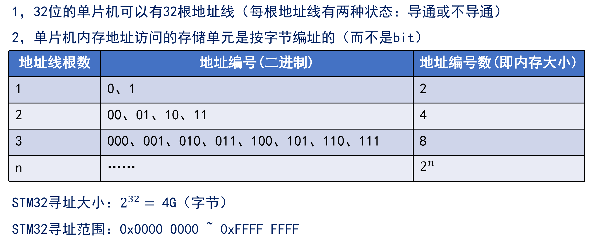

### 存储器映射

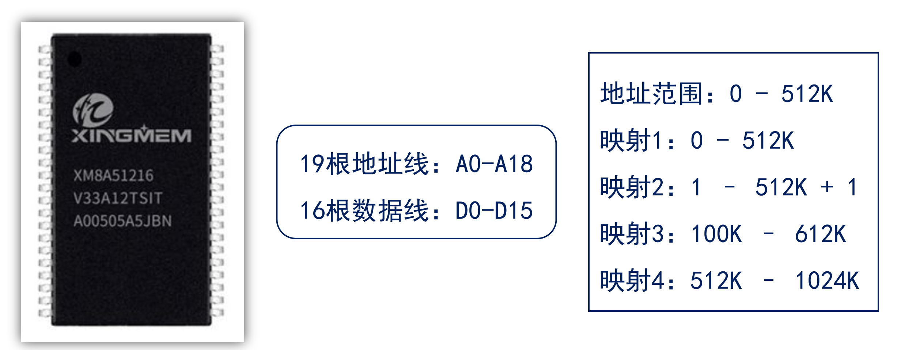

19根地址线,有$2^{19}$个地址,即512k

16根数据线,有2个字节的数据存储位置

所以整块芯片加起来有$2*512k=1024k=1Mb$的数据存储

映射方式:

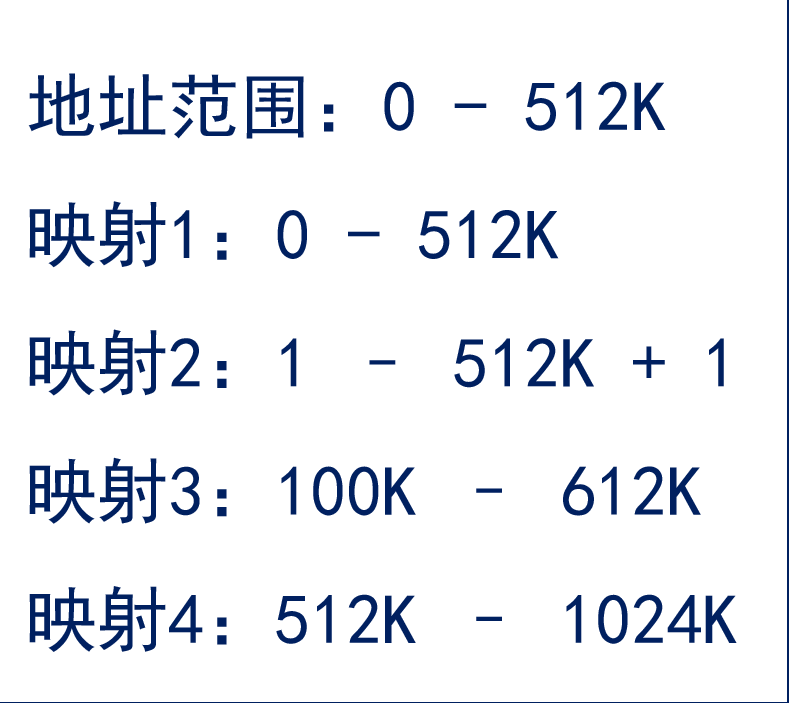

### 存储器功能划分:

STM32将存储器分成了8个块,他们各自的作用是:

| **存储块**  | **功能**          | **地址范围**                       |
| ----------- | ----------------- | ---------------------------------- |
| **Block 0** | Code（FLASH）     | 0x0000 0000 ~ 0x1FFF FFFF（512MB） |
| **Block 1** | SRAM              | 0x2000 0000 ~ 0x3FFF FFFF（512MB） |
| **Block 2** | 片上外设          | 0x4000 0000 ~ 0x5FFF FFFF（512MB） |
| **Block 3** | FSMC Bank1&2      | 0x6000 0000 ~ 0x7FFF FFFF（512MB） |
| **Block 4** | FSMC Bank3&4      | 0x8000 0000 ~ 0x9FFF FFFF（512MB） |
| **Block 5** | FSMC寄存器        | 0xA000 0000 ~ 0xBFFF FFFF（512MB） |
| **Block 6** | 没用到            | 0xC000 0000 ~ 0xDFFF FFFF（512MB） |
| **Block 7** | Cortex M3内部外设 | 0xE000 0000 ~ 0xFFFF FFFF（512MB） |

我们重点看Block0-2

#### Block0

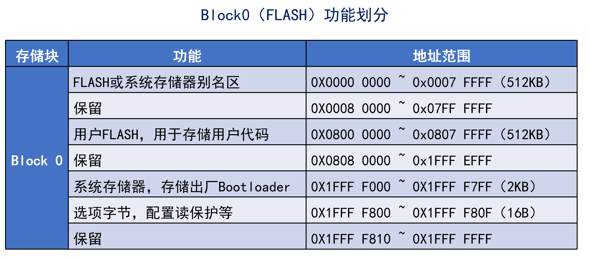

#### Block1

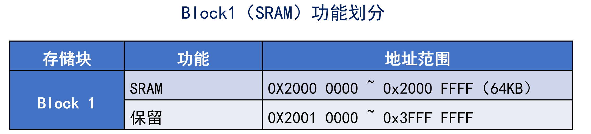

#### Block2

## 寄存器映射

寄存器是单片机内部一种特殊的内存，可以实现对单片机各个功能的控制

简单来说：寄存器就是单片机内部的控制机构

可以理解为寄存器就是某个开关,用来控制设备进行工作

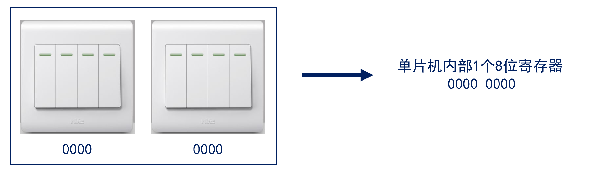

### STM32寄存器分类

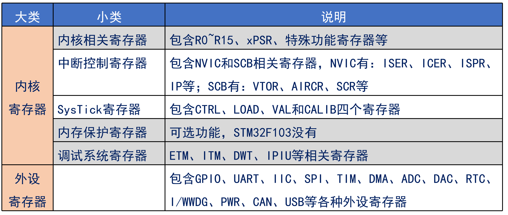

### 寄存器映射

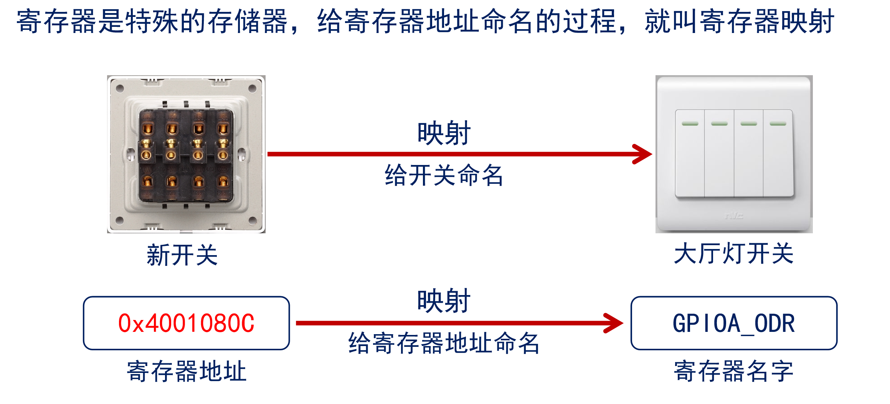

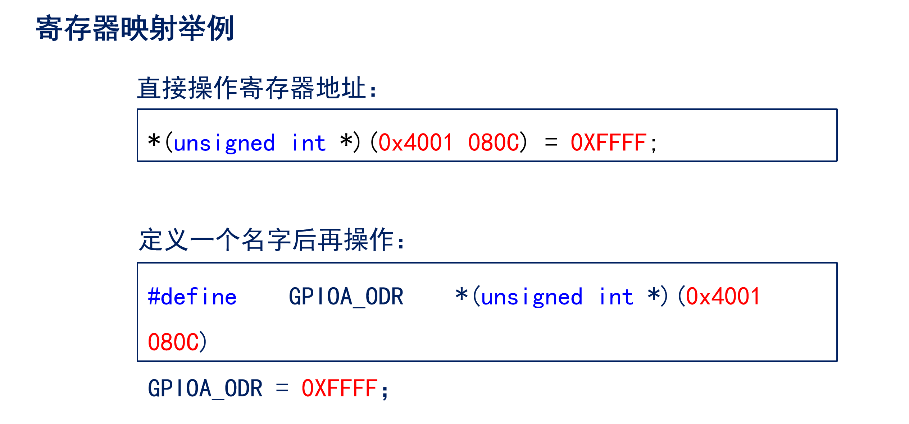

GPIO的命名通常是以A,B,C这样命名, 和51单片机不一样,51单片机以1,2,3这样命名

### 寄存器描述解读

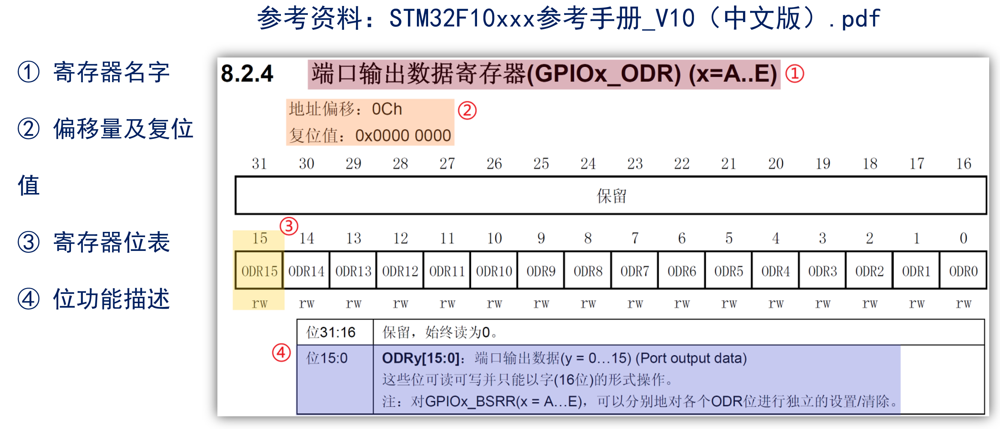

### 寄存器计算

就一个公式:

- 总线基地址（BUS_BASE_ADDR）
- 外设基于总线基地址的偏移量（PERIPH_OFFSET）
- 寄存器相对外设基地址的偏移量（REG_OFFSET）

寄存器地址 = BUS_BASE_ADDR +  PERIPH_OFFSET + REG_OFFSET

计算例子

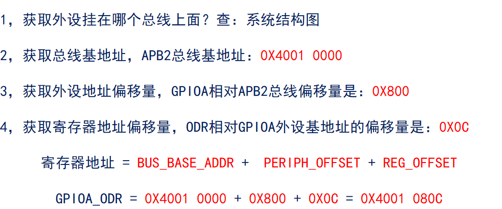

也可以使用结构体完成快速的地址定位

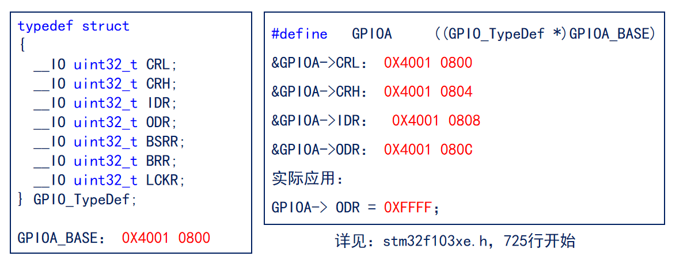

## 创建MDK工程

## HAL库的使用

### HAL库介绍

CMSIS: Cortex Microcontroller Software Interface Standard 微控制器软件接口标准, 由ARM和与其合作的公司指定的一套标准

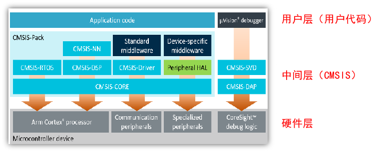

为了方便开发,STM提供了3种库

- 标准外设库 (Standard Peripheral Libraries)
- HAL库(硬件抽象层)：Hardware Abstraction Layer 
- LL库：Low Layer

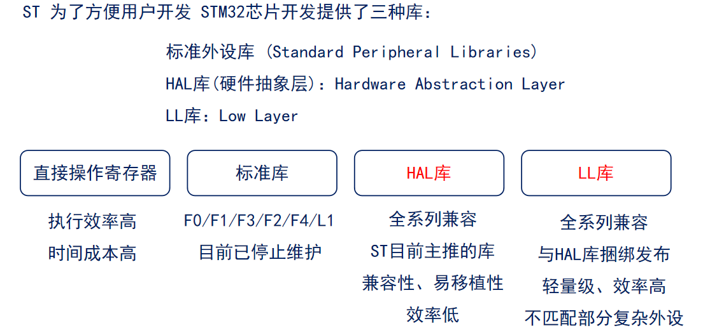

#### STM32Cube固件包

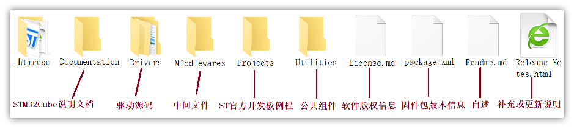

重点: 

1. 驱动源码
2. 中间文件
3. ST开发例程

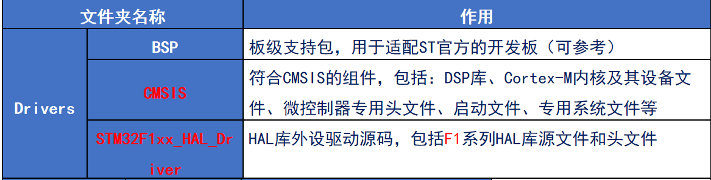

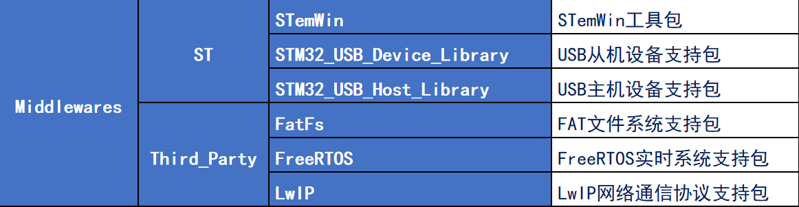

CMSIS文件

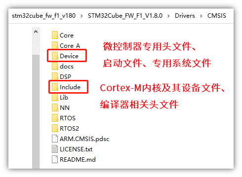

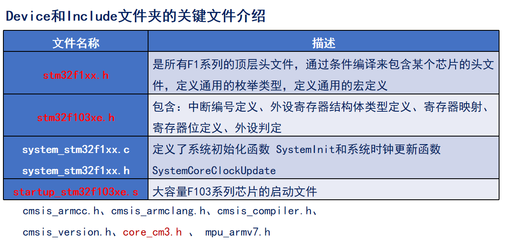

### HAL库的框架结构
