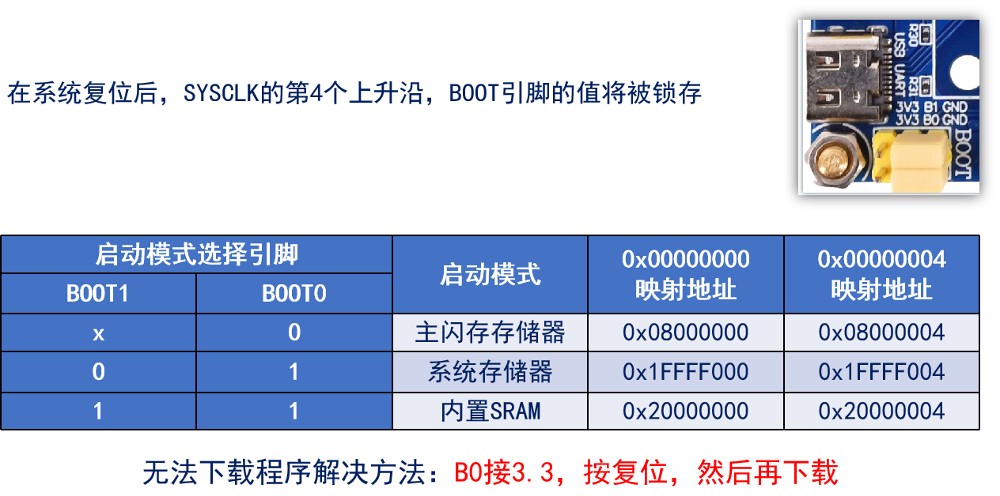
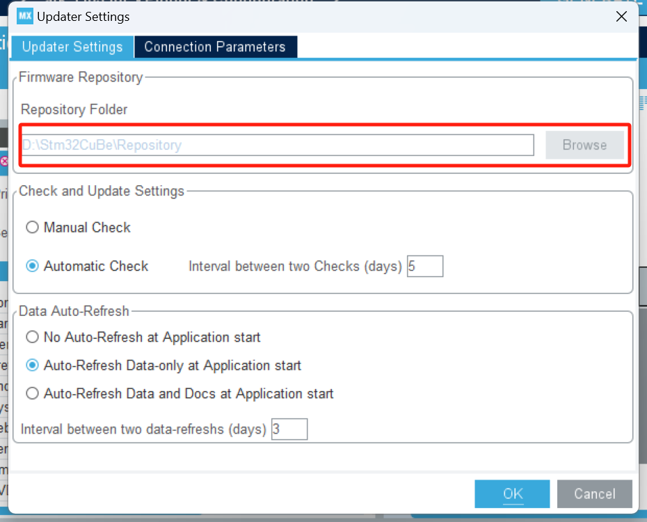
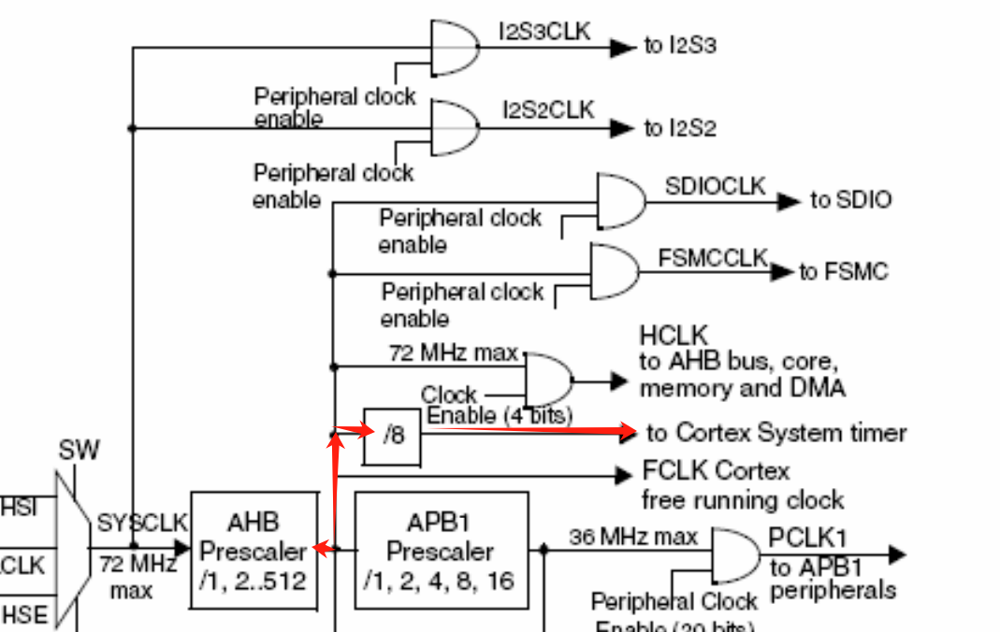

[TOC]


# STM32


STM32命名规制


## Contex-M介绍

ARM公司: 只做内核设计和IP授权,不参与芯片设计

### ARM架构


### 数据手册查看

手册下载:

- ST中文社区网：https://www.stmcu.org.cn/
- ST官网：https://www.st.com

STM32F103开发板的参数


在我们开发的过程中,重点关注两个模块

1.  引脚模块
2. 电气特征


这两个单元能方便我们去了解这个开发板的特征,以及引脚的分布图


电源引脚分布:


引脚类型:

1. 电源引脚, 带V的基本都是
2. 晶振引脚:23-24, 晶振引脚
3. 复位引脚: 25, NRST
4. 下载引脚: 三类下载引脚
   - JTAG: 占用5个IO口
   - SWD:占用2个IO口, 可以仿真调试
   - 串口下载:占用两个IO口, 只能下载程序不能调试
   - 
5. BOOT引脚
   - 138:BooT0
   - 48: BooT1
6. GPIO引脚


## STM32的最小系统


### 电源部分


> [!NOTE]
>
> 这里使用了一个电压稳压器,为了将电源控制在3.3V左右,防止5V电压直接击穿电路

这里经过稳压后,给多组电源供电,方便提供给不同设备供电


当我们开发板断电的时候,由下面部分的纽扣电池来供电,以维持一些数据的存储 ,额定电压为3V


### 复位电路


STM32复位引脚NRST保持低电平状态时间1~4.5ms即可复位

- 没按下RESET之前,是3.3v直接供电,处于高电平状态, 按下按键后,并联分流,这时NRST就是处于低电平状态,就会复位了
- 也可以直接通电复位,当我们直接供电的时候,C12电容(10**4 PF)还未满,需要充电,这时候是导通的,也起到分流作用,此时NRST也是低电平, 充满时间是满足1-4.5ms的


### BOOT启动电路

M3和M4内核


使用了一个短路帽来进行控制,如果按下就是接在13, 24, 这时候通的是高电压。35,46则是接地,也就是关机


M7内核


### 晶振电路


### 下载电路


### IO分配原则

优先特点设备IO,如SPI, 下载串口等,然后分配通用IO口,最后微调

通用IO: GPIO


## 环境配置


### 安装MDK


第三步下载算法对于F103的板子不需要

注意点:

1. 安装目录及路径不要有任何中文汉字，且路径越短越好
2. 电脑系统名和用户名最好都不要有任何中文


### 安装仿真器

直接下载CH340串口即可,用来使用串口下载


CH340C是在开发板上面的,所以我们要在PC下载CH340串口协议,这样才能正确下载


### MDK5编译例程


1. 全局编译: 编译全部文件
2. 部分编译: 只编译部分修改过的文件


### 串口下载程序

1. 串口下载程序须知
2. 串口下载程序的硬件连接
3. 配置下载工具(ATK-XISP.exe 正点原子自研)
4. STM32启动模式(M3和M4)


#### 下载须知

1. M3、M4、M7开发板支持串口下载程序， 但是ATK-XISP.exe软件只支持下载到内部FLASH
2. STM32的ISP下载，常用串口1下载程序
3. 因为使用USB虚拟串口，所以事先得安装CH340 USB虚拟串口驱动（搭建开发环境视频）


#### 下载程序的硬件连接


- 串口1之所以要进行短路帽连接,是因为PA9在stm32相当于TX, PA10相当于RX
- B0,B1通过短路帽连接到GND,低电平
- 电源关闭


#### 串口调试软件


1. 串口选择CH340
2. 选择Hex文件
3. 选择编译选项
4. 选择模式
5. 开始编程

在编程前可以先获取芯片信息看看是否有效,获取不了就换个波特率之类的

> [!NOTE]
>
> 每次重新下载或者获取芯片信息时都需要按下复位键:RESET


#### STM32的启动模式


ISP下载步骤:

1. BOOT0接高电平，BOOT1接低电平
2. 按复位键


执行步骤

1. BOOT0接低电平，BOOT1接任意
2. 按复位键


实际上,我们下载时是吧B0和B1都接0, 然后直接用一键下载电路进行下载的


一键下载电路，是利用串口的DTR和RTS信号，分别控制STM32的复位和BOOT0引脚，配合ATK-XISP.exe软件，设置：DTR低电平复位，RTS高电平进BootLoader，这样， BOOT0和STM32的复位引脚，完全由下载软件自动控制，从而实现一键下载。


不使用一键下载的电路:


可以看出RTS和DTR是没有接任何电路的


### DAP下载电路


DAP仿真下载器:


#### KEIL5配置DAP

我这里用的是F103,使用的ST-Link, 不是DAP,具体配置如下:


****


### JTAG/SWD调试模块

Cortex-M内核含有硬件调试模块，该模块可在取指(指令断点)或访问数据(数据断点)时停止。内核停止时，可以查询内核的内部状态和系统的外部状态。完成查询后，可恢复程序执行。


#### 断点调试


#### 查看程序段执行的时间

1. 设置开发板内核的时钟


F1开发板的时钟频率是72MHZ

这样就可以在调试的过程中看程序执行的时间了


#### 仿真结束可能出现的报错


#### Debug过程中工具栏常用功能


##### command


##### 反汇编窗口


##### 符号窗口

 


##### Registers寄存器窗口


##### Call Stack窗口

查看函数调用关系和局部变量


##### watch窗口

查看函数首地址或者变量的值

通过点击变量:add_watch来查看变量在调试过程中的值

**注意**: 有时候修改后,需要编译后再调式


##### memory窗口

可以通过这个窗口,看到数组内存的情况


M3/M4/M7内核是小端模式，内存的值得倒着读


##### Peripheral窗口：查看寄存器的值


调试时，使用该功能可以确定配置寄存器是否有问题


#### 仿真时注意的点

1. 仿真时，使用MDK的Level 0等级优化
2. 调试停止在断点处时，只是内核停止，外设会继续运行
3. 断点的设置要有时间观念，考虑是否会打断正常通信


## F1的系统架构


F1架构可以理解为下面的几个单元:


对于我们学习来说,最重要的是AHB系统总线, APB1和2总线,这几个总线负责了全部的外设

总线时钟频率：

1. AHB：72MHz (Max)
2. APB1：36MHz (Max)
3. APB2：72MHz (Max)


##  存储器映射


### 存储器映射


19根地址线,有$2^{19}$个地址,即512k

16根数据线,有2个字节的数据存储位置

所以整块芯片加起来有$2*512k=1024k=1Mb$的数据存储

映射方式:


### 存储器功能划分:

STM32将存储器分成了8个块,他们各自的作用是:

| **存储块**  | **功能**          | **地址范围**                       |
| ----------- | ----------------- | ---------------------------------- |
| **Block 0** | Code（FLASH）     | 0x0000 0000 ~ 0x1FFF FFFF（512MB） |
| **Block 1** | SRAM              | 0x2000 0000 ~ 0x3FFF FFFF（512MB） |
| **Block 2** | 片上外设          | 0x4000 0000 ~ 0x5FFF FFFF（512MB） |
| **Block 3** | FSMC Bank1&2      | 0x6000 0000 ~ 0x7FFF FFFF（512MB） |
| **Block 4** | FSMC Bank3&4      | 0x8000 0000 ~ 0x9FFF FFFF（512MB） |
| **Block 5** | FSMC寄存器        | 0xA000 0000 ~ 0xBFFF FFFF（512MB） |
| **Block 6** | 没用到            | 0xC000 0000 ~ 0xDFFF FFFF（512MB） |
| **Block 7** | Cortex M3内部外设 | 0xE000 0000 ~ 0xFFFF FFFF（512MB） |

我们重点看Block0-2


#### Block0


#### Block1


#### Block2


## 寄存器映射

寄存器是单片机内部一种特殊的内存，可以实现对单片机各个功能的控制

简单来说：寄存器就是单片机内部的控制机构


可以理解为寄存器就是某个开关,用来控制设备进行工作


### STM32寄存器分类


### 寄存器映射


GPIO的命名通常是以A,B,C这样命名, 和51单片机不一样,51单片机以1,2,3这样命名


### 寄存器描述解读


### 寄存器计算

就一个公式:

- 总线基地址（BUS_BASE_ADDR）
- 外设基于总线基地址的偏移量（PERIPH_OFFSET）
- 寄存器相对外设基地址的偏移量（REG_OFFSET）

寄存器地址 = BUS_BASE_ADDR +  PERIPH_OFFSET + REG_OFFSET


计算例子


也可以使用结构体完成快速的地址定位


## 创建MDK工程

### 新建寄存器版本的MDK工程

1.   新建工程文件夹
2.   新建工程框架
3.   添加文件
4.   魔术棒设置
5.   添加main.c,并编写代码


#### 新建工程文件


#### 拷贝或者新建工程相关文件


该文件夹用于存放正点原子和其他第三方提供的中间层代码（组件/Lib 等），如： USMART、MALLOC、 TEXT、 FATFS、 USB、 LWIP、各种 OS、各种 GUI 等


### 全流程

#### 构建工程目录


##### 配置Drivers


CMSIS里面要找到一个启动函数,没有可以去找个例子直接复制


##### Middlewares

暂时用不到,为空


##### Output

用来存储编译后的文件


##### Project

存放用户程序,里面新建一个MDK-ARM文件夹


##### User 

存放用户的main函数


#### UE4的工程文件创建


选择MDK-ARM目录


然后选芯片


成功后:


##### 设置分组


设置完后的效果:


##### 设置魔术棒


##### target


MHz改8, 这个MDK版本有点高,所以不能改

ARM Compiler改成版本5


##### output


路径改成Output, 勾选Create Hex File


##### Listen


这个和output一样


1.   定义宏定义STM32F103xE
2.   优先级选0
3.   标准选C99
4.   Include Path选择编译时需要用到的头文件的路径


##### Debug


根据实际要求改


\


##### utilties


这样就完成了,可以进行编译测试了


## HAL库的使用


### HAL库介绍


CMSIS: Cortex Microcontroller Software Interface Standard 微控制器软件接口标准, 由ARM和与其合作的公司指定的一套标准


为了方便开发,STM提供了3种库

- 标准外设库 (Standard Peripheral Libraries)
- HAL库(硬件抽象层)：Hardware Abstraction Layer 
- LL库：Low Layer


#### STM32Cube固件包


重点: 

1. 驱动源码
2. 中间文件
3. ST开发例程


CMSIS文件


### HAL库的框架结构

#### 比较重要的文件


#### API命名规则:


#### 对寄存器的操作API定义


#### 回调函数


### HAL库的构建

和MDK工程一样,只是在Device加一个HAL库的包


## STM32启动过程


### MAP文件

MAP文件是MDK编译代码后，产生的集程序、数据及IO空间的一种映射列表文件。简单说就是包括了：各种.c文件、函数、符号等的地址、大小、引用关系等信息。**分析各.c文件占用FLASH 和 RAM的大小，方便优化代码**


整个MAP反应了整个编译过程中的各种程序之间的引用关系,和变量之间的定义

交叉引用:


删除;


符号表:


内存映射


占用flash和SRAM的情况


### STM32启动模式


#### F1芯片启动模式



这里主要想表达的是启动地址相对于栈顶地址的相对地址为4个字节


### STM32启动过程


这里以FLASH启动为例, 将基地址映射到0x08000 0000 ,相对的PC计数器位置就是0X08000 0004 在这里获取到Reset_Handler函数的地址, 执行里面的启动文件, 这样一来系统就会自动调用我们的main函数


#### Reset_Handler函数介绍


汇编语言: 看定义来理解


堆栈设置可以去到启动文件设置


## STM32CuBeMX

stm32CuBeMx可以通过图形化界面来帮我们生成初始化代码

思路: 工具+不同芯片的STM32CuBe固件包来适配不同的型号的芯片


工具的使用:

### 关联固件包

先设定固件包的仓库





然后选择本地导入固件包或者下载


### 构建项目


#### 建立工程


选择芯片


双击即可


#### 配置时钟模块


在这里构建时钟模块


#### GPIO引脚配置


在这里找到我们要用的GPIO引脚,可以去查看对应的原理图


找到对应的引脚后可以来这里设置初始化的值


#### 设置Cortex内核


在这里完成配置

在设置Application时, Advanced和basic的区别是:


#### 生成项目代码


打开文件后的结构如下:


我们只需要编写main函数即可, 注意里面的注释,要在特定的位置写对应的内容,不然重新生成的时候会被覆盖


这样就完成建立了


## STM32的时钟系统


### 时钟系统的介绍

STM32时钟系统可以归纳为三个字: 选, 乘, 除


F1芯片中, 有四个产生时钟的震荡器

| 时钟源名称          | 频率      | 材料      | 用途       |
| ------------------- | --------- | --------- | ---------- |
| 高速外部振荡器(HSE) | 4~16MHz   | 晶体/陶瓷 | SYSCLK/RTC |
| 低速外部振荡器(LSE) | 32.768KHz | 晶体/陶瓷 | RTC        |
| 高速内部振荡器(HSI) | 8MHz      | RC        | SYSCLK     |
| 低速内部振荡器(LSI) | 40KHz     | RC        | RTC/IWDG   |


重点了解红色标记的部分


F1时钟树简图


名词的定义:

PLL(Phase-Locked-Loop): 锁相环

RCC: Reset and Clock Control

Osc: Oscillator*/*ˈɒsɪleɪtə(r)*/*振荡器

Periph: Peripheral*/*pəˈrɪfərəl*/*外围的


CubeMX上面的设置


### 系统时钟配置步骤


第2点很少需要调整

第5点只在H7芯片才有


#### 配置HSE_VALUE


F1默认8MHz


#### 配置HAL_RCC_OscConfig


这一部分对应着


```c
void sys_stm32_clock_init(uint32_t plln)
{
    HAL_StatusTypeDef ret = HAL_ERROR;
    RCC_OscInitTypeDef rcc_osc_init = {0};
    RCC_ClkInitTypeDef rcc_clk_init = {0};

    rcc_osc_init.OscillatorType = RCC_OSCILLATORTYPE_HSE;       /* Ñ¡ÔñÒªÅäÖÃHSE */
    rcc_osc_init.HSEState = RCC_HSE_ON;                         /* ´ò¿ªHSE */
    rcc_osc_init.HSEPredivValue = RCC_HSE_PREDIV_DIV1;          /* HSEÔ¤·ÖƵϵÊý */
    rcc_osc_init.PLL.PLLState = RCC_PLL_ON;                     /* ´ò¿ªPLL */
    rcc_osc_init.PLL.PLLSource = RCC_PLLSOURCE_HSE;             /* PLLʱÖÓÔ´Ñ¡ÔñHSE */
    rcc_osc_init.PLL.PLLMUL = plln;                             /* PLL±¶ÆµÏµÊý */
    ret = HAL_RCC_OscConfig(&rcc_osc_init);                     /* ³õʼ»¯ */

    if (ret != HAL_OK)
    {
        while (1);                                              /* ʱÖÓ³õʼ»¯Ê§°Ü£¬Ö®ºóµÄ³ÌÐò½«¿ÉÄÜÎÞ·¨Õý³£Ö´ÐУ¬¿ÉÒÔÔÚÕâÀï¼ÓÈë×Ô¼ºµÄ´¦Àí */
    }

    /* Ñ¡ÖÐPLL×÷ΪϵͳʱÖÓÔ´²¢ÇÒÅäÖÃHCLK,PCLK1ºÍPCLK2*/
    rcc_clk_init.ClockType = (RCC_CLOCKTYPE_SYSCLK | RCC_CLOCKTYPE_HCLK | RCC_CLOCKTYPE_PCLK1 | RCC_CLOCKTYPE_PCLK2);
    rcc_clk_init.SYSCLKSource = RCC_SYSCLKSOURCE_PLLCLK;        /* ÉèÖÃϵͳʱÖÓÀ´×ÔPLL */
    rcc_clk_init.AHBCLKDivider = RCC_SYSCLK_DIV1;               /* AHB·ÖƵϵÊýΪ1 */
    rcc_clk_init.APB1CLKDivider = RCC_HCLK_DIV2;                /* APB1·ÖƵϵÊýΪ2 */
    rcc_clk_init.APB2CLKDivider = RCC_HCLK_DIV1;                /* APB2·ÖƵϵÊýΪ1 */
    ret = HAL_RCC_ClockConfig(&rcc_clk_init, FLASH_LATENCY_2);  /* ͬʱÉèÖÃFLASHÑÓʱÖÜÆÚΪ2WS£¬Ò²¾ÍÊÇ3¸öCPUÖÜÆÚ¡£ */

    if (ret != HAL_OK)
    {
        while (1);                                              /* ʱÖÓ³õʼ»¯Ê§°Ü£¬Ö®ºóµÄ³ÌÐò½«¿ÉÄÜÎÞ·¨Õý³£Ö´ÐУ¬¿ÉÒÔÔÚÕâÀï¼ÓÈë×Ô¼ºµÄ´¦Àí */
    }
}

```

1.   振荡器有4个,2个外部2个内部
2.   给对应的晶振器使能
3.   选中对应的分屏
4.   其他值暂时用不上,就不设置,默认为0
5.   配置PLL, PLL是锁相环, 需要配置里面的使能, PLL的输入(晶振来源), 增加频率的倍数
6.   最后赋值给HAL_RCC_OscConfig函数


**这些配置都有特定的寄存器来存放对应的值**


#### 配置HAL_RCC_ClockConfig函数


对应部分:


```c
void sys_stm32_clock_init(uint32_t plln)
{
    HAL_StatusTypeDef ret = HAL_ERROR;
    RCC_OscInitTypeDef rcc_osc_init = {0};
    RCC_ClkInitTypeDef rcc_clk_init = {0};

    rcc_osc_init.OscillatorType = RCC_OSCILLATORTYPE_HSE;       /* Ñ¡ÔñÒªÅäÖÃHSE */
    rcc_osc_init.HSEState = RCC_HSE_ON;                         /* ´ò¿ªHSE */
    rcc_osc_init.HSEPredivValue = RCC_HSE_PREDIV_DIV1;          /* HSEÔ¤·ÖƵϵÊý */
    rcc_osc_init.PLL.PLLState = RCC_PLL_ON;                     /* ´ò¿ªPLL */
    rcc_osc_init.PLL.PLLSource = RCC_PLLSOURCE_HSE;             /* PLLʱÖÓÔ´Ñ¡ÔñHSE */
    rcc_osc_init.PLL.PLLMUL = plln;                             /* PLL±¶ÆµÏµÊý */
    ret = HAL_RCC_OscConfig(&rcc_osc_init);                     /* ³õʼ»¯ */

    if (ret != HAL_OK)
    {
        while (1);                                              /* ʱÖÓ³õʼ»¯Ê§°Ü£¬Ö®ºóµÄ³ÌÐò½«¿ÉÄÜÎÞ·¨Õý³£Ö´ÐУ¬¿ÉÒÔÔÚÕâÀï¼ÓÈë×Ô¼ºµÄ´¦Àí */
    }

    /* Ñ¡ÖÐPLL×÷ΪϵͳʱÖÓÔ´²¢ÇÒÅäÖÃHCLK,PCLK1ºÍPCLK2*/
    rcc_clk_init.ClockType = (RCC_CLOCKTYPE_SYSCLK | RCC_CLOCKTYPE_HCLK | RCC_CLOCKTYPE_PCLK1 | RCC_CLOCKTYPE_PCLK2);
    rcc_clk_init.SYSCLKSource = RCC_SYSCLKSOURCE_PLLCLK;        /* ÉèÖÃϵͳʱÖÓÀ´×ÔPLL */
    rcc_clk_init.AHBCLKDivider = RCC_SYSCLK_DIV1;               /* AHB·ÖƵϵÊýΪ1 */
    rcc_clk_init.APB1CLKDivider = RCC_HCLK_DIV2;                /* APB1·ÖƵϵÊýΪ2 */
    rcc_clk_init.APB2CLKDivider = RCC_HCLK_DIV1;                /* APB2·ÖƵϵÊýΪ1 */
    ret = HAL_RCC_ClockConfig(&rcc_clk_init, FLASH_LATENCY_2);  /* ͬʱÉèÖÃFLASHÑÓʱÖÜÆÚΪ2WS£¬Ò²¾ÍÊÇ3¸öCPUÖÜÆÚ¡£ */

    if (ret != HAL_OK)
    {
        while (1);                                              /* ʱÖÓ³õʼ»¯Ê§°Ü£¬Ö®ºóµÄ³ÌÐò½«¿ÉÄÜÎÞ·¨Õý³£Ö´ÐУ¬¿ÉÒÔÔÚÕâÀï¼ÓÈë×Ô¼ºµÄ´¦Àí */
    }
}

```

1.  配置系统时钟源:系统, HCLK(外设总线), PCLK1(APB1), PCLK2(APB2)。这里直接构成了一条频率路线
2.  配置系统时钟源: 这里的时钟源来自于PLL分频后
3.  设置分频系数


第二个参数FLatency表示的是FLASH等待的周期,FLASH的频率只有24MHz, 但是系统频率是72MHz, 所以需要等待2个是周期


## SYSTEM文件夹


### sys


具体功能作用和配置学到相关功能函数就知道了


### Deley

文件函数结构:


stm32主要是裸机,所以我们这里只学习不适用OS的版本


了解函数之前,先学习一下SysTick的工作原理

#### SysTick系统滴答定时器


LOAD可以由我们人为设定,这样就可以去控制时间,从而起到计时或者延时之类的效果


1.   COUNTFLAG: 溢出位判断, 如果溢出表示数到了0, 计数+1, 自动复位
2.   由于STM32已经固定了时钟源,所以这里就变成了分频
3.   TICKINT:中断请求时会用到
4.   ENABLE: 使能位


1.  RELOAD: 重载位的值, 有24位, 最大16xxxxx几
2.  CURRENT: 系统计数计数器,同样也是24位的


#### dealy函数


1.  CTRL设置为0是为了防止一开始初始化系统时,里面设置了系统计时器,从而产生不必要的影响因素
2.  HAL_SYSTICK_CLKSourceConfig(SYSTICK_CLKSOURCE_HCLK_DIV8):设置系统总线来源,这里说的是来源为HCLK(即APH总线)经过/8分频得到的
3.  g_fac_us表示的是sysclk/8后每1us占用多少频率




##### 微秒定时函数

这里的g_fac_us 的值为9, 因为在9MHZ的情况下, 每一个时钟等于$\frac{1}{9000000}$, 所以之后要乘以一个g_fac_us 变成$\frac{1}{1000000}$

```c
void delay_us(uint32_t nus) 
{ 
	uint32_t temp; 
	SysTick->LOAD = nus * g_fac_us; 	/* 时间加载 */ 
	SysTick->VAL = 0x00; 			/* 清空计数器 */ 
	SysTick->CTRL |= 1 << 0 ; 		/* 开始倒数 */ 
	do 
	{ 
		temp = SysTick->CTRL; 
	} while ((temp & 0x01) && !(temp & (1 << 16))); /* CTRL.ENABLE位必须为1, 并等待时间到达 */

 
	SysTick->CTRL &= ~(1 << 0) ; 		/* 关闭SYSTICK */ 
	SysTick->VAL = 0X00; 			/* 清空计数器 */ 
}

```


##### 毫秒定时函数

```c
void delay_ms(uint16_t nms) 
{ 
	uint32_t repeat = nms / 1000;	/* 这里用1000,是考虑到可能有超频应用, 
							    	 * 比如128Mhz的时候, delay_us最大只能延时1048576us
								 */ 
	uint32_t remain = nms % 1000; 
	while (repeat) 
	{ 
		delay_us(1000 * 1000); 	/* 利用delay_us 实现 1000ms 延时 */ 
		repeat--; 
	} 
	if (remain) 
	{ 
		delay_us(remain * 1000); 	/* 利用delay_us, 把尾数延时(remain ms)给做了 */ 
	} 
}

```


这里ms使用的是us的定时函数,但是us的定时函数在超频的情况下, 最大可以延时到1048576, 约为1s, 所以如果delay_ms输入的值超过1s的话,就需要分开几次进行调用,就有了上面的代码


### usart


## GPIO

### GPIO的简介

GPIO: 通用输入输出口, 用来采集外部信息和控制外部器件

特点:

1. 不同芯片信号IO口数量可能不一样
2. 快速翻转, 每次翻转最快只要两个周期,F1最快可到50Mhz (超频的情况下)
3. 每个IO口都可以用来做中断
4. 支持8种工作模式


电气特性:

stm32工作电压范围: 2-3.6V, 所以不能接5V给开发板,不然会烧毁开发板

GPIO识别电压范围: 

1. CMOS端口: -0.3V-1.164V和1.833V-3.6V
2. TTL(标有FT的都是TTL端口):5V, 3.3V


GPIO单个输出IO口最大电流是25mA


不同芯片的IO情况


### GPIO端口基本结构介绍


F1和其他系列的差距

#### F1结构模式


#### 斯密特触发器:


#### P-MOS, C-MOS


Mos需要有压差才能导通,这里VDD为1, 那么G就要为0,形成压差, 实际上1为3.3V,0为0V
