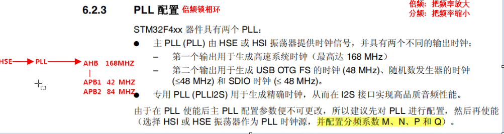
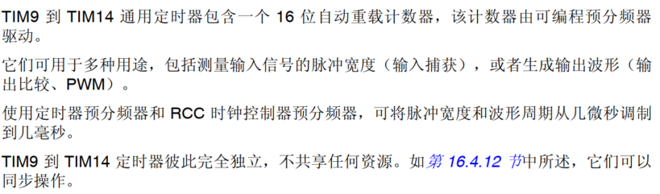

# stm32标准库

本笔记使用的芯片是STM32F407ZET6


## 硬件部分

### 如何保养电烙铁

1.  可以用高温海绵加水来清洗
2.  用纸巾叠多层,用来擦
3.  到100多°用剪刀刮一下
4.  用砂纸磨一下

### 怎么用


可以通过助焊剂让锡受热均匀,这样就会好看点


## 软件下载

下载思路:

1.   下载MDK开发集成软件
2.   下载对应的芯片开发包, 通常是以.pack结尾, F4就是:Keil.STM32F4xx_DFP.2.x.x.pack
3.   破解MDK软件, 去到file里面的license management找到CID,进行破解
4.   去Edit里面的configuration里面设置编码为GB2313和调整缩减即可


## 嵌入式技术架构:


冯诺依曼结构和哈佛结构


| **特点**       | **冯诺依曼结构**         | **哈佛结构**               |
| -------------- | ------------------------ | -------------------------- |
| **存储器设计** | 数据与指令共用同一存储器 | 数据与指令分开存储         |
| **总线设计**   | 共用同一总线             | 数据与指令独立总线         |
| **处理效率**   | 较低，有总线瓶颈         | 高，可以并行处理数据和指令 |
| **硬件复杂度** | 低                       | 高                         |
| **应用场景**   | 通用计算机               | 嵌入式系统、DSP等          |


在冯诺依曼结构中，数据和指令共享同一存储器和总线。这意味着处理器在同一时间只能访问数据或指令，可能导致性能瓶颈。

哈佛结构将数据和指令分别存储在独立的存储器中，并通过独立的总线进行传输。这种设计允许处理器同时访问数据和指令，提高了执行效率。


stm32的是修正哈佛结构,修正哈佛结构和哈佛结构的区别是:

**共享访问机制**：

-   在需要时，允许CPU通过指令总线访问指令存储器中的数据（例如常量表）。
-   例如，程序中存储的只读数据（常量）可以直接存储在Flash中，避免占用RAM资源。

**缓存与流水线优化**：

-   修正哈佛结构通常结合缓存技术（如I-Cache和D-Cache），进一步提高了指令和数据访问的效率。
-   流水线设计能够最大限度地减少总线共享时的冲突，维持高吞吐量。

**嵌入式系统支持**：

-   嵌入式系统（如ARM Cortex-M系列微控制器）大量采用修正哈佛结构，通过这种设计可以在Flash中存储程序和常量数据，同时保持高效的指令与数据访问。


| **特性**           | **传统哈佛结构**                   | **修正哈佛结构**                       |
| ------------------ | ---------------------------------- | -------------------------------------- |
| **存储分离程度**   | 指令和数据存储器完全分离           | 指令和数据存储器分离，但支持一定的共享 |
| **总线独立性**     | 指令和数据总线完全独立             | 大多数情况下独立，某些场景下共享       |
| **灵活性**         | 灵活性低，需严格区分指令和数据用途 | 灵活性高，支持部分共享存储资源         |
| **嵌入式应用场景** | 高性能计算（DSP等）                | 微控制器（STM32、Cortex-M）            |


## 工程目录的创建


### 创建工程目录


-   CMSIS：Cortex微控制器软件接口标准文件，该目录下文件适用所有Cortex系列（启动文件、配置文件）
-   DEVICE_LIB：M4对应外设的模块代码。Inc+src
-   HARDWARE：用户实现的模块功能函数
-   LIST：链接相关
-   OBJ：编译产生的中间文件+hex/bin文件
-   SYSTEM：系统相关代码
-   USER：自定义代码（main.c）


移植思路:

| stm32F4xx的官方库                                            | 工程       |
| ------------------------------------------------------------ | ---------- |
| Libraries\STM32F4xx_StdPeriph_Driver\inc 库头文件夹Libraries\STM32F4xx_StdPeriph_Driver\src 库源文件夹 | DEVICE_LIB |
| Project\STM32F4xx_StdPeriph_Templates\main.cProject\STM32F4xx_StdPeriph_Templates\stm32f4xx_it.h 中断函数头文件Project\STM32F4xx_StdPeriph_Templates\stm32f4xx_conf.h 配置文件Project\STM32F4xx_StdPeriph_Templates\stm32f4xx_it.c 中断函数文件 | USER       |
| Libraries\CMSIS\Device\ST\STM32F4xx\Include\stm32f4xx.h Libraries\CMSIS\Device\ST\STM32F4xx\Source\Templates\ system_stm32f4xx.c Libraries\CMSIS\Device\ST\STM32F4xx\Include\system_stm32f4xx.h | SYSTEM     |
| Libraries\CMSIS\Include\core_cm4_simd.h Libraries\CMSIS\Include\core_cm4.h  Cortex-M4系统文件Libraries\CMSIS\Include\core_cmFunc.h Libraries\CMSIS\Include\core_cmInstr.h Libraries\CMSIS\Device\ST\STM32F4xx\Source\Templates\arm\startup_stm32f40_41xxx.s | CMSIS      |


### keil5 project

打开keil5，选中project-->new project-->在弹出的对话框中，选择项目保存位置。


选择对应的芯片型号(需要提前下载好对应的包)


选定型号后就要为这个项目添加需要使用的模块代码,如果使用了固件库源码复制后就不需要这个步骤了


设置项目文件夹结构


配置output, Listing, c++编译链


STM32F40_41xxx：该宏指定芯片的型号，不同型号对应的硬件代码有不同，必须定义。

USE_STDPERIPH_DRIVER：该宏指定是否启用外设，定义则为启用外设，必须定义。

宏定义:

```c
STM32F40_41xxx,USE_STDPERIPH_DRIVER
```

这个宏定义用来选择芯片的型号的, 可看下面的英文文档


完成这些就可以编译了


### 编译自举模式


 需要记住:

1.   BOOT跳线帽结合的原理
2.   复位电路图原理


常见的Flash种类有两种:

1.   NOR Flash
2.   NAND Flash

MCU中的Flash的种类属于NOR Flash

NOR Flash的特定:

1.   随机访问速度快,适合存储执行程序代码
2.   可按字节读写
3.   支持代码直接执行, 无需复制到RAM中


## 如何查资料

-   STM32F407数据手册: 包含了引脚分布图, 在使用复用功能时可以去查看, 在45页左右
-   Standard Peripheral Library手册:标准库文件夹下面, 可以查看各个函数是怎么使用的,需要什么参数
-   STM32F4xxx参考手册(中文): 可以查看各个功能模块的寄存器的详细情况
-   GEC-STM32F407原理图: 里面有各个功能的电路图设计
-   每个外设的stm32f4xxx_ppp.c文件中的开头都会告诉你怎么快速的使用这个系统库函数


### 不同外设对应的时钟总线查询

STM32F4xxx参考手册(中文): 2.存储器的总线架构中的2.3 存储器的映射


## 外设初始化步骤


1.   初始化一个句柄 PPP_InitType
2.   给这个句柄赋值
3.   通过调用PPP_Init(PPP_Name, PPP_InitType*)来初始化这个外设
4.   使能外设, 一般对于复杂的外设才有, GPIO没有, PPP_Cmd()


>   [!NOTE]
>
>   1.   配置外设时,需要先打开外设时钟,可以用RCC_AHBxPeriphClockCmd(RCC_AHBxPeriphClock_PPPx, ENABLE), 来打开
>   2.   PPP_Deinit(PPP), 将任意外设恢复为默认值
>   3.   


## 时钟源体系

**参考文献: Cortex M3和M4的区别, 9.5 The SysTick timer**


时钟源有三种:

1.   HSI振荡器
2.   HSE振荡器
3.   主PLL时钟


### 时钟体系的框图

对于外设的来说,走的是HSE, 经过PLL来倍频, 之后通过sw选择器后再分频给不同的外设


M, N, P的值是: 以25Mhz为例,因为stm官方用的是25Mhz的


去到stm32f4xx.h可以找到HSE_VALUE来修改

对于M, P, Q可以去system_stm32f4xx.c中的PLL_X 来修改


记得要改一下这个PLL_M,改成上面的公式


### 时间源介绍


#### 高速外部时钟HSE

外部高速时钟采用的是石英晶振, 这种晶振具体有机电效应, 当按一定的角度切割这个晶振时, 利用石英晶振的机械振动达到生成周期的时钟信号, 另外石英损耗小, 且振荡频率高度稳定。


优点:

-   频率稳定性极高，受温度、电压等外部因素影响较小
-   频率精度高，可以达到百万分之一的水平
-   品质因数Q值高，能量损耗小
-   体积小，成本低


晶振电路:

`需要记忆`


#### HSI时钟

高速内部时钟, 在MCU里面自带, 不需要花钱额外拓展, 频率是16MHz, 由RC振荡器生成, 启动速度比HSE快,但是精度没有HSE高


使用场景:

1.   直接作为系统时钟
2.   用于低功耗模式


#### 低速外部时钟LSE


一般给实时时钟外设使用, 即RTC, 用来做计时的, 我们电脑上的时钟显示也是通过这个LSE来生成的


#### 低速内部时钟LSI


精度低,成本低,用在低功耗待机模式


#### 倍频锁相环PLL



-   倍频: 把频率放大
-   分频: 把频率降低


### 延时功能

我们直接通过for循环来进行的计时, 但是这种情况需要配合逻辑示波器来确定精度。所以我们需要使用系统滴答定时器来确定这个准确值

#### 系统滴答定时器


如上面所说, 滴答计数器可以周期性产生中断

滴答计数器的时钟源有两种:

1.   来自处理器的时钟频率
2.   来自一个参考的时钟频率


系统滴答计数器包含四个寄存器


1.   系统滴答计数器控制状态寄存器
2.   系统滴答计数器重载状态寄存器
3.   系统滴答计数器当前值的寄存器
4.   系统滴答计数器验证寄存器


去到core_cm4.h中找到这个结构体


```c
typedef struct
{
  __IO uint32_t CTRL;                    /*!< Offset: 0x000 (R/W)  SysTick Control and Status Register */
  __IO uint32_t LOAD;                    /*!< Offset: 0x004 (R/W)  SysTick Reload Value Register       */
  __IO uint32_t VAL;                     /*!< Offset: 0x008 (R/W)  SysTick Current Value Register      */
  __I  uint32_t CALIB;                   /*!< Offset: 0x00C (R/ )  SysTick Calibration Register        */
} SysTick_Type;
```


步骤:

1.   关闭状态寄存器
2.   清空当前数值寄存器
3.   设置重装载寄存器
4.   打开状态寄存器


四个对应的寄存器的内部结构:


这里的while表示,当SysTick->CTRL的第16位为0的时候,表示时间已经到了, 然后关闭这个定时器,重新装填后在开启, 这样就可以实现精准的延时


## GPIO

### LED简介


### GPIO简介


标有 "FT" 的GPIO引脚可以容忍最高5V的输入电压。保护二极管确保电压被调节至3.3V，然后输入到MCU中。


### 八种模式

1.   上拉输入
2.   下拉输入
3.   浮空输入
4.   模拟功能
5.   推挽输出
6.   开漏输出
7.   推挽复用输出
8.   开漏复用输出


上拉电阻: 能让IO引脚的默认输出为高电平, 通常电阻连接着电源

下拉电阻: 能让IO引脚的默认输出为低电平, 通常电阻接地


1.   上拉输入：通过上拉电阻使未接信号时默认为高电平，防止输入端悬空。
2.   下拉输入：通过下拉电阻使未接信号时默认为低电平，防止输入端悬空。 
3.   浮空输入：没有上拉或下拉电阻，完全依赖外部信号控制，易受干扰。
4.   模拟功能：用于处理模拟信号（如ADC/DAC），此时引脚不再作为数字输入/输出。
5.   推挽输出：使用两个MOS管，可直接输出高电平或低电平，输出驱动能力强，同时降低功耗。
6.   开漏输出：仅能直接输出低电平，输出高电平时需外接上拉电阻，常用于与其他设备共享信号线（如I2C总线）。
7.   推挽复用输出：GPIO引脚作为外设的功能引脚（如UART、SPI等），仍保留推挽结构，具备强驱动能力。
8.   开漏复用输出：GPIO引脚作为外设的功能引脚，但采用开漏模式，需外接上拉电阻，适合多设备通信或逻辑共享。


### GPIO寄存器


#### GPIOx_MODER

GPIOx_MODER是模式寄存器:


寄存器地址 = 基地址 + 偏移地址

一个GPIO组由16个IO口, 每个IO口有四个模式,分别为:

1.  00: Input  输入
2.  01: General purpose output mode 通用输出模式
3.  10: Alternate function mode 复用模式
4.  11: Analog mode 模拟模式


#### GPIOx_OTYPER

这个是配置输出模式的寄存器,有推挽和开漏两种模式, 高16位保留


偏移地址为0x04, 因为0x00被mode占用了, 地址是32bit,也就是四字节,所以这里在的偏移地址位0x04


#### GPIOx_OSPEEDR

配置输出速度


#### GPIOx_PUPDR

配置上拉下拉的输入模式


#### GPIOx_BSRR

置位复位寄存器


 

高16位是复位

低16位是置位


### GPIO初始化流程

初始化整个流程:

1.   使能时钟
2.   配置句柄结构体
3.   初始化


#### 使能时钟函数

在STM32F4xxx参考手册中, 2.3 Memory map可以查询到GPIO挂在在AHB1总线上


要使能某个外设的时钟，可以使用以下函数：

```c
/**
  * @brief  使能或关闭AHB1外设时钟。
  * @note   复位后外设时钟默认是关闭的，在访问外设寄存器前必须使能时钟。
  * @param  RCC_AHBPeriph: 指定要使能时钟的AHB1外设。
  *          参数可以是以下值的任意组合：
  *            @arg RCC_AHB1Periph_GPIOA: GPIOA时钟
  *            @arg RCC_AHB1Periph_GPIOB: GPIOB时钟
  *            @arg RCC_AHB1Periph_GPIOC: GPIOC时钟
  *            ...
  * @param  NewState: 指定外设时钟的新状态。
  *          参数可以是ENABLE或DISABLE。
  * @retval 无
  */
void RCC_AHB1PeriphClockCmd(uint32_t RCC_AHB1Periph, FunctionalState NewState)
```

输入参数两个:

1.   需要使能的外设时钟地址
2.   状态: 使能和关闭使能


#### GPIO初始化

```c
/**
  * @brief  根据GPIO_InitStruct中的指定参数初始化GPIOx外设。
  * @param  GPIOx: 指定GPIO端口（A, B, C, ...）。
  * @param  GPIO_InitStruct: 指向包含GPIO配置信息的结构体的指针。
  * @retval 无
  */
void GPIO_Init(GPIO_TypeDef* GPIOx, GPIO_InitTypeDef* GPIO_InitStruct)
```

初始化结构体结构:

```c
/**
  * @brief   GPIO初始化结构定义
  */
typedef struct
{
  uint32_t GPIO_Pin;              /*!< 指定要配置的GPIO引脚。 */

  GPIOMode_TypeDef GPIO_Mode;     /*!< 指定所选引脚的工作模式。 */

  GPIOSpeed_TypeDef GPIO_Speed;   /*!< 指定所选引脚的速度。 */

  GPIOOType_TypeDef GPIO_OType;   /*!< 指定所选引脚的输出类型。 */

  GPIOPuPd_TypeDef GPIO_PuPd;     /*!< 指定所选引脚的上拉/下拉配置。 */
} GPIO_InitTypeDef;
```


#### 初始化例子

```c
#include "LED.h"
#include "stm32f4xx.h"

void LED_GPIO_Config(void)
{
    GPIO_InitTypeDef GPIO_InitStructure;
    
    // 使能GPIOF时钟
    RCC_AHB1PeriphClockCmd(RCC_AHB1Periph_GPIOF, ENABLE);
    
    // 配置PF10引脚用于LED
    GPIO_InitStructure.GPIO_Pin = GPIO_Pin_10;        // 选择PF10引脚
    GPIO_InitStructure.GPIO_Mode = GPIO_Mode_OUT;     // 输出模式
    GPIO_InitStructure.GPIO_OType = GPIO_OType_PP;    // 推挽输出
    GPIO_InitStructure.GPIO_Speed = GPIO_Speed_50MHz; // 50MHz速度
    GPIO_InitStructure.GPIO_PuPd = GPIO_PuPd_UP;      // 上拉
    
    GPIO_Init(GPIOF, &GPIO_InitStructure);
    
    // 默认将引脚设置为高电平（LED熄灭）
    GPIO_SetBits(GPIOF, GPIO_Pin_10);
}
```


### 其余函数功能


给某个引脚置位

```c
void GPIO_SetBits(GPIO_TypeDef* GPIOx, uint16_t GPIO_Pin)
```


给某个引脚复位

```c
void GPIO_ResetBits(GPIO_TypeDef* GPIOx, uint16_t GPIO_Pin)
```


读取某个引脚的状态

```c
uint8_t GPIO_ReadInputDataBit(GPIO_TypeDef* GPIOx, uint16_t GPIO_Pin)
```

>   [!NOTE]
>
>   函数`GPIO_SetBits`和`GPIO_ResetBits`由于需要进行上下文保护和恢复，性能并不高，可能比较耗时。为了更快、更高效地控制GPIO，可以考虑使用位带操作直接操作单个位。可以通过下面这个操作,直接进行位操作

```c
// 置位操作
GPIOG->BSRRL = LED1_PIN | LED2_PIN;
// 复位操作
GPIOG->BSRRH = LED1_PIN | LED2_PIN;
```


### 解析标准库中的封装函数

GPIO_Init(GPIOE, &GPIO_InitStructure_LED);

```c
void GPIO_Init(GPIO_TypeDef* GPIOx, GPIO_InitTypeDef* GPIO_InitStruct)
{
  uint32_t pinpos = 0x00, pos = 0x00 , currentpin = 0x00;

  /* Check the parameters */
  assert_param(IS_GPIO_ALL_PERIPH(GPIOx));
  assert_param(IS_GPIO_PIN(GPIO_InitStruct->GPIO_Pin));
  assert_param(IS_GPIO_MODE(GPIO_InitStruct->GPIO_Mode));
  assert_param(IS_GPIO_PUPD(GPIO_InitStruct->GPIO_PuPd));

  /* ------------------------- Configure the port pins ---------------- */
  /*-- GPIO Mode Configuration --*/
  for (pinpos = 0x00; pinpos < 0x10; pinpos++)
  {
    pos = ((uint32_t)0x01) << pinpos;
    /* Get the port pins position */
    currentpin = (GPIO_InitStruct->GPIO_Pin) & pos;

    if (currentpin == pos)
    {
      GPIOx->MODER  &= ~(GPIO_MODER_MODER0 << (pinpos * 2));
      GPIOx->MODER |= (((uint32_t)GPIO_InitStruct->GPIO_Mode) << (pinpos * 2));

      if ((GPIO_InitStruct->GPIO_Mode == GPIO_Mode_OUT) || (GPIO_InitStruct->GPIO_Mode == GPIO_Mode_AF))
      {
        /* Check Speed mode parameters */
        assert_param(IS_GPIO_SPEED(GPIO_InitStruct->GPIO_Speed));

        /* Speed mode configuration */
        GPIOx->OSPEEDR &= ~(GPIO_OSPEEDER_OSPEEDR0 << (pinpos * 2));
        GPIOx->OSPEEDR |= ((uint32_t)(GPIO_InitStruct->GPIO_Speed) << (pinpos * 2));

        /* Check Output mode parameters */
        assert_param(IS_GPIO_OTYPE(GPIO_InitStruct->GPIO_OType));

        /* Output mode configuration*/
        GPIOx->OTYPER  &= ~((GPIO_OTYPER_OT_0) << ((uint16_t)pinpos)) ;
        GPIOx->OTYPER |= (uint16_t)(((uint16_t)GPIO_InitStruct->GPIO_OType) << ((uint16_t)pinpos));
      }

      /* Pull-up Pull down resistor configuration*/
      GPIOx->PUPDR &= ~(GPIO_PUPDR_PUPDR0 << ((uint16_t)pinpos * 2));
      GPIOx->PUPDR |= (((uint32_t)GPIO_InitStruct->GPIO_PuPd) << (pinpos * 2));
    }
  }
}
```

GPIOE是一个基地址, 他计算方式是:

#define PERIPH_BASE           ((uint32_t)0x40000000)

#define AHB1PERIPH_BASE       (PERIPH_BASE + 0x00020000)

#define GPIOE_BASE            (AHB1PERIPH_BASE + 0x1000)

#define GPIOE               ((GPIO_TypeDef *) GPIOE_BASE)


在这里用了GPIO_TypeDef , stm32是四字节对齐, 每个寄存器的地址刚好也是四个字节, 所以就可以直接通过结构体封装在一起, 而不用考虑结构体字节对齐带来的地址误差

```c
typedef struct
{
  __IO uint32_t MODER;    /*!< GPIO port mode register,         Address offset: 0x00      */
  __IO uint32_t OTYPER;   /*!< GPIO port output type register,  Address offset: 0x04      */
  __IO uint32_t OSPEEDR;  /*!< GPIO port output speed register, Address offset: 0x08      */
  __IO uint32_t PUPDR;    /*!< GPIO port pull-up/pull-down register,  Address offset: 0x0C      */
  __IO uint32_t IDR;      /*!< GPIO port input data register,   Address offset: 0x10      */
  __IO uint32_t ODR;      /*!< GPIO port output data register,  Address offset: 0x14      */
  __IO uint16_t BSRRL;    /*!< GPIO port bit set/reset low register,  Address offset: 0x18      */
  __IO uint16_t BSRRH;    /*!< GPIO port bit set/reset high register, Address offset: 0x1A      */
  __IO uint32_t LCKR;     /*!< GPIO port configuration lock register, Address offset: 0x1C      */
  __IO uint32_t AFR[2];   /*!< GPIO alternate function registers,     Address offset: 0x20-0x24 */
} GPIO_TypeDef;
```


### 点亮四个LED灯

分两种实现方式:

1.   标准库
2.   直接寄存器操作


#### 标准库操作:

```c
/**
  ******************************************************************************
  * @file    main.c 
  * @author  苏向标
  * @version V1.0.0
  * @date    2024/11/20
  * @brief   程序主函数
  * @retval  None
  ******************************************************************************
  * 初始化发光二极管的代码
  * 1. 使能控制四个LED灯的时钟GPIOF和GPIOE
  * 2. 配置四个LED灯的引脚,PF9,PF10,PE13,PE14
  * 3. 每个引脚默认高电平,即熄灭状态
  ******************************************************************************
  */
void LED_GPIO_Config(void)
{
    GPIO_InitTypeDef GPIO_InitStructure_LED;
    
    // 使能GPIO F和E时钟
    RCC_AHB1PeriphClockCmd(RCC_AHB1Periph_GPIOF | RCC_AHB1Periph_GPIOE, ENABLE);

    // 配置LED0对应的GPIO引脚PF9
    GPIO_InitStructure_LED.GPIO_Pin = GPIO_Pin_9 | GPIO_Pin_10;       
    GPIO_InitStructure_LED.GPIO_Mode = GPIO_Mode_OUT;    
    GPIO_InitStructure_LED.GPIO_OType = GPIO_OType_PP;   
    GPIO_InitStructure_LED.GPIO_Speed = GPIO_Speed_50MHz;
    GPIO_InitStructure_LED.GPIO_PuPd = GPIO_PuPd_UP;   
    
    GPIO_Init(GPIOF, &GPIO_InitStructure_LED);
	
	// 设置E组引脚
	GPIO_InitStructure_LED.GPIO_Pin = GPIO_Pin_13 | GPIO_Pin_14; 
	GPIO_Init(GPIOE, &GPIO_InitStructure_LED);
    
    // 设置引脚默认状态为高电平
    GPIO_SetBits(GPIOF, GPIO_Pin_9);
    GPIO_SetBits(GPIOF, GPIO_Pin_10);
    GPIO_SetBits(GPIOE, GPIO_Pin_13);
    GPIO_SetBits(GPIOE, GPIO_Pin_14);	
}
```


#### 寄存器操作:

寄存器操作需要去查文件,文件是: STM32F4xx参考手册(中文)

1.   时钟使能地址: 6.3.12 RCC_AHB1ENR
2.   GPIOE和GPIOF的地址: 2.3寄存器映射
3.   GPIO配置寄存器的偏移地址: 7.4GPIO寄存器


思路: 将地址值 转化为一个可变的无符号整形指针, 然后取地址值来赋值,从而改变寄存器的值

```c
#define RCC_AHB1ENR 	(*(volatile unsigned int *)(0x40023800 + 0x30))

#define GPIO_F_BASE_ADDR 0x40021400
#define GPIO_E_BASE_ADDR 0x40021000

#define GPIOF_MODER 	(*(volatile unsigned int *)(GPIO_F_BASE_ADDR + 0x00))
#define GPIOF_OTYPER 	(*(volatile unsigned int *)(GPIO_F_BASE_ADDR + 0x04))
#define GPIOF_OSPEEDR 	(*(volatile unsigned int *)(GPIO_F_BASE_ADDR + 0x08))
#define GPIOF_PUPDR 	(*(volatile unsigned int *)(GPIO_F_BASE_ADDR + 0x0C))
#define GPIOF_ODR 		(*(volatile unsigned int *)(GPIO_F_BASE_ADDR + 0x14))

#define GPIOE_MODER 	(*(volatile unsigned int *)(GPIO_E_BASE_ADDR + 0x00))
#define GPIOE_OTYPER 	(*(volatile unsigned int *)(GPIO_E_BASE_ADDR + 0x04))
#define GPIOE_OSPEEDR 	(*(volatile unsigned int *)(GPIO_E_BASE_ADDR + 0x08))
#define GPIOE_PUPDR 	(*(volatile unsigned int *)(GPIO_E_BASE_ADDR + 0x0C))
#define GPIOE_ODR 		(*(volatile unsigned int *)(GPIO_E_BASE_ADDR + 0x14))


void LED_GPIO_Register_Config(void)
{
	// 使能GPIOF的端口时钟
	RCC_AHB1ENR |= (1<<5)|(1<<4);
	
	// 配置PF9和PF10的引脚输出模式
	GPIOF_MODER &= ~((1<<19) |(1<<21));
	GPIOF_MODER |= (1<<18) | (1<<20);
	
	// 配置PE13和PE14的引脚输出模式
	GPIOE_MODER &= ~((1<<27) |(1<<29));
	GPIOE_MODER |= (1<<26) | (1<<28);
	
	// 推挽输出
	GPIOF_PUPDR &= ~((1<<9)|(1<<10));
	GPIOE_PUPDR &= ~((1<<13)|(1<<14));
	
	// 高速输出
	GPIOF_OSPEEDR |= (1<<19)| (1<<21);
	GPIOF_OSPEEDR |= (1<<18)| (1<<20);
	GPIOE_OSPEEDR |= (1<<27)| (1<<29);
	GPIOE_OSPEEDR |= (1<<26)| (1<<28);
	
	// 浮空输入
	GPIOF_PUPDR &= ~((1<<19) |(1<<21));
	GPIOF_PUPDR &= ~((1<<19) |(1<<21));
	GPIOE_PUPDR &= ~((1<<27)| (1<<29));
	GPIOE_PUPDR &= ~((1<<26)| (1<<28));
	
    // 设置默认低电平
	GPIOF_ODR &= ~((1<<9)|(1<<10));
	GPIOE_ODR &= ~((1<<13)|(1<<14));
}
```


### LED流水灯例子

LED.c

```c
#include "LED.h"
#include "stm32f4xx.h"

void LED_GPIO_Config(void)
{
    GPIO_InitTypeDef GPIO_InitStructure_LED;
    
    // 使能GPIO F和E时钟
    RCC_AHB1PeriphClockCmd(RCC_AHB1Periph_GPIOF, ENABLE);
	RCC_AHB1PeriphClockCmd(RCC_AHB1Periph_GPIOE, ENABLE);
    
    // 配置LED0对应的GPIO引脚PF9和PF10
    GPIO_InitStructure_LED.GPIO_Pin = GPIO_Pin_9 | GPIO_Pin_10;       // 选择PF9和PF10引脚
    GPIO_InitStructure_LED.GPIO_Mode = GPIO_Mode_OUT;    // 输出模式
    GPIO_InitStructure_LED.GPIO_OType = GPIO_OType_PP;   // 推挽输出
    GPIO_InitStructure_LED.GPIO_Speed = GPIO_Speed_50MHz;// 50MHz速度
    GPIO_InitStructure_LED.GPIO_PuPd = GPIO_PuPd_UP;    // 上拉
    
    GPIO_Init(GPIOF, &GPIO_InitStructure_LED);
	
	// 设置E组引脚
	GPIO_InitStructure_LED.GPIO_Pin = GPIO_Pin_13 | GPIO_Pin_14; // 选择PE13和PE14引脚
	GPIO_Init(GPIOE, &GPIO_InitStructure_LED);
    
    // 设置引脚默认状态为高电平
    GPIO_SetBits(GPIOF, GPIO_Pin_9);
    GPIO_SetBits(GPIOF, GPIO_Pin_10);
    GPIO_SetBits(GPIOE, GPIO_Pin_13);
    GPIO_SetBits(GPIOE, GPIO_Pin_14);	
}


```

main.c

```c
#include "stm32f4xx.h"
#include "LED.h"

/** @addtogroup Template_Project
  * @{
  */ 

/* Private typedef --------------------------定义类型----------------------------*/
/* Private define ---------------------------定义声明----------------------------*/
/* Private macro ----------------------------宏定义------------------------------*/
/* Private variables ------------------------定义变量----------------------------*/
/* Private function prototypes --------------函数声明----------------------------*/
/* Private functions ------------------------定义函数----------------------------*/

/**
  * @brief  Main program
  * @param  None
  * @retval None
  */

  


int main(void)
{
	LED_GPIO_Config();
	while (1)
	{
		// 点亮LED0（设置为低电平）
        GPIO_ResetBits(GPIOF, GPIO_Pin_9);
        for(uint32_t i = 0; i < 0x5FFFFF; i++);
        // 熄灭LED0（设置为高电平）
        GPIO_SetBits(GPIOF, GPIO_Pin_9);
		
		GPIO_ResetBits(GPIOF, GPIO_Pin_10);
        for(uint32_t i = 0; i < 0x5FFFFF; i++);
		GPIO_SetBits(GPIOF, GPIO_Pin_10);
		
		GPIO_ResetBits(GPIOE, GPIO_Pin_13);
        for(uint32_t i = 0; i < 0x5FFFFF; i++);
		GPIO_SetBits(GPIOE, GPIO_Pin_13);
		
		GPIO_ResetBits(GPIOE, GPIO_Pin_14);
        for(uint32_t i = 0; i < 0x5FFFFF; i++);
		GPIO_SetBits(GPIOE, GPIO_Pin_14);
	}
}
```


### 蜂鸣器


蜂鸣器分两种:

1.   有源蜂鸣器: 内部有振荡电路,通电就会响
2.   无源蜂鸣器: 内部没有振荡器,通电后不会响, 必须人为通过一个驱动信号才能响


####  三极管


b: 基极

c: 集电极

e: 发射极


记住: 导电方向是给PN施加一个正向电压, 通过这个可以看电流方向来直到是PNP还是NPN


三极管的作用:

1.   放大电路
2.   开关


放大电路:

任何放大的原则都是不能失真


三极管导通条件:

1.   NPN型在基极施加高电平
2.   PNP型在基极施加低电平


#### 蜂鸣器电路图


这个三极管是一个NPN结, 下拉电阻让基极默认输出低电平,需要控制BEEP变成高电平才能让三极管导通


对应PF8口


#### 蜂鸣器代码

```c
#include "./BUZZER/buzzer.h"

void Init_Buzzer()
{
	RCC->AHB1ENR |= (1<<5);
	
	GPIOF->MODER &= ~(1<<17);
	GPIOF->MODER |= (1<<16);
	
	GPIOF->OTYPER &= ~(1<<8);
	GPIOF->OSPEEDR |= (1<<16)|(1<<17);
	GPIOF->PUPDR &= ~((1<<16)|(1<<17));
	GPIOF->ODR &= ~(1<<8);
}

```

main

```c
int main(void)
{
	// LED_GPIO_Config();
	Key_Config();
	Init_Buzzer();

	while (1)
	{
		// 点亮LED0（设置为低电平）
        if (GPIO_ReadInputDataBit(GPIOA, GPIO_Pin_0) == 0) // 按键按下，PA0 为低电平
        {
            for (uint32_t i = 0; i < 0x0000FF; i++); // 简单消抖
            if (GPIO_ReadInputDataBit(GPIOA, GPIO_Pin_0) == 0) // 再次确认按键仍然按下
            {
                GPIO_ToggleBits(GPIOF, GPIO_Pin_8); // 翻转 LED 状态
                while (GPIO_ReadInputDataBit(GPIOA, GPIO_Pin_0) == 0); // 等待按键释放
            }
        }
        
       
		

	}
}
  
```


## 中断

前后台结构:

中断被称为前台, 主程序中的whlie被称为后台。中断会终止后台程序的运行,跳转到中断处理函数进行处理, 处理完后才会继续执后台程序


示意图如下:


最多有255个中断请求, 240个外部的中断请求, 15个系统中断。实际上被使用的中断请求远远小于255个

### NVIC

**NVIC**: Nested vectored interrupt controller  嵌套向量中断控制器, 所有中断都是通过NVIC来管理的

中断要做的设置:

1.   设置优先级(可选)
2.   使能外设的中断生成控制
3.   配置NVIC中关于这个中断的参数


>   [!NOTE]
>
>   在中断服务程序结束之前,必须要清空中断触发标志,不然系统会一直循环处理这个中断函数
>
>   所有的中断服务程序都可以从启动文件中的向量表找到
>
>   这些向量表中的终端服务名字都是由芯片厂商提供的, 我们编写的终端服务函数名称必须匹配中断向量表的名称一致,这样系统的连接器才能跳转到ISR程序的开始地址


我们可以在misc.h头文件中找到这个中断初始化句柄结构体, misc是Miscellaneous的缩写,表示杂项或者其他的意思, 通常用于存放一些不易于归类的工具函数或者硬件配置


抢占优先级和响应优先级的作用:


有四个bit来设置这个NVIC优先级分组,抢占优先级和响应优先级公用这四个bit,共有5个分组, 如下:


通过函数`NVIC_PriorityGroupConfig()`来配置, 只有一个参数, 就是选择优先级分组


只有五个选择


**这个函数在入口处调用, 且尽量不要再改**


### EXTI

外部中断事件控制器, 外部中断/事件控制器包含多达23个用于产生事件/中断请求的边沿检测器, 每根输入线都可以单独进行配置, 以选择类型和相应的触发事件,  每根输入线还可以单独屏蔽, 挂起寄存器用于保持中断请求的状态线


整个过程由四个寄存器联动完成:

1.   上升或下降沿边缘检测器
2.   中断屏蔽寄存器 interrupt mask register
3.   挂起请求寄存器
4.   SYSCFG_EXITCR1寄存器


用户按一下key, 先高后低最后又高, 可以检测上升沿来判定按键触发事件,触发事件后,挂起请求寄存器位为1, 去到


MCU内部的所有IO口都只和EXTI0-EXTI15这16个边沿检测器有关, 举个例子,比如按下按钮PB4, 那么会触发的中断就是EXIT4这个事件


IO端口的引脚编号和EXIT外设的内部编号是对应的


#### 设置边缘检测器寄存器

上升沿寄存器


下降沿触发


一共23个位被使用了, 对应23条EXTI线


#### 中断/事件掩码寄存器


#### 挂起寄存器


#### SYSCFG_EXTICRx


### 中断处理程序ISR

对于一个EXTI线对应一个ISR处理函数, 这个时候可以不写EXTI_GetITStatus(), 因为一进来就几乎可以确定是这条线触发的中断, 如果一个ISR处理函数对应多条线,如EXTI9_5_IRQHandler, 这个时候就需要使用EXTI_GetITStatus()来判断是由那一条线来触发


### 向量表

向量表本质上是一个指针数组, 这个数组用来记录外部异常处理函数的入口指针, 下标从0开始,每个指针4个字节


一旦异常发送, MCU中断NVIC就知道了异常发生编号,也就是数组的下标, NVIC就会告诉CPU, 让它去根据这个编号来去到中断向量表中找到对应的元素, 进行读取, 读取后根据map映射文件,找到这个指针指向的ISR地址, 这个地址就是真正意义上的ISR的地址, 这个时候就会把这个ISR地址放入PC, 进行跳转。


### 代码

>   ​								 How to use this driver 
>
>    ===============================================================================
>
>   In order to use an I/O pin as an external interrupt source, follow steps 
>         below:
>      (#) Configure the I/O in input mode using GPIO_Init()
>      (#) Select the input source pin for the EXTI line using SYSCFG_EXTILineConfig()
>      (#) Select the mode(interrupt, event) and configure the trigger 
>          selection (Rising, falling or both) using EXTI_Init()
>      (#) Configure NVIC IRQ channel mapped to the EXTI line using NVIC_Init()
>
>    [..]     
>      (@) SYSCFG APB clock must be enabled to get write access to SYSCFG_EXTICRx
>          registers using RCC_APB2PeriphClockCmd(RCC_APB2Periph_SYSCFG, ENABLE);

  


初始化步骤:

1.   设置GPIO输入模式
2.   配置EXIT线, 需要哪条配置那条, 可以根据GPIO端口的引脚来配置
3.   配置NVIC, 绑定ISR服务函数
4.   初始化EXTI和NVIC
5.   编写中断处理函数


```c
#include "./NVIC/nvic.h"

void KEY_Config(void)
{
	GPIO_InitTypeDef gpio_instructurn;
	RCC_AHB1PeriphClockCmd(RCC_AHB1Periph_GPIOE|RCC_AHB1Periph_GPIOA, ENABLE);
	// 初始化PA0 和 PB2-4
	gpio_instructurn.GPIO_Pin = GPIO_Pin_0;
	gpio_instructurn.GPIO_Mode = GPIO_Mode_IN;
	gpio_instructurn.GPIO_PuPd = GPIO_PuPd_NOPULL;
	GPIO_Init(GPIOA, &gpio_instructurn);
	gpio_instructurn.GPIO_Pin = GPIO_Pin_2|GPIO_Pin_3|GPIO_Pin_4;
	GPIO_Init(GPIOE, &gpio_instructurn);
}

void NVIC_Config(void)
{
	EXTI_InitTypeDef   EXTI_InitStructure;
	NVIC_InitTypeDef   NVIC_InitStructure;
	
	KEY_Config();
	/* Enable SYSCFG clock */
	RCC_APB2PeriphClockCmd(RCC_APB2Periph_SYSCFG, ENABLE);


	/* Connect EXTI Line to port's pin */
	SYSCFG_EXTILineConfig(EXTI_PortSourceGPIOA, EXTI_PinSource0);
	SYSCFG_EXTILineConfig(EXTI_PortSourceGPIOE, EXTI_PinSource2);
	SYSCFG_EXTILineConfig(EXTI_PortSourceGPIOE, EXTI_PinSource3);
	SYSCFG_EXTILineConfig(EXTI_PortSourceGPIOE, EXTI_PinSource4);

	/* Configure EXTI Line0 */
	EXTI_InitStructure.EXTI_Line = EXTI_Line0;
	EXTI_InitStructure.EXTI_Mode = EXTI_Mode_Interrupt;
	EXTI_InitStructure.EXTI_Trigger = EXTI_Trigger_Rising;  
	EXTI_InitStructure.EXTI_LineCmd = ENABLE;
	EXTI_Init(&EXTI_InitStructure);
	
	EXTI_InitStructure.EXTI_Line = EXTI_Line2;
	EXTI_Init(&EXTI_InitStructure);
	
	EXTI_InitStructure.EXTI_Line = EXTI_Line3;
	EXTI_Init(&EXTI_InitStructure);
	
	EXTI_InitStructure.EXTI_Line = EXTI_Line4;
	EXTI_Init(&EXTI_InitStructure);

	/* Enable and set EXTI Line0 Interrupt to the lowest priority */
	NVIC_InitStructure.NVIC_IRQChannel = EXTI0_IRQn;
	NVIC_InitStructure.NVIC_IRQChannelPreemptionPriority = 16;
	NVIC_InitStructure.NVIC_IRQChannelCmd = ENABLE;
	NVIC_Init(&NVIC_InitStructure);
	
	NVIC_InitStructure.NVIC_IRQChannel = EXTI2_IRQn;
	NVIC_Init(&NVIC_InitStructure);
	NVIC_InitStructure.NVIC_IRQChannel = EXTI3_IRQn;
	NVIC_Init(&NVIC_InitStructure);
	NVIC_InitStructure.NVIC_IRQChannel = EXTI4_IRQn;
	NVIC_Init(&NVIC_InitStructure);
}


void EXTI0_IRQHandler(void)
{
	GPIO_ToggleBits(GPIOF, GPIO_Pin_9);
	EXTI_ClearITPendingBit(EXTI_Line0);
}

void EXTI2_IRQHandler(void)
{
	GPIO_ToggleBits(GPIOF, GPIO_Pin_10);
	EXTI_ClearITPendingBit(EXTI_Line2);
}

void EXTI3_IRQHandler(void)
{
	GPIO_ToggleBits(GPIOE, GPIO_Pin_13);
	EXTI_ClearITPendingBit(EXTI_Line3);
}

void EXTI4_IRQHandler(void)
{
	GPIO_ToggleBits(GPIOE, GPIO_Pin_14);
	EXTI_ClearITPendingBit(EXTI_Line4);
}
```


对应的main:

```c
/**
  ******************************************************************************
  * @file    main.c 
  * @author  苏向标
  * @version V1.0.0
  * @date    2024/11/20
  * @brief   程序主函数
  ******************************************************************************
  * 通过调用中断来控制LED的亮灭
  * None
  ******************************************************************************
  */

/* Includes ----------------定义头文件---------------------------------------*/

#include "stm32f4xx.h"
#include "LED.h"
#include "./KEY/key.h"
#include "./NVIC/nvic.h"

/** @addtogroup Template_Project
  * @{
  */ 


void delay_8ms(void)
{
	int i = 13437;
	while(i--);
}

int main(void)
{
	// 设置分组4, 抢占优先级是0-15, 响应优先级是0
	NVIC_PriorityGroupConfig(NVIC_PriorityGroup_4);
	NVIC_Config();
	LED_GPIO_Config();
	
	while (1)
	{	

	}
}
  

```


### 注意点

1.   如果要用异常, 必须要在汇编文件外定义ISR程序, 并且ISR函数名称必须和启动文件的向量表中的异常名称必须一致,如果不一致会导致你的程序死循环。这是由于汇编的问题: 因为在汇编文件中的所有ISR函数都是弱定义,如果不重写, 就会触发汇编的默认操作,进入死循环, 所有一定要按ISR的函数名字重写 


## 定时器

STM32F407共有14个定时器, 2个基本定时器, 10个通用定时器, 2个高级定时器


定时器是属于外设,时钟由APB提供,但定时器是一种特殊外设, 时钟会独立一个通道提供给他们。

已知:

1.   APB1的时钟频率是42MHz
2.   APB2的时钟频率是84MHz


### 基本定时器


特征:

1.   16位自动重载计数器, 最高能数65536
2.   只有递增计数模式,且可以通过分频来改变计时周期
3.   用于触发DAC的同步电路
4.   发送计数器上溢更新事件时会生成中断/DMA请求:


stm32f407zet6中只有TIM6和TIM7属于基本定时器,经过查表,发现TIM6和TIM7是挂载在APB1总线下面的, 所以定时器的时钟频率是84MHz


1.   预分频器是16位的, 可以将84MHz的频率降低, 最高降低65536倍
2.   自动重载寄存器可以设置计数的次数,也就是上溢的上限
3.   计数器寄存器有加减的能力, 基本定时器只能加, 从0开始加到65535


计算公式:
$$
time = \frac{(psc+1)(arr+1)}{TIMxCLK}
$$


例子

```c
void delay_Tim_us(uint32_t nus)
{
	NVIC_InitTypeDef NVIC_InitStructure;
	/* TIM3 clock enable */
	RCC_APB1PeriphClockCmd(RCC_APB1Periph_TIM6, ENABLE);

	/* Enable the TIM3 gloabal Interrupt */
	NVIC_InitStructure.NVIC_IRQChannel = TIM6_DAC_IRQn;
	NVIC_InitStructure.NVIC_IRQChannelPreemptionPriority = 0;
	NVIC_InitStructure.NVIC_IRQChannelCmd = ENABLE;
	NVIC_Init(&NVIC_InitStructure);

	TIM_TimeBaseInitTypeDef  TIM_TimeBaseStructure;
	  /* Time base configuration */
	// 定时100ms
	TIM_TimeBaseStructure.TIM_Period = nus-1;
	TIM_TimeBaseStructure.TIM_Prescaler = 84-1;
	TIM_TimeBaseStructure.TIM_ClockDivision = 0;
	TIM_TimeBaseStructure.TIM_CounterMode = TIM_CounterMode_Up;

	TIM_TimeBaseInit(TIM6, &TIM_TimeBaseStructure);
	// 选择中断源, 基本定时器只能上溢更新事件
	TIM_ITConfig(TIM6, TIM_IT_Update, ENABLE);
	
	// 使能定时器6
	TIM_Cmd(TIM6, ENABLE);
}

///**
//  ******************************************************************************
//  * @brief    中断服务函数
//  * @param    
//  * @retval    void
//  * @note   
//*/

void TIM6_DAC_IRQHandler(void)
{
	if (TIM_GetITStatus(TIM6, TIM_IT_Update) != RESET)
	{
		TIM_ClearITPendingBit(TIM6, TIM_IT_Update);
		// 电平翻转
		GPIO_ToggleBits(GPIOB, GPIO_Pin_7);
	}
}
```


### 通用定时器

框图:


#### TIM2到TIM5


特征:

1.   多达4个独立通道,每个可以用于: 输入捕获,输出比较, PWM生成, 单脉冲模式输出
2.   使用外部信号控制定时器可以实现多个定时器互联的同步电路
3.   发生如下事件时,可以产生中断或者DMA请求:
     1.   更新: 上下溢
     2.   触发事件: 计数器启动, 停止, 初始化或者内部外部触发计数
     3.   输入捕获
     4.   输出比较


#### TIM9到TIM14



特征:

1.   **2个**独立通道,每个可以用于: 输入捕获,输出比较, PWM生成, 单脉冲模式输出
2.   使用外部信号控制定时器可以实现多个定时器互联的同步电路
3.   发生如下事件时,可以产生中断或者DMA请求:
     1.   更新: 上下溢
     2.   触发事件: 计数器启动, 停止, 初始化或者内部外部触发计数
     3.   输入捕获
     4.   输出比较


### 定时器输出部分


上面的定时器部分功能和基本定时器一样,只是多了几个输入源

这里的比较寄存器的特征是: 当CNT的值小于设定的值(计数模式为增量计算), 默认输出低电平/高电平, 超过就会自动翻转, 通过这个特征可以输出一定占空比的脉冲信号


### PWM脉冲调制


PWM输出有两种模式, 区别如下:


假设选择的定时器是在APB1下, 定时器时钟频率是84MHz, 想要生成的脉冲信号的50Hz, 脉冲信号是20ms, 预分频值设置为8400, 所以自动重载寄存器的重载值是200, 并且选择高电平有效


1.  使用PWM控制舵机, 舵机连接的是MCU的PC7管脚, 对应TIM3_CH2
2.  舵机需要20ms的脉冲信号, 并且脉冲信息的高电平0.5ms, 2.5ms可以控制0~180°
3.  0.5ms*n -> (n-1)\*45°


代码

```c
#include "./SG/SG.h"


uint16_t PrescalerValue = 0;

//GPIO引脚PC7, 将PC7的引脚复用改成TIM3_CH2(查表)
void SG90_Config(void)
{
  GPIO_InitTypeDef GPIO_InitStructure;

  /* TIM3 clock enable */
  RCC_APB1PeriphClockCmd(RCC_APB1Periph_TIM3, ENABLE);

  /* GPIOC clock enable */
  RCC_AHB1PeriphClockCmd(RCC_AHB1Periph_GPIOC, ENABLE);
  
  /* GPIOC Configuration: TIM3 CH2 (PC7)*/
  GPIO_InitStructure.GPIO_Pin = GPIO_Pin_7;
  GPIO_InitStructure.GPIO_Mode = GPIO_Mode_AF;
  GPIO_InitStructure.GPIO_Speed = GPIO_Speed_100MHz;
  GPIO_InitStructure.GPIO_OType = GPIO_OType_PP;
  GPIO_InitStructure.GPIO_PuPd = GPIO_PuPd_UP ;
  GPIO_Init(GPIOC, &GPIO_InitStructure); 

  /* Connect TIM3 pins to AF2 */  
  GPIO_PinAFConfig(GPIOC, GPIO_PinSource7, GPIO_AF_TIM3); 

}


void TIM3_CH2_Config()
{
	TIM_TimeBaseInitTypeDef  TIM_TimeBaseStructure;
	TIM_OCInitTypeDef  TIM_OCInitStructure;
	// 配置20ms的脉冲配置
	TIM_TimeBaseStructure.TIM_Period = 2000-1;
	TIM_TimeBaseStructure.TIM_Prescaler = 840-1;
	TIM_TimeBaseStructure.TIM_ClockDivision = 0;
	TIM_TimeBaseStructure.TIM_CounterMode = TIM_CounterMode_Up;
	TIM_TimeBaseInit(TIM3, &TIM_TimeBaseStructure);


	// 配置PWM通道2
	TIM_OCInitStructure.TIM_OCMode = TIM_OCMode_PWM1;
	TIM_OCInitStructure.TIM_OutputState = TIM_OutputState_Enable;
	// 初始化0°
	TIM_OCInitStructure.TIM_Pulse = 0;
	// 高电平有效
	TIM_OCInitStructure.TIM_OCPolarity = TIM_OCPolarity_High;
	TIM_OC2Init(TIM3, &TIM_OCInitStructure);
	//使能预装载寄存器,用来比较的
	TIM_OC2PreloadConfig(TIM3, TIM_OCPreload_Enable);


	TIM_ARRPreloadConfig(TIM3, ENABLE);

	/* TIM3 enable counter */
	TIM_Cmd(TIM3, ENABLE);

}
```


#### 小tis

可以利用定时器准确的定时功能,来模拟pwm脉冲输出, 这样就可以实现哪怕我们要的引脚没有定时器复用功能,也可以产生类似于定时器PWM脉冲的机制


### 通用定时器的中断

通用定时器的中断只需要配置NVIC对应的事件号, 然后无论是计时器上下溢, 输入/输出捕获事件, 比较寄存器更新事件等, 都共用一个中断处理函数, 只需要通过TIM_GetITStatus加以区分就行


具体代码:

```c
// 1. 使能定时器比较中断
void TIM_Config(void)
{
    // 假设已经完成了基本的 PWM 配置
    
    // 使能比较中断
    TIM_ITConfig(TIMx, TIM_IT_CCx, ENABLE);  // x是通道号(1-4)
    
    // 配置 NVIC
    NVIC_InitTypeDef NVIC_InitStructure;
    NVIC_InitStructure.NVIC_IRQChannel = TIMx_IRQn;  // 定时器对应的中断通道
    NVIC_InitStructure.NVIC_IRQChannelPreemptionPriority = 0;
    NVIC_InitStructure.NVIC_IRQChannelSubPriority = 1;
    NVIC_InitStructure.NVIC_IRQChannelCmd = ENABLE;
    NVIC_Init(&NVIC_InitStructure);
}

// 2. 中断服务函数
void TIMx_IRQHandler(void)
{
    if(TIM_GetITStatus(TIMx, TIM_IT_CCx) != RESET)
    {
        // 清除中断标志位
        TIM_ClearITPendingBit(TIMx, TIM_IT_CCx);
        
        // 在这里添加你的中断处理代码
    }
}
```


## 通信

在stm32中,所有的通信都是发生在物理层的, 数据都是以比特流的方式来进行传输的。


TTL(晶体管-晶体管逻辑)电平协议：

-   电平标准： • 高电平(逻辑1): +5V或+3.3V • 低电平(逻辑0): 0V • 阈值电平: 典型值约2.0V左右
-   工作原理：采用单端信号传输,即信号线和地线
-   传输距离：通常限制在几米以内
-   优点： • 电路结构简单,成本低 • 与数字电路直接兼容 • 信号处理简单直观
-   缺点： • 抗干扰能力弱 • 传输距离短 • 容易受到地电位差影响
-   典型应用：设备内部短距离通信,如单片机与外设之间的通信

RS-232电平协议：

-   电平标准： • 逻辑1: -3V至-15V • 逻辑0: +3V至+15V • 典型值通常为±12V
-   工作原理： • 使用负逻辑电平(高电平表示0,低电平表示1) • 采用单端不平衡传输
-   传输距离：一般可达15米左右
-   抗干扰性：通过较大电压摆幅提高抗干扰能力
-   优点： • 比TTL具有更强的抗干扰能力 • 传输距离更远 • 广泛应用于计算机串行接口
-   缺点： • 需要电平转换电路 • 功耗较大 • 传输速率受限
-   典型应用：计算机与外设通信,工业控制设备通信


RS-485电平协议：

-   电平标准： • 差分电压>+200mV表示逻辑1  • 差分电压<-200mV表示逻辑0
-   工作原理： • 采用差分信号传输 • 使用双绞线传输差分信号 • A、B两线之间的电位差决定逻辑电平
-   传输特性： • 最大传输距离可达1200米 • 最高传输速率可达10Mbps(取决于传输距离)
-   优点： • 抗干扰能力极强 • 传输距离远 • 支持多点通信(最多32个节点) • 传输速率高
-   缺点： • 需要专用收发器芯片 • 布线相对复杂 • 成本较高
-   典型应用： • 工业自动化控制系统 • 楼宇自动化 • 智能交通系统 • 安防监控系统


抗干扰原理： 想象两根信号线紧密绞在一起（双绞线）。当外界电磁干扰来临时：

1.  干扰会同时影响两根线
2.  由于两线距离很近，它们受到的干扰几乎完全相同
3.  虽然两根线的电压都发生了变化，但它们的电压差基本保持不变
4.  接收端只看电压差，所以能有效过滤掉这些共模干扰


LSB: 低位先发, 一个字节,先发bit0, 就是发送最低位的那个字节

MSB: 高位先发, 一个字节, 先发bit7, 就是发送最高位的那个字节

例子:

>   0x12 = 0001 0010 (二进制)
>
>   MSB优先发送（高位先发）：0 → 0 → 0 → 1 → 0 → 0 → 1 → 0
>
>   LSB优先发送（低位先发） ：0 → 1 → 0 → 0 → 1 → 0 → 0 → 0


### 串口通信


简化就是:


#### 同步通信:

1.  边沿同步
2.  电平同步


边沿同步:


每触发规定的边沿下降, 就可以同时发送和接收一个位的数据


电平同步:


规定高电平的时候可以发送数据, 8位的数据,需要8个脉冲才能发送出去, 反过来也是,同一时间只能有一方传输数据


#### 异步通信:

利用字符帧来告诉接收方什么时候开始接收, 什么时候结束接收


波特率: 单位时间内传输码元的数量, 单位是波特baud, 当码元是二进制的时候和比特率是一样的, 但是单位还是不一样

比特率: 单位时间内传输2进制码元的数量, 单位是bit/s

码元: 表示信息的携带量, 十六进制的码元就是16


#### stm32f407开发板的uart通信原理


电脑通过usb串口将电平信号发送到stm32上面的ch340的芯片, 然后变成电平信号由ch340的rx和tx发送出去, 去到stm32的usart1中的TXD和RXD口, 通过短路帽连接, 这样就完成电脑和MCU的通信连接,之后设置好代码就可以通信xcom串口模拟通信了


如果想要usart和外设传感器通信的话,就将短路帽接入35和24, 这样就会打通和外设的通信电路


代码:

通过xcom发送指令控制LED灯开关和舵机转动


```c
#include "stm32f4xx.h"
#include "LED.h"
#include "Delay.h" 
#include "./TIM/tim.h"
#include "./USART/uart.h"
#include "./SG/SG.h"


/** @addtogroup Template_Project
  * @{
  */ 

/* Private typedef --------------------------定义类型----------------------------*/
/* Private define ---------------------------定义声明----------------------------*/
/* Private macro ----------------------------宏定义------------------------------*/
/* Private variables ------------------------定义变量----------------------------*/
/* Private function prototypes --------------函数声明----------------------------*/
/* Private functions ------------------------定义函数----------------------------*/

/**
  * @brief  Main program
  * @param  None
  * @retval None
  */

 
void delay_ms_(uint32_t nms)
{
	
	SysTick->CTRL = 0; 				 // 关闭定时器
	SysTick->LOAD = 21*1000 - 1 ;	 // 设置重载值
	SysTick->VAL  = 0; 				 // 清除当前值
	SysTick->CTRL = 1; 				 // 开启定时器，并且使用外部时钟 21MHZ 
	while ((SysTick->CTRL & 0x00010000)==0);// 等待计数完成
	SysTick->CTRL = 0; 			     // 关闭定时器		
}


int main(void)
{
	uint32_t current_duty=2;
    NVIC_PriorityGroupConfig(NVIC_PriorityGroup_4);
	LED_GPIO_Config();
	SG90_Config();
	TIM3_CH2_Config();
	UART_Config(115200);
	TIM_SetCompare2(TIM3, 2); 
    for (;;)
	{   
		switch(Flag)
		{
			case 1: 
				GPIO_ResetBits(GPIOF, GPIO_Pin_9);
				Flag=0; 
				break;
			
			case 2: 
				GPIO_SetBits(GPIOF, GPIO_Pin_9);
				Flag=0; 
				break;
			
			case 3: 
				current_duty = current_duty >= 250 ? 250 : current_duty + 50;
				TIM_SetCompare2(TIM3, current_duty); 
				Flag=0;  
				break;
			
			case 4: 
				current_duty = current_duty <= 50 ? 50 : current_duty - 50;
				TIM_SetCompare2(TIM3, current_duty);
				Flag=0;
				break;
		}

    }
}
  
```


舵机代码

```c
#include "./SG/SG.h"


uint16_t PrescalerValue = 0;


void SG90_Config(void)
{
  GPIO_InitTypeDef GPIO_InitStructure;

  /* TIM3 clock enable */
  RCC_APB1PeriphClockCmd(RCC_APB1Periph_TIM3, ENABLE);

  /* GPIOC clock enable */
  RCC_AHB1PeriphClockCmd(RCC_AHB1Periph_GPIOC, ENABLE);
  
  /* GPIOC Configuration: TIM3 CH2 (PC7)*/
  GPIO_InitStructure.GPIO_Pin = GPIO_Pin_7;
  GPIO_InitStructure.GPIO_Mode = GPIO_Mode_AF;
  GPIO_InitStructure.GPIO_Speed = GPIO_Speed_100MHz;
  GPIO_InitStructure.GPIO_OType = GPIO_OType_PP;
  GPIO_InitStructure.GPIO_PuPd = GPIO_PuPd_UP ;
  GPIO_Init(GPIOC, &GPIO_InitStructure); 

  /* Connect TIM3 pins to AF2 */  
  GPIO_PinAFConfig(GPIOC, GPIO_PinSource7, GPIO_AF_TIM3); 

}


void TIM3_CH2_Config()
{
	TIM_TimeBaseInitTypeDef  TIM_TimeBaseStructure;
	TIM_OCInitTypeDef  TIM_OCInitStructure;
	// 配置20ms的脉冲配置
	TIM_TimeBaseStructure.TIM_Period = 2000-1;
	TIM_TimeBaseStructure.TIM_Prescaler = 840-1;
	TIM_TimeBaseStructure.TIM_ClockDivision = 0;
	TIM_TimeBaseStructure.TIM_CounterMode = TIM_CounterMode_Up;
	TIM_TimeBaseInit(TIM3, &TIM_TimeBaseStructure);


	// 配置PWM通道2
	TIM_OCInitStructure.TIM_OCMode = TIM_OCMode_PWM1;
	TIM_OCInitStructure.TIM_OutputState = TIM_OutputState_Enable;
	// 初始化0°
	TIM_OCInitStructure.TIM_Pulse = 0;
	// 高电平有效
	TIM_OCInitStructure.TIM_OCPolarity = TIM_OCPolarity_High;
	TIM_OC2Init(TIM3, &TIM_OCInitStructure);
	//使能预装载寄存器,用来比较的
	TIM_OC2PreloadConfig(TIM3, TIM_OCPreload_Enable);


	TIM_ARRPreloadConfig(TIM3, ENABLE);

	/* TIM3 enable counter */
	TIM_Cmd(TIM3, ENABLE);

}
```


串口通信代码

```c
#include "./USART/uart.h"

// 1开灯,2关灯, 3舵机前移, 4舵机后移
volatile uint8_t Flag = 0;

void UART_Config(uint32_t boud)
{
	USART_InitTypeDef USART_InitStructure;
	NVIC_InitTypeDef NVIC_InitStructure;
	GPIO_InitTypeDef GPIO_InitStructure;

	/* Enable GPIO clock */
	RCC_AHB1PeriphClockCmd(RCC_AHB1Periph_GPIOA, ENABLE);
	RCC_APB2PeriphClockCmd(RCC_APB2Periph_USART1, ENABLE);


	/* Connect USART pins to AF7 */
	GPIO_PinAFConfig(GPIOA, GPIO_PinSource9, GPIO_AF_USART1);
	GPIO_PinAFConfig(GPIOA, GPIO_PinSource10, GPIO_AF_USART1);

	/* Configure USART Tx and Rx as alternate function push-pull */
	GPIO_InitStructure.GPIO_Mode = GPIO_Mode_AF;
	GPIO_InitStructure.GPIO_Speed = GPIO_Speed_100MHz;
	GPIO_InitStructure.GPIO_OType = GPIO_OType_PP;
	GPIO_InitStructure.GPIO_PuPd = GPIO_PuPd_UP;
	GPIO_InitStructure.GPIO_Pin = GPIO_Pin_9|GPIO_Pin_10;
	GPIO_Init(GPIOA, &GPIO_InitStructure);


	USART_InitStructure.USART_BaudRate = boud;
	USART_InitStructure.USART_WordLength = USART_WordLength_8b;
	USART_InitStructure.USART_StopBits = USART_StopBits_1;
	USART_InitStructure.USART_Parity = USART_Parity_No;
	USART_InitStructure.USART_HardwareFlowControl = USART_HardwareFlowControl_None;
	USART_InitStructure.USART_Mode = USART_Mode_Rx | USART_Mode_Tx;
	USART_Init(USART1, &USART_InitStructure);

	USART_ITConfig(USART1, USART_IT_RXNE, ENABLE);
	/* NVIC configuration */
	/* Enable the USARTx Interrupt */
	NVIC_InitStructure.NVIC_IRQChannel = USART1_IRQn;
	NVIC_InitStructure.NVIC_IRQChannelPreemptionPriority = 0;
	NVIC_InitStructure.NVIC_IRQChannelCmd = ENABLE;
	NVIC_Init(&NVIC_InitStructure);

	/* Enable USART */
	USART_Cmd(USART1, ENABLE);
}


void USART1_IRQHandler(void)
{
	uint8_t data = 0;
	/* USART in Receiver mode */
	if (USART_GetITStatus(USART1, USART_IT_RXNE) == SET)
	{
		data = USART_ReceiveData(USART1);
		USART_SendData(USART1, data);
		switch(data)
		{
			case 0xA1: Flag=1; break;
			case 0xA2: Flag=2; break;
			case 0x0C: Flag=3; break;
			case 0x0D: Flag=4; break;
		}
	}	
}
```


### 无线通信

#### 主流的无线通信方法

 BLE, WIFI. Zigbee, LoRa


BLE:

BLE是经典蓝牙的低功耗版本，它采用频率跳跃扩频(FHSS)技术来抵抗干扰。BLE使用主从架构，其中主设备可以同时连接多个从设备。它的调制方式采用高斯频移键控(GFSK)，这种调制方式可以在保证传输可靠性的同时降低功耗。BLE的数据包很小，通常只有几十字节，这也有助于降低传输时的能量消耗。


对于WiFi： WiFi使用OFDM（正交频分复用）调制技术，这种技术可以在有限带宽内传输大量数据。现代WiFi支持MIMO（多输入多输出）技术，通过多根天线同时收发数据来提高传输速率。WiFi的MAC层采用CSMA/CA（载波侦听多路访问/冲突避免）机制来协调多个设备的传输，这种机制虽然会带来一些延迟，但可以有效避免数据冲突。


再看Zigbee： Zigbee基于IEEE 802.15.4标准，采用DSSS（直接序列扩频）技术来提高抗干扰能力。它的网络层支持自组网和自愈合功能，如果某个节点失效，网络可以自动寻找新的路由路径。Zigbee使用CSMA-CA机制进行信道访问，并支持信标模式和非信标模式两种工作方式。在信标模式下，协调器会定期发送信标帧来同步网络。


LoRa（Long Range）是一种专门为物联网设计的远距离通信技术，它有许多独特的特征：

1.  调制技术： LoRa使用CSS（Chirp Spread Spectrum，线性调频扩频）调制技术。这种调制方式通过在频率上的线性变化来传输数据。CSS技术具有很强的抗干扰能力，即使在信号很弱的情况下也能正确解调数据。
2.  扩频因子（SF）： LoRa引入了可变扩频因子（SF7到SF12）的概念。更高的扩频因子可以提供更远的传输距离，但会降低数据率。这种灵活性让用户可以根据实际需求在覆盖范围和数据率之间做出权衡。比如：

-   SF7适合近距离高速传输
-   SF12则用于远距离低速传输

1.  自适应数据率（ADR）： LoRa支持自适应数据率技术，终端设备可以根据信号质量自动调整传输参数，包括扩频因子、带宽和发射功率。这种机制可以优化网络容量并延长终端电池寿命。
2.  链路预算： LoRa具有高达168dB的链路预算，这意味着信号可以穿透建筑物并传播很远距离。这种特性使它特别适合城市和地下环境中的应用。
3.  LoRaWAN协议： 在LoRa物理层之上，通常使用LoRaWAN协议。LoRaWAN提供了三种设备类型：

-   A类：最省电，采用ALOHA方式接入
-   B类：允许周期性接收下行数据
-   C类：持续接收，适合需要实时控制的场景

1.  安全性： LoRaWAN实现了端到端加密，使用AES-128加密算法，并采用了双层安全密钥机制：

-   网络会话密钥（NwkSKey）用于网络级别的安全

-   应用会话密钥（AppSKey）用于应用层数据的加密

    

    

    应用场景示例： LoRa技术特别适合以下场景：

-   智慧农业：监测土壤湿度、温度等环境参数
-   智慧城市：垃圾桶管理、街道照明控制
-   资产追踪：追踪集装箱、货物等大型资产的位置
-   环境监测：空气质量监测、水质监测等


传输距离和覆盖范围：

-   BLE (蓝牙低功耗)的传输距离相对较短，通常在10-50米范围内。这使它特别适合近距离的个人设备互联。
-   WiFi的覆盖范围在室内可达50-100米左右。在开阔地带可以更远，这让它成为家庭和办公室网络的理想选择。
-   Zigbee的传输距离介于10-100米之间，但通过网状网络可以扩展覆盖范围。每个节点都可以作为中继器。
-   LoRa则具有最长的传输距离，在农村地区可达15公里，城市环境下也能达到2-5公里。这使它特别适合远距离物联网应用。


#### 蓝牙模块


我们要配置蓝牙模块的参数,需要使用AT指令集


我这里是JDY-31的蓝牙模块, 对应的指令集如上, 需要注意的是修改配置的过程中,蓝牙是不能被连接的


