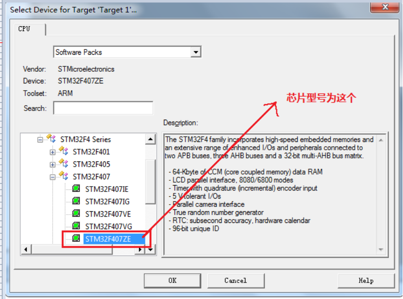
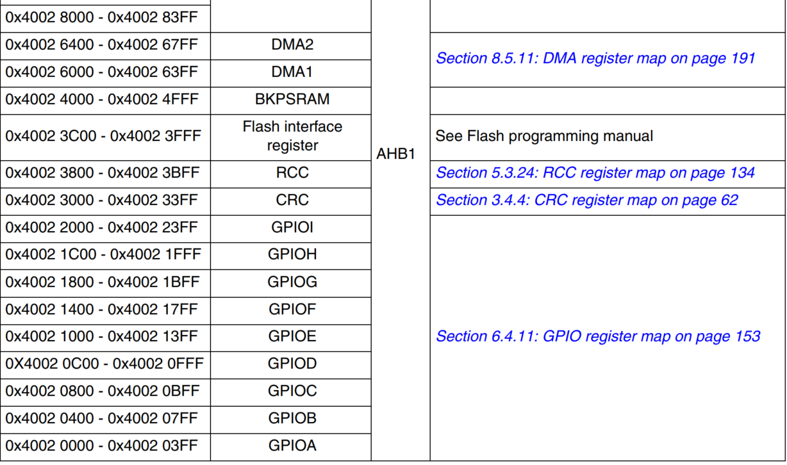
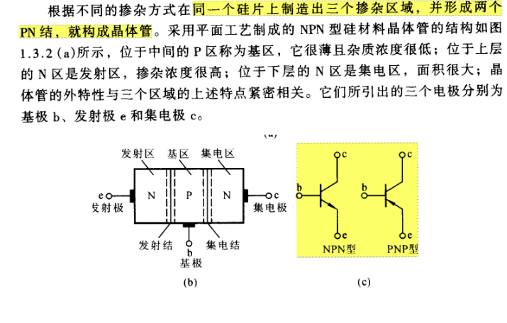
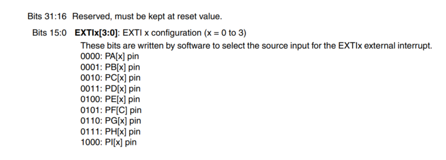
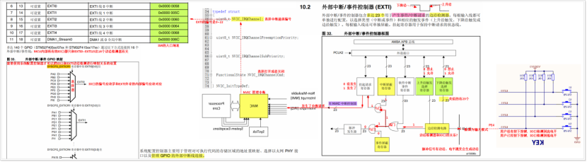
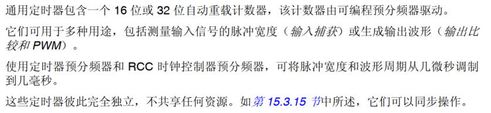
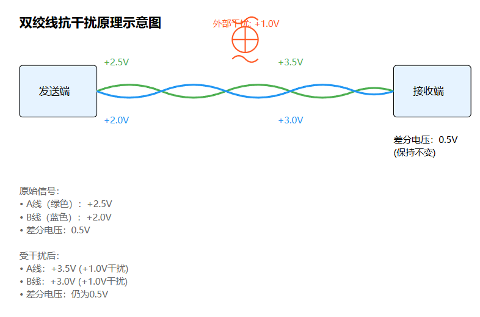

# stm32标准库

本笔记使用的芯片是STM32F407ZET6


## 硬件部分

### 如何保养电烙铁

1.  可以用高温海绵加水来清洗
2.  用纸巾叠多层,用来擦
3.  到100多°用剪刀刮一下
4.  用砂纸磨一下

### 怎么用


可以通过助焊剂让锡受热均匀,这样就会好看点


## 软件下载

下载思路:

1.   下载MDK开发集成软件
2.   下载对应的芯片开发包, 通常是以.pack结尾, F4就是:Keil.STM32F4xx_DFP.2.x.x.pack
3.   破解MDK软件, 去到file里面的license management找到CID,进行破解
4.   去Edit里面的configuration里面设置编码为GB2313和调整缩减即可


## 嵌入式技术架构:


冯诺依曼结构和哈佛结构


| **特点**       | **冯诺依曼结构**         | **哈佛结构**               |
| -------------- | ------------------------ | -------------------------- |
| **存储器设计** | 数据与指令共用同一存储器 | 数据与指令分开存储         |
| **总线设计**   | 共用同一总线             | 数据与指令独立总线         |
| **处理效率**   | 较低，有总线瓶颈         | 高，可以并行处理数据和指令 |
| **硬件复杂度** | 低                       | 高                         |
| **应用场景**   | 通用计算机               | 嵌入式系统、DSP等          |


在冯诺依曼结构中，数据和指令共享同一存储器和总线。这意味着处理器在同一时间只能访问数据或指令，可能导致性能瓶颈。

哈佛结构将数据和指令分别存储在独立的存储器中，并通过独立的总线进行传输。这种设计允许处理器同时访问数据和指令，提高了执行效率。


stm32的是修正哈佛结构,修正哈佛结构和哈佛结构的区别是:

**共享访问机制**：

-   在需要时，允许CPU通过指令总线访问指令存储器中的数据（例如常量表）。
-   例如，程序中存储的只读数据（常量）可以直接存储在Flash中，避免占用RAM资源。

**缓存与流水线优化**：

-   修正哈佛结构通常结合缓存技术（如I-Cache和D-Cache），进一步提高了指令和数据访问的效率。
-   流水线设计能够最大限度地减少总线共享时的冲突，维持高吞吐量。

**嵌入式系统支持**：

-   嵌入式系统（如ARM Cortex-M系列微控制器）大量采用修正哈佛结构，通过这种设计可以在Flash中存储程序和常量数据，同时保持高效的指令与数据访问。


| **特性**           | **传统哈佛结构**                   | **修正哈佛结构**                       |
| ------------------ | ---------------------------------- | -------------------------------------- |
| **存储分离程度**   | 指令和数据存储器完全分离           | 指令和数据存储器分离，但支持一定的共享 |
| **总线独立性**     | 指令和数据总线完全独立             | 大多数情况下独立，某些场景下共享       |
| **灵活性**         | 灵活性低，需严格区分指令和数据用途 | 灵活性高，支持部分共享存储资源         |
| **嵌入式应用场景** | 高性能计算（DSP等）                | 微控制器（STM32、Cortex-M）            |


## 工程目录的创建


### 创建工程目录


-   CMSIS：Cortex微控制器软件接口标准文件，该目录下文件适用所有Cortex系列（启动文件、配置文件）
-   DEVICE_LIB：M4对应外设的模块代码。Inc+src
-   HARDWARE：用户实现的模块功能函数
-   LIST：链接相关
-   OBJ：编译产生的中间文件+hex/bin文件
-   SYSTEM：系统相关代码
-   USER：自定义代码（main.c）


移植思路:

| stm32F4xx的官方库                                            | 工程       |
| ------------------------------------------------------------ | ---------- |
| Libraries\STM32F4xx_StdPeriph_Driver\inc 库头文件夹Libraries\STM32F4xx_StdPeriph_Driver\src 库源文件夹 | DEVICE_LIB |
| Project\STM32F4xx_StdPeriph_Templates\main.cProject\STM32F4xx_StdPeriph_Templates\stm32f4xx_it.h 中断函数头文件Project\STM32F4xx_StdPeriph_Templates\stm32f4xx_conf.h 配置文件Project\STM32F4xx_StdPeriph_Templates\stm32f4xx_it.c 中断函数文件 | USER       |
| Libraries\CMSIS\Device\ST\STM32F4xx\Include\stm32f4xx.h Libraries\CMSIS\Device\ST\STM32F4xx\Source\Templates\ system_stm32f4xx.c Libraries\CMSIS\Device\ST\STM32F4xx\Include\system_stm32f4xx.h | SYSTEM     |
| Libraries\CMSIS\Include\core_cm4_simd.h Libraries\CMSIS\Include\core_cm4.h  Cortex-M4系统文件Libraries\CMSIS\Include\core_cmFunc.h Libraries\CMSIS\Include\core_cmInstr.h Libraries\CMSIS\Device\ST\STM32F4xx\Source\Templates\arm\startup_stm32f40_41xxx.s | CMSIS      |


### keil5 project

打开keil5，选中project-->new project-->在弹出的对话框中，选择项目保存位置。


选择对应的芯片型号(需要提前下载好对应的包)



选定型号后就要为这个项目添加需要使用的模块代码,如果使用了固件库源码复制后就不需要这个步骤了


设置项目文件夹结构


配置output, Listing, c++编译链


STM32F40_41xxx：该宏指定芯片的型号，不同型号对应的硬件代码有不同，必须定义。

USE_STDPERIPH_DRIVER：该宏指定是否启用外设，定义则为启用外设，必须定义。

宏定义:

```c
STM32F40_41xxx,USE_STDPERIPH_DRIVER
```

这个宏定义用来选择芯片的型号的, 可看下面的英文文档


完成这些就可以编译了


### 编译自举模式


 需要记住:

1.   BOOT跳线帽结合的原理
2.   复位电路图原理


常见的Flash种类有两种:

1.   NOR Flash
2.   NAND Flash

MCU中的Flash的种类属于NOR Flash

NOR Flash的特定:

1.   随机访问速度快,适合存储执行程序代码
2.   可按字节读写
3.   支持代码直接执行, 无需复制到RAM中


## 如何查资料

-   STM32F407数据手册: 包含了引脚分布图, 在使用复用功能时可以去查看, 在45页左右
-   Standard Peripheral Library手册:标准库文件夹下面, 可以查看各个函数是怎么使用的,需要什么参数
-   STM32F4xxx参考手册(中文): 可以查看各个功能模块的寄存器的详细情况
-   GEC-STM32F407原理图: 里面有各个功能的电路图设计
-   每个外设的stm32f4xxx_ppp.c文件中的开头都会告诉你怎么快速的使用这个系统库函数


### 不同外设对应的时钟总线查询

STM32F4xxx参考手册(中文): 2.存储器的总线架构中的2.3 存储器的映射


## 外设初始化步骤


1.   初始化一个句柄 PPP_InitType
2.   给这个句柄赋值
3.   通过调用PPP_Init(PPP_Name, PPP_InitType*)来初始化这个外设
4.   使能外设, 一般对于复杂的外设才有, GPIO没有, PPP_Cmd()


>   [!NOTE]
>
>   1.   配置外设时,需要先打开外设时钟,可以用RCC_AHBxPeriphClockCmd(RCC_AHBxPeriphClock_PPPx, ENABLE), 来打开
>   2.   PPP_Deinit(PPP), 将任意外设恢复为默认值
>   3.   


## 时钟源体系

**参考文献: Cortex M3和M4的区别, 9.5 The SysTick timer**


时钟源有三种:

1.   HSI振荡器
2.   HSE振荡器
3.   主PLL时钟


### 时钟体系的框图

对于外设的来说,走的是HSE, 经过PLL来倍频, 之后通过sw选择器后再分频给不同的外设


M, N, P的值是: 以25Mhz为例,因为stm官方用的是25Mhz的


#### 修改stm32f4xx的时钟配置

去到stm32f4xx.h可以找到HSE_VALUE来修改

对于M, P, Q可以去system_stm32f4xx.c中的PLL_X 来修改


记得要改一下这个PLL_M,改成上面的公式


### 时间源介绍


#### 高速外部时钟HSE

外部高速时钟采用的是石英晶振, 这种晶振具体有机电效应, 当按一定的角度切割这个晶振时, 利用石英晶振的机械振动达到生成周期的时钟信号, 另外石英损耗小, 且振荡频率高度稳定。


优点:

-   频率稳定性极高，受温度、电压等外部因素影响较小
-   频率精度高，可以达到百万分之一的水平
-   品质因数Q值高，能量损耗小
-   体积小，成本低


晶振电路:

`需要记忆`


#### HSI时钟

高速内部时钟, 在MCU里面自带, 不需要花钱额外拓展, 频率是16MHz, 由RC振荡器生成, 启动速度比HSE快,但是精度没有HSE高


使用场景:

1.   直接作为系统时钟
2.   用于低功耗模式


#### 低速外部时钟LSE


一般给实时时钟外设使用, 即RTC, 用来做计时的, 我们电脑上的时钟显示也是通过这个LSE来生成的


#### 低速内部时钟LSI


精度低,成本低,用在低功耗待机模式


#### 倍频锁相环PLL


-   倍频: 把频率放大
-   分频: 把频率降低


### 延时功能

我们直接通过for循环来进行的计时, 但是这种情况需要配合逻辑示波器来确定精度。所以我们需要使用系统滴答定时器来确定这个准确值

#### 系统滴答定时器


如上面所说, 滴答计数器可以周期性产生中断

滴答计数器的时钟源有两种:

1.   来自处理器的时钟频率
2.   来自一个参考的时钟频率


系统滴答计数器包含四个寄存器


1.   系统滴答计数器控制状态寄存器
2.   系统滴答计数器重载状态寄存器
3.   系统滴答计数器当前值的寄存器
4.   系统滴答计数器验证寄存器


去到core_cm4.h中找到这个结构体


```c
typedef struct
{
  __IO uint32_t CTRL;                    /*!< Offset: 0x000 (R/W)  SysTick Control and Status Register */
  __IO uint32_t LOAD;                    /*!< Offset: 0x004 (R/W)  SysTick Reload Value Register       */
  __IO uint32_t VAL;                     /*!< Offset: 0x008 (R/W)  SysTick Current Value Register      */
  __I  uint32_t CALIB;                   /*!< Offset: 0x00C (R/ )  SysTick Calibration Register        */
} SysTick_Type;
```


步骤:

1.   关闭状态寄存器
2.   清空当前数值寄存器
3.   设置重装载寄存器
4.   打开状态寄存器


四个对应的寄存器的内部结构:


这里的while表示,当SysTick->CTRL的第16位为0的时候,表示时间已经到了, 然后关闭这个定时器,重新装填后在开启, 这样就可以实现精准的延时


## GPIO

### LED简介


### GPIO简介


标有 "FT" 的GPIO引脚可以容忍最高5V的输入电压。保护二极管确保电压被调节至3.3V，然后输入到MCU中。


### 八种模式

1.   上拉输入
2.   下拉输入
3.   浮空输入
4.   模拟功能
5.   推挽输出
6.   开漏输出
7.   推挽复用输出
8.   开漏复用输出


上拉电阻: 能让IO引脚的默认输出为高电平, 通常电阻连接着电源

下拉电阻: 能让IO引脚的默认输出为低电平, 通常电阻接地


1.   上拉输入：通过上拉电阻使未接信号时默认为高电平，防止输入端悬空。
2.   下拉输入：通过下拉电阻使未接信号时默认为低电平，防止输入端悬空。 
3.   浮空输入：没有上拉或下拉电阻，完全依赖外部信号控制，易受干扰。
4.   模拟功能：用于处理模拟信号（如ADC/DAC），此时引脚不再作为数字输入/输出。
5.   推挽输出：使用两个MOS管，可直接输出高电平或低电平，输出驱动能力强，同时降低功耗。
6.   开漏输出：仅能直接输出低电平，输出高电平时需外接上拉电阻，常用于与其他设备共享信号线（如I2C总线）。
7.   推挽复用输出：GPIO引脚作为外设的功能引脚（如UART、SPI等），仍保留推挽结构，具备强驱动能力。
8.   开漏复用输出：GPIO引脚作为外设的功能引脚，但采用开漏模式，需外接上拉电阻，适合多设备通信或逻辑共享。


### GPIO寄存器


#### GPIOx_MODER

GPIOx_MODER是模式寄存器:


寄存器地址 = 基地址 + 偏移地址

一个GPIO组由16个IO口, 每个IO口有四个模式,分别为:

1.  00: Input  输入
2.  01: General purpose output mode 通用输出模式
3.  10: Alternate function mode 复用模式
4.  11: Analog mode 模拟模式


#### GPIOx_OTYPER

这个是配置输出模式的寄存器,有推挽和开漏两种模式, 高16位保留


偏移地址为0x04, 因为0x00被mode占用了, 地址是32bit,也就是四字节,所以这里在的偏移地址位0x04


#### GPIOx_OSPEEDR

配置输出速度


#### GPIOx_PUPDR

配置上拉下拉的输入模式


#### GPIOx_BSRR

置位复位寄存器


 

高16位是复位

低16位是置位


### GPIO初始化流程

初始化整个流程:

1.   使能时钟
2.   配置句柄结构体
3.   初始化


#### 使能时钟函数

在STM32F4xxx参考手册中, 2.3 Memory map可以查询到GPIO挂在在AHB1总线上




要使能某个外设的时钟，可以使用以下函数：

```c
/**
  * @brief  使能或关闭AHB1外设时钟。
  * @note   复位后外设时钟默认是关闭的，在访问外设寄存器前必须使能时钟。
  * @param  RCC_AHBPeriph: 指定要使能时钟的AHB1外设。
  *          参数可以是以下值的任意组合：
  *            @arg RCC_AHB1Periph_GPIOA: GPIOA时钟
  *            @arg RCC_AHB1Periph_GPIOB: GPIOB时钟
  *            @arg RCC_AHB1Periph_GPIOC: GPIOC时钟
  *            ...
  * @param  NewState: 指定外设时钟的新状态。
  *          参数可以是ENABLE或DISABLE。
  * @retval 无
  */
void RCC_AHB1PeriphClockCmd(uint32_t RCC_AHB1Periph, FunctionalState NewState)
```

输入参数两个:

1.   需要使能的外设时钟地址
2.   状态: 使能和关闭使能


#### GPIO初始化

```c
/**
  * @brief  根据GPIO_InitStruct中的指定参数初始化GPIOx外设。
  * @param  GPIOx: 指定GPIO端口（A, B, C, ...）。
  * @param  GPIO_InitStruct: 指向包含GPIO配置信息的结构体的指针。
  * @retval 无
  */
void GPIO_Init(GPIO_TypeDef* GPIOx, GPIO_InitTypeDef* GPIO_InitStruct)
```

初始化结构体结构:

```c
/**
  * @brief   GPIO初始化结构定义
  */
typedef struct
{
  uint32_t GPIO_Pin;              /*!< 指定要配置的GPIO引脚。 */

  GPIOMode_TypeDef GPIO_Mode;     /*!< 指定所选引脚的工作模式。 */

  GPIOSpeed_TypeDef GPIO_Speed;   /*!< 指定所选引脚的速度。 */

  GPIOOType_TypeDef GPIO_OType;   /*!< 指定所选引脚的输出类型。 */

  GPIOPuPd_TypeDef GPIO_PuPd;     /*!< 指定所选引脚的上拉/下拉配置。 */
} GPIO_InitTypeDef;
```


#### 初始化例子

```c
#include "LED.h"
#include "stm32f4xx.h"

void LED_GPIO_Config(void)
{
    GPIO_InitTypeDef GPIO_InitStructure;
    
    // 使能GPIOF时钟
    RCC_AHB1PeriphClockCmd(RCC_AHB1Periph_GPIOF, ENABLE);
    
    // 配置PF10引脚用于LED
    GPIO_InitStructure.GPIO_Pin = GPIO_Pin_10;        // 选择PF10引脚
    GPIO_InitStructure.GPIO_Mode = GPIO_Mode_OUT;     // 输出模式
    GPIO_InitStructure.GPIO_OType = GPIO_OType_PP;    // 推挽输出
    GPIO_InitStructure.GPIO_Speed = GPIO_Speed_50MHz; // 50MHz速度
    GPIO_InitStructure.GPIO_PuPd = GPIO_PuPd_UP;      // 上拉
    
    GPIO_Init(GPIOF, &GPIO_InitStructure);
    
    // 默认将引脚设置为高电平（LED熄灭）
    GPIO_SetBits(GPIOF, GPIO_Pin_10);
}
```


### 其余函数功能


给某个引脚置位

```c
void GPIO_SetBits(GPIO_TypeDef* GPIOx, uint16_t GPIO_Pin)
```


给某个引脚复位

```c
void GPIO_ResetBits(GPIO_TypeDef* GPIOx, uint16_t GPIO_Pin)
```


读取某个引脚的状态

```c
uint8_t GPIO_ReadInputDataBit(GPIO_TypeDef* GPIOx, uint16_t GPIO_Pin)
```

>   [!NOTE]
>
>   函数`GPIO_SetBits`和`GPIO_ResetBits`由于需要进行上下文保护和恢复，性能并不高，可能比较耗时。为了更快、更高效地控制GPIO，可以考虑使用位带操作直接操作单个位。可以通过下面这个操作,直接进行位操作

```c
// 置位操作
GPIOG->BSRRL = LED1_PIN | LED2_PIN;
// 复位操作
GPIOG->BSRRH = LED1_PIN | LED2_PIN;
```


### 解析标准库中的封装函数

GPIO_Init(GPIOE, &GPIO_InitStructure_LED);

```c
void GPIO_Init(GPIO_TypeDef* GPIOx, GPIO_InitTypeDef* GPIO_InitStruct)
{
  uint32_t pinpos = 0x00, pos = 0x00 , currentpin = 0x00;

  /* Check the parameters */
  assert_param(IS_GPIO_ALL_PERIPH(GPIOx));
  assert_param(IS_GPIO_PIN(GPIO_InitStruct->GPIO_Pin));
  assert_param(IS_GPIO_MODE(GPIO_InitStruct->GPIO_Mode));
  assert_param(IS_GPIO_PUPD(GPIO_InitStruct->GPIO_PuPd));

  /* ------------------------- Configure the port pins ---------------- */
  /*-- GPIO Mode Configuration --*/
  for (pinpos = 0x00; pinpos < 0x10; pinpos++)
  {
    pos = ((uint32_t)0x01) << pinpos;
    /* Get the port pins position */
    currentpin = (GPIO_InitStruct->GPIO_Pin) & pos;

    if (currentpin == pos)
    {
      GPIOx->MODER  &= ~(GPIO_MODER_MODER0 << (pinpos * 2));
      GPIOx->MODER |= (((uint32_t)GPIO_InitStruct->GPIO_Mode) << (pinpos * 2));

      if ((GPIO_InitStruct->GPIO_Mode == GPIO_Mode_OUT) || (GPIO_InitStruct->GPIO_Mode == GPIO_Mode_AF))
      {
        /* Check Speed mode parameters */
        assert_param(IS_GPIO_SPEED(GPIO_InitStruct->GPIO_Speed));

        /* Speed mode configuration */
        GPIOx->OSPEEDR &= ~(GPIO_OSPEEDER_OSPEEDR0 << (pinpos * 2));
        GPIOx->OSPEEDR |= ((uint32_t)(GPIO_InitStruct->GPIO_Speed) << (pinpos * 2));

        /* Check Output mode parameters */
        assert_param(IS_GPIO_OTYPE(GPIO_InitStruct->GPIO_OType));

        /* Output mode configuration*/
        GPIOx->OTYPER  &= ~((GPIO_OTYPER_OT_0) << ((uint16_t)pinpos)) ;
        GPIOx->OTYPER |= (uint16_t)(((uint16_t)GPIO_InitStruct->GPIO_OType) << ((uint16_t)pinpos));
      }

      /* Pull-up Pull down resistor configuration*/
      GPIOx->PUPDR &= ~(GPIO_PUPDR_PUPDR0 << ((uint16_t)pinpos * 2));
      GPIOx->PUPDR |= (((uint32_t)GPIO_InitStruct->GPIO_PuPd) << (pinpos * 2));
    }
  }
}
```

GPIOE是一个基地址, 他计算方式是:

#define PERIPH_BASE           ((uint32_t)0x40000000)

#define AHB1PERIPH_BASE       (PERIPH_BASE + 0x00020000)

#define GPIOE_BASE            (AHB1PERIPH_BASE + 0x1000)

#define GPIOE               ((GPIO_TypeDef *) GPIOE_BASE)


在这里用了GPIO_TypeDef , stm32是四字节对齐, 每个寄存器的地址刚好也是四个字节, 所以就可以直接通过结构体封装在一起, 而不用考虑结构体字节对齐带来的地址误差

```c
typedef struct
{
  __IO uint32_t MODER;    /*!< GPIO port mode register,         Address offset: 0x00      */
  __IO uint32_t OTYPER;   /*!< GPIO port output type register,  Address offset: 0x04      */
  __IO uint32_t OSPEEDR;  /*!< GPIO port output speed register, Address offset: 0x08      */
  __IO uint32_t PUPDR;    /*!< GPIO port pull-up/pull-down register,  Address offset: 0x0C      */
  __IO uint32_t IDR;      /*!< GPIO port input data register,   Address offset: 0x10      */
  __IO uint32_t ODR;      /*!< GPIO port output data register,  Address offset: 0x14      */
  __IO uint16_t BSRRL;    /*!< GPIO port bit set/reset low register,  Address offset: 0x18      */
  __IO uint16_t BSRRH;    /*!< GPIO port bit set/reset high register, Address offset: 0x1A      */
  __IO uint32_t LCKR;     /*!< GPIO port configuration lock register, Address offset: 0x1C      */
  __IO uint32_t AFR[2];   /*!< GPIO alternate function registers,     Address offset: 0x20-0x24 */
} GPIO_TypeDef;
```


### 点亮四个LED灯

分两种实现方式:

1.   标准库
2.   直接寄存器操作


#### 标准库操作:

```c
/**
  ******************************************************************************
  * @file    main.c 
  * @author  苏向标
  * @version V1.0.0
  * @date    2024/11/20
  * @brief   程序主函数
  * @retval  None
  ******************************************************************************
  * 初始化发光二极管的代码
  * 1. 使能控制四个LED灯的时钟GPIOF和GPIOE
  * 2. 配置四个LED灯的引脚,PF9,PF10,PE13,PE14
  * 3. 每个引脚默认高电平,即熄灭状态
  ******************************************************************************
  */
void LED_GPIO_Config(void)
{
    GPIO_InitTypeDef GPIO_InitStructure_LED;
    
    // 使能GPIO F和E时钟
    RCC_AHB1PeriphClockCmd(RCC_AHB1Periph_GPIOF | RCC_AHB1Periph_GPIOE, ENABLE);

    // 配置LED0对应的GPIO引脚PF9
    GPIO_InitStructure_LED.GPIO_Pin = GPIO_Pin_9 | GPIO_Pin_10;       
    GPIO_InitStructure_LED.GPIO_Mode = GPIO_Mode_OUT;    
    GPIO_InitStructure_LED.GPIO_OType = GPIO_OType_PP;   
    GPIO_InitStructure_LED.GPIO_Speed = GPIO_Speed_50MHz;
    GPIO_InitStructure_LED.GPIO_PuPd = GPIO_PuPd_UP;   
    
    GPIO_Init(GPIOF, &GPIO_InitStructure_LED);
	
	// 设置E组引脚
	GPIO_InitStructure_LED.GPIO_Pin = GPIO_Pin_13 | GPIO_Pin_14; 
	GPIO_Init(GPIOE, &GPIO_InitStructure_LED);
    
    // 设置引脚默认状态为高电平
    GPIO_SetBits(GPIOF, GPIO_Pin_9);
    GPIO_SetBits(GPIOF, GPIO_Pin_10);
    GPIO_SetBits(GPIOE, GPIO_Pin_13);
    GPIO_SetBits(GPIOE, GPIO_Pin_14);	
}
```


#### 寄存器操作:

寄存器操作需要去查文件,文件是: STM32F4xx参考手册(中文)

1.   时钟使能地址: 6.3.12 RCC_AHB1ENR
2.   GPIOE和GPIOF的地址: 2.3寄存器映射
3.   GPIO配置寄存器的偏移地址: 7.4GPIO寄存器


思路: 将地址值 转化为一个可变的无符号整形指针, 然后取地址值来赋值,从而改变寄存器的值

```c
#define RCC_AHB1ENR 	(*(volatile unsigned int *)(0x40023800 + 0x30))

#define GPIO_F_BASE_ADDR 0x40021400
#define GPIO_E_BASE_ADDR 0x40021000

#define GPIOF_MODER 	(*(volatile unsigned int *)(GPIO_F_BASE_ADDR + 0x00))
#define GPIOF_OTYPER 	(*(volatile unsigned int *)(GPIO_F_BASE_ADDR + 0x04))
#define GPIOF_OSPEEDR 	(*(volatile unsigned int *)(GPIO_F_BASE_ADDR + 0x08))
#define GPIOF_PUPDR 	(*(volatile unsigned int *)(GPIO_F_BASE_ADDR + 0x0C))
#define GPIOF_ODR 		(*(volatile unsigned int *)(GPIO_F_BASE_ADDR + 0x14))

#define GPIOE_MODER 	(*(volatile unsigned int *)(GPIO_E_BASE_ADDR + 0x00))
#define GPIOE_OTYPER 	(*(volatile unsigned int *)(GPIO_E_BASE_ADDR + 0x04))
#define GPIOE_OSPEEDR 	(*(volatile unsigned int *)(GPIO_E_BASE_ADDR + 0x08))
#define GPIOE_PUPDR 	(*(volatile unsigned int *)(GPIO_E_BASE_ADDR + 0x0C))
#define GPIOE_ODR 		(*(volatile unsigned int *)(GPIO_E_BASE_ADDR + 0x14))


void LED_GPIO_Register_Config(void)
{
	// 使能GPIOF的端口时钟
	RCC_AHB1ENR |= (1<<5)|(1<<4);
	
	// 配置PF9和PF10的引脚输出模式
	GPIOF_MODER &= ~((1<<19) |(1<<21));
	GPIOF_MODER |= (1<<18) | (1<<20);
	
	// 配置PE13和PE14的引脚输出模式
	GPIOE_MODER &= ~((1<<27) |(1<<29));
	GPIOE_MODER |= (1<<26) | (1<<28);
	
	// 推挽输出
	GPIOF_PUPDR &= ~((1<<9)|(1<<10));
	GPIOE_PUPDR &= ~((1<<13)|(1<<14));
	
	// 高速输出
	GPIOF_OSPEEDR |= (1<<19)| (1<<21);
	GPIOF_OSPEEDR |= (1<<18)| (1<<20);
	GPIOE_OSPEEDR |= (1<<27)| (1<<29);
	GPIOE_OSPEEDR |= (1<<26)| (1<<28);
	
	// 浮空输入
	GPIOF_PUPDR &= ~((1<<19) |(1<<21));
	GPIOF_PUPDR &= ~((1<<19) |(1<<21));
	GPIOE_PUPDR &= ~((1<<27)| (1<<29));
	GPIOE_PUPDR &= ~((1<<26)| (1<<28));
	
    // 设置默认低电平
	GPIOF_ODR &= ~((1<<9)|(1<<10));
	GPIOE_ODR &= ~((1<<13)|(1<<14));
}
```


### LED流水灯例子

LED.c

```c
#include "LED.h"
#include "stm32f4xx.h"

void LED_GPIO_Config(void)
{
    GPIO_InitTypeDef GPIO_InitStructure_LED;
    
    // 使能GPIO F和E时钟
    RCC_AHB1PeriphClockCmd(RCC_AHB1Periph_GPIOF, ENABLE);
	RCC_AHB1PeriphClockCmd(RCC_AHB1Periph_GPIOE, ENABLE);
    
    // 配置LED0对应的GPIO引脚PF9和PF10
    GPIO_InitStructure_LED.GPIO_Pin = GPIO_Pin_9 | GPIO_Pin_10;       // 选择PF9和PF10引脚
    GPIO_InitStructure_LED.GPIO_Mode = GPIO_Mode_OUT;    // 输出模式
    GPIO_InitStructure_LED.GPIO_OType = GPIO_OType_PP;   // 推挽输出
    GPIO_InitStructure_LED.GPIO_Speed = GPIO_Speed_50MHz;// 50MHz速度
    GPIO_InitStructure_LED.GPIO_PuPd = GPIO_PuPd_UP;    // 上拉
    
    GPIO_Init(GPIOF, &GPIO_InitStructure_LED);
	
	// 设置E组引脚
	GPIO_InitStructure_LED.GPIO_Pin = GPIO_Pin_13 | GPIO_Pin_14; // 选择PE13和PE14引脚
	GPIO_Init(GPIOE, &GPIO_InitStructure_LED);
    
    // 设置引脚默认状态为高电平
    GPIO_SetBits(GPIOF, GPIO_Pin_9);
    GPIO_SetBits(GPIOF, GPIO_Pin_10);
    GPIO_SetBits(GPIOE, GPIO_Pin_13);
    GPIO_SetBits(GPIOE, GPIO_Pin_14);	
}


```

main.c

```c
#include "stm32f4xx.h"
#include "LED.h"

/** @addtogroup Template_Project
  * @{
  */ 

/* Private typedef --------------------------定义类型----------------------------*/
/* Private define ---------------------------定义声明----------------------------*/
/* Private macro ----------------------------宏定义------------------------------*/
/* Private variables ------------------------定义变量----------------------------*/
/* Private function prototypes --------------函数声明----------------------------*/
/* Private functions ------------------------定义函数----------------------------*/

/**
  * @brief  Main program
  * @param  None
  * @retval None
  */

  


int main(void)
{
	LED_GPIO_Config();
	while (1)
	{
		// 点亮LED0（设置为低电平）
        GPIO_ResetBits(GPIOF, GPIO_Pin_9);
        for(uint32_t i = 0; i < 0x5FFFFF; i++);
        // 熄灭LED0（设置为高电平）
        GPIO_SetBits(GPIOF, GPIO_Pin_9);
		
		GPIO_ResetBits(GPIOF, GPIO_Pin_10);
        for(uint32_t i = 0; i < 0x5FFFFF; i++);
		GPIO_SetBits(GPIOF, GPIO_Pin_10);
		
		GPIO_ResetBits(GPIOE, GPIO_Pin_13);
        for(uint32_t i = 0; i < 0x5FFFFF; i++);
		GPIO_SetBits(GPIOE, GPIO_Pin_13);
		
		GPIO_ResetBits(GPIOE, GPIO_Pin_14);
        for(uint32_t i = 0; i < 0x5FFFFF; i++);
		GPIO_SetBits(GPIOE, GPIO_Pin_14);
	}
}
```


### 蜂鸣器


蜂鸣器分两种:

1.   有源蜂鸣器: 内部有振荡电路,通电就会响
2.   无源蜂鸣器: 内部没有振荡器,通电后不会响, 必须人为通过一个驱动信号才能响


####  三极管



b: 基极

c: 集电极

e: 发射极


记住: 导电方向是给PN施加一个正向电压, 通过这个可以看电流方向来直到是PNP还是NPN


三极管的作用:

1.   放大电路
2.   开关


放大电路:

任何放大的原则都是不能失真


三极管导通条件:

1.   NPN型在基极施加高电平
2.   PNP型在基极施加低电平


#### 蜂鸣器电路图


这个三极管是一个NPN结, 下拉电阻让基极默认输出低电平,需要控制BEEP变成高电平才能让三极管导通


对应PF8口


#### 蜂鸣器代码

```c
#include "./BUZZER/buzzer.h"

void Init_Buzzer()
{
	RCC->AHB1ENR |= (1<<5);
	
	GPIOF->MODER &= ~(1<<17);
	GPIOF->MODER |= (1<<16);
	
	GPIOF->OTYPER &= ~(1<<8);
	GPIOF->OSPEEDR |= (1<<16)|(1<<17);
	GPIOF->PUPDR &= ~((1<<16)|(1<<17));
	GPIOF->ODR &= ~(1<<8);
}

```

main

```c
int main(void)
{
	// LED_GPIO_Config();
	Key_Config();
	Init_Buzzer();

	while (1)
	{
		// 点亮LED0（设置为低电平）
        if (GPIO_ReadInputDataBit(GPIOA, GPIO_Pin_0) == 0) // 按键按下，PA0 为低电平
        {
            for (uint32_t i = 0; i < 0x0000FF; i++); // 简单消抖
            if (GPIO_ReadInputDataBit(GPIOA, GPIO_Pin_0) == 0) // 再次确认按键仍然按下
            {
                GPIO_ToggleBits(GPIOF, GPIO_Pin_8); // 翻转 LED 状态
                while (GPIO_ReadInputDataBit(GPIOA, GPIO_Pin_0) == 0); // 等待按键释放
            }
        }
        
       
		

	}
}
  
```


## 中断

前后台结构:

中断被称为前台, 主程序中的whlie被称为后台。中断会终止后台程序的运行,跳转到中断处理函数进行处理, 处理完后才会继续执后台程序


示意图如下:


最多有255个中断请求, 240个外部的中断请求, 15个系统中断。实际上被使用的中断请求远远小于255个

### NVIC

**NVIC**: Nested vectored interrupt controller  嵌套向量中断控制器, 所有中断都是通过NVIC来管理的

中断要做的设置:

1.   设置优先级(可选)
2.   使能外设的中断生成控制
3.   配置NVIC中关于这个中断的参数


>   [!NOTE]
>
>   在中断服务程序结束之前,必须要清空中断触发标志,不然系统会一直循环处理这个中断函数
>
>   所有的中断服务程序都可以从启动文件中的向量表找到
>
>   这些向量表中的终端服务名字都是由芯片厂商提供的, 我们编写的终端服务函数名称必须匹配中断向量表的名称一致,这样系统的连接器才能跳转到ISR程序的开始地址


我们可以在misc.h头文件中找到这个中断初始化句柄结构体, misc是Miscellaneous的缩写,表示杂项或者其他的意思, 通常用于存放一些不易于归类的工具函数或者硬件配置


抢占优先级和响应优先级的作用:


有四个bit来设置这个NVIC优先级分组,抢占优先级和响应优先级公用这四个bit,共有5个分组, 如下:


通过函数`NVIC_PriorityGroupConfig()`来配置, 只有一个参数, 就是选择优先级分组


只有五个选择


**这个函数在入口处调用, 且尽量不要再改**


### EXTI

外部中断事件控制器, 外部中断/事件控制器包含多达23个用于产生事件/中断请求的边沿检测器, 每根输入线都可以单独进行配置, 以选择类型和相应的触发事件,  每根输入线还可以单独屏蔽, 挂起寄存器用于保持中断请求的状态线


整个过程由四个寄存器联动完成:

1.   上升或下降沿边缘检测器
2.   中断屏蔽寄存器 interrupt mask register
3.   挂起请求寄存器
4.   SYSCFG_EXITCR1寄存器


用户按一下key, 先高后低最后又高, 可以检测上升沿来判定按键触发事件,触发事件后,挂起请求寄存器位为1, 去到


MCU内部的所有IO口都只和EXTI0-EXTI15这16个边沿检测器有关, 举个例子,比如按下按钮PB4, 那么会触发的中断就是EXIT4这个事件


IO端口的引脚编号和EXIT外设的内部编号是对应的


#### 设置边缘检测器寄存器

上升沿寄存器


下降沿触发


一共23个位被使用了, 对应23条EXTI线


#### 中断/事件掩码寄存器


#### 挂起寄存器


#### SYSCFG_EXTICRx





### 中断处理程序ISR

对于一个EXTI线对应一个ISR处理函数, 这个时候可以不写EXTI_GetITStatus(), 因为一进来就几乎可以确定是这条线触发的中断, 如果一个ISR处理函数对应多条线,如EXTI9_5_IRQHandler, 这个时候就需要使用EXTI_GetITStatus()来判断是由那一条线来触发


### 向量表

向量表本质上是一个指针数组, 这个数组用来记录外部异常处理函数的入口指针, 下标从0开始,每个指针4个字节


一旦异常发送, MCU中断NVIC就知道了异常发生编号,也就是数组的下标, NVIC就会告诉CPU, 让它去根据这个编号来去到中断向量表中找到对应的元素, 进行读取, 读取后根据map映射文件,找到这个指针指向的ISR地址, 这个地址就是真正意义上的ISR的地址, 这个时候就会把这个ISR地址放入PC, 进行跳转。


### 代码

>   ​								 How to use this driver 
>
>    ===============================================================================
>
>   In order to use an I/O pin as an external interrupt source, follow steps 
>         below:
>      (#) Configure the I/O in input mode using GPIO_Init()
>      (#) Select the input source pin for the EXTI line using SYSCFG_EXTILineConfig()
>      (#) Select the mode(interrupt, event) and configure the trigger 
>          selection (Rising, falling or both) using EXTI_Init()
>      (#) Configure NVIC IRQ channel mapped to the EXTI line using NVIC_Init()
>
>    [..]     
>      (@) SYSCFG APB clock must be enabled to get write access to SYSCFG_EXTICRx
>          registers using RCC_APB2PeriphClockCmd(RCC_APB2Periph_SYSCFG, ENABLE);

  


初始化步骤:

1.   设置GPIO输入模式
2.   配置EXIT线, 需要哪条配置那条, 可以根据GPIO端口的引脚来配置
3.   配置NVIC, 绑定ISR服务函数
4.   初始化EXTI和NVIC
5.   编写中断处理函数


```c
#include "./NVIC/nvic.h"

void KEY_Config(void)
{
	GPIO_InitTypeDef gpio_instructurn;
	RCC_AHB1PeriphClockCmd(RCC_AHB1Periph_GPIOE|RCC_AHB1Periph_GPIOA, ENABLE);
	// 初始化PA0 和 PB2-4
	gpio_instructurn.GPIO_Pin = GPIO_Pin_0;
	gpio_instructurn.GPIO_Mode = GPIO_Mode_IN;
	gpio_instructurn.GPIO_PuPd = GPIO_PuPd_NOPULL;
	GPIO_Init(GPIOA, &gpio_instructurn);
	gpio_instructurn.GPIO_Pin = GPIO_Pin_2|GPIO_Pin_3|GPIO_Pin_4;
	GPIO_Init(GPIOE, &gpio_instructurn);
}

void NVIC_Config(void)
{
	EXTI_InitTypeDef   EXTI_InitStructure;
	NVIC_InitTypeDef   NVIC_InitStructure;
	
	KEY_Config();
	/* Enable SYSCFG clock */
	RCC_APB2PeriphClockCmd(RCC_APB2Periph_SYSCFG, ENABLE);


	/* Connect EXTI Line to port's pin */
	SYSCFG_EXTILineConfig(EXTI_PortSourceGPIOA, EXTI_PinSource0);
	SYSCFG_EXTILineConfig(EXTI_PortSourceGPIOE, EXTI_PinSource2);
	SYSCFG_EXTILineConfig(EXTI_PortSourceGPIOE, EXTI_PinSource3);
	SYSCFG_EXTILineConfig(EXTI_PortSourceGPIOE, EXTI_PinSource4);

	/* Configure EXTI Line0 */
	EXTI_InitStructure.EXTI_Line = EXTI_Line0;
	EXTI_InitStructure.EXTI_Mode = EXTI_Mode_Interrupt;
	EXTI_InitStructure.EXTI_Trigger = EXTI_Trigger_Rising;  
	EXTI_InitStructure.EXTI_LineCmd = ENABLE;
	EXTI_Init(&EXTI_InitStructure);
	
	EXTI_InitStructure.EXTI_Line = EXTI_Line2;
	EXTI_Init(&EXTI_InitStructure);
	
	EXTI_InitStructure.EXTI_Line = EXTI_Line3;
	EXTI_Init(&EXTI_InitStructure);
	
	EXTI_InitStructure.EXTI_Line = EXTI_Line4;
	EXTI_Init(&EXTI_InitStructure);

	/* Enable and set EXTI Line0 Interrupt to the lowest priority */
	NVIC_InitStructure.NVIC_IRQChannel = EXTI0_IRQn;
	NVIC_InitStructure.NVIC_IRQChannelPreemptionPriority = 16;
	NVIC_InitStructure.NVIC_IRQChannelCmd = ENABLE;
	NVIC_Init(&NVIC_InitStructure);
	
	NVIC_InitStructure.NVIC_IRQChannel = EXTI2_IRQn;
	NVIC_Init(&NVIC_InitStructure);
	NVIC_InitStructure.NVIC_IRQChannel = EXTI3_IRQn;
	NVIC_Init(&NVIC_InitStructure);
	NVIC_InitStructure.NVIC_IRQChannel = EXTI4_IRQn;
	NVIC_Init(&NVIC_InitStructure);
}


void EXTI0_IRQHandler(void)
{
	GPIO_ToggleBits(GPIOF, GPIO_Pin_9);
	EXTI_ClearITPendingBit(EXTI_Line0);
}

void EXTI2_IRQHandler(void)
{
	GPIO_ToggleBits(GPIOF, GPIO_Pin_10);
	EXTI_ClearITPendingBit(EXTI_Line2);
}

void EXTI3_IRQHandler(void)
{
	GPIO_ToggleBits(GPIOE, GPIO_Pin_13);
	EXTI_ClearITPendingBit(EXTI_Line3);
}

void EXTI4_IRQHandler(void)
{
	GPIO_ToggleBits(GPIOE, GPIO_Pin_14);
	EXTI_ClearITPendingBit(EXTI_Line4);
}
```


对应的main:

```c
/**
  ******************************************************************************
  * @file    main.c 
  * @author  苏向标
  * @version V1.0.0
  * @date    2024/11/20
  * @brief   程序主函数
  ******************************************************************************
  * 通过调用中断来控制LED的亮灭
  * None
  ******************************************************************************
  */

/* Includes ----------------定义头文件---------------------------------------*/

#include "stm32f4xx.h"
#include "LED.h"
#include "./KEY/key.h"
#include "./NVIC/nvic.h"

/** @addtogroup Template_Project
  * @{
  */ 


void delay_8ms(void)
{
	int i = 13437;
	while(i--);
}

int main(void)
{
	// 设置分组4, 抢占优先级是0-15, 响应优先级是0
	NVIC_PriorityGroupConfig(NVIC_PriorityGroup_4);
	NVIC_Config();
	LED_GPIO_Config();
	
	while (1)
	{	

	}
}
  

```


### 注意点

1.   如果要用异常, 必须要在汇编文件外定义ISR程序, 并且ISR函数名称必须和启动文件的向量表中的异常名称必须一致,如果不一致会导致你的程序死循环。这是由于汇编的问题: 因为在汇编文件中的所有ISR函数都是弱定义,如果不重写, 就会触发汇编的默认操作,进入死循环, 所有一定要按ISR的函数名字重写 


## 定时器

STM32F407共有14个定时器, 2个基本定时器, 10个通用定时器, 2个高级定时器


定时器是属于外设,时钟由APB提供,但定时器是一种特殊外设, 时钟会独立一个通道提供给他们。

已知:

1.   APB1的时钟频率是42MHz
2.   APB2的时钟频率是84MHz


### 基本定时器


特征:

1.   16位自动重载计数器, 最高能数65536
2.   只有递增计数模式,且可以通过分频来改变计时周期
3.   用于触发DAC的同步电路
4.   发送计数器上溢更新事件时会生成中断/DMA请求:


stm32f407zet6中只有TIM6和TIM7属于基本定时器,经过查表,发现TIM6和TIM7是挂载在APB1总线下面的, 所以定时器的时钟频率是84MHz


1.   预分频器是16位的, 可以将84MHz的频率降低, 最高降低65536倍
2.   自动重载寄存器可以设置计数的次数,也就是上溢的上限
3.   计数器寄存器有加减的能力, 基本定时器只能加, 从0开始加到65535


计算公式:
$$
time = \frac{(psc+1)(arr+1)}{TIMxCLK}
$$


例子

```c
void delay_Tim_us(uint32_t nus)
{
	NVIC_InitTypeDef NVIC_InitStructure;
	/* TIM3 clock enable */
	RCC_APB1PeriphClockCmd(RCC_APB1Periph_TIM6, ENABLE);

	/* Enable the TIM3 gloabal Interrupt */
	NVIC_InitStructure.NVIC_IRQChannel = TIM6_DAC_IRQn;
	NVIC_InitStructure.NVIC_IRQChannelPreemptionPriority = 0;
	NVIC_InitStructure.NVIC_IRQChannelCmd = ENABLE;
	NVIC_Init(&NVIC_InitStructure);

	TIM_TimeBaseInitTypeDef  TIM_TimeBaseStructure;
	  /* Time base configuration */
	// 定时100ms
	TIM_TimeBaseStructure.TIM_Period = nus-1;
	TIM_TimeBaseStructure.TIM_Prescaler = 84-1;
	TIM_TimeBaseStructure.TIM_ClockDivision = 0;
	TIM_TimeBaseStructure.TIM_CounterMode = TIM_CounterMode_Up;

	TIM_TimeBaseInit(TIM6, &TIM_TimeBaseStructure);
	// 选择中断源, 基本定时器只能上溢更新事件
	TIM_ITConfig(TIM6, TIM_IT_Update, ENABLE);
	
	// 使能定时器6
	TIM_Cmd(TIM6, ENABLE);
}

///**
//  ******************************************************************************
//  * @brief    中断服务函数
//  * @param    
//  * @retval    void
//  * @note   
//*/

void TIM6_DAC_IRQHandler(void)
{
	if (TIM_GetITStatus(TIM6, TIM_IT_Update) != RESET)
	{
		TIM_ClearITPendingBit(TIM6, TIM_IT_Update);
		// 电平翻转
		GPIO_ToggleBits(GPIOB, GPIO_Pin_7);
	}
}
```


### 通用定时器

框图:


#### TIM2到TIM5




特征:

1.   多达4个独立通道,每个可以用于: 输入捕获,输出比较, PWM生成, 单脉冲模式输出
2.   使用外部信号控制定时器可以实现多个定时器互联的同步电路
3.   发生如下事件时,可以产生中断或者DMA请求:
     1.   更新: 上下溢
     2.   触发事件: 计数器启动, 停止, 初始化或者内部外部触发计数
     3.   输入捕获
     4.   输出比较


#### TIM9到TIM14


特征:

1.   **2个**独立通道,每个可以用于: 输入捕获,输出比较, PWM生成, 单脉冲模式输出
2.   使用外部信号控制定时器可以实现多个定时器互联的同步电路
3.   发生如下事件时,可以产生中断或者DMA请求:
     1.   更新: 上下溢
     2.   触发事件: 计数器启动, 停止, 初始化或者内部外部触发计数
     3.   输入捕获
     4.   输出比较


### 定时器输出部分


上面的定时器部分功能和基本定时器一样,只是多了几个输入源

这里的比较寄存器的特征是: 当CNT的值小于设定的值(计数模式为增量计算), 默认输出低电平/高电平, 超过就会自动翻转, 通过这个特征可以输出一定占空比的脉冲信号


### PWM脉冲调制


PWM输出有两种模式, 区别如下:


假设选择的定时器是在APB1下, 定时器时钟频率是84MHz, 想要生成的脉冲信号的50Hz, 脉冲信号是20ms, 预分频值设置为8400, 所以自动重载寄存器的重载值是200, 并且选择高电平有效


1.  使用PWM控制舵机, 舵机连接的是MCU的PC7管脚, 对应TIM3_CH2
2.  舵机需要20ms的脉冲信号, 并且脉冲信息的高电平0.5ms, 2.5ms可以控制0~180°
3.  0.5ms*n -> (n-1)\*45°


代码

```c
#include "./SG/SG.h"


uint16_t PrescalerValue = 0;

//GPIO引脚PC7, 将PC7的引脚复用改成TIM3_CH2(查表)
void SG90_Config(void)
{
  GPIO_InitTypeDef GPIO_InitStructure;

  /* TIM3 clock enable */
  RCC_APB1PeriphClockCmd(RCC_APB1Periph_TIM3, ENABLE);

  /* GPIOC clock enable */
  RCC_AHB1PeriphClockCmd(RCC_AHB1Periph_GPIOC, ENABLE);
  
  /* GPIOC Configuration: TIM3 CH2 (PC7)*/
  GPIO_InitStructure.GPIO_Pin = GPIO_Pin_7;
  GPIO_InitStructure.GPIO_Mode = GPIO_Mode_AF;
  GPIO_InitStructure.GPIO_Speed = GPIO_Speed_100MHz;
  GPIO_InitStructure.GPIO_OType = GPIO_OType_PP;
  GPIO_InitStructure.GPIO_PuPd = GPIO_PuPd_UP ;
  GPIO_Init(GPIOC, &GPIO_InitStructure); 

  /* Connect TIM3 pins to AF2 */  
  GPIO_PinAFConfig(GPIOC, GPIO_PinSource7, GPIO_AF_TIM3); 

}


void TIM3_CH2_Config()
{
	TIM_TimeBaseInitTypeDef  TIM_TimeBaseStructure;
	TIM_OCInitTypeDef  TIM_OCInitStructure;
	// 配置20ms的脉冲配置
	TIM_TimeBaseStructure.TIM_Period = 2000-1;
	TIM_TimeBaseStructure.TIM_Prescaler = 840-1;
	TIM_TimeBaseStructure.TIM_ClockDivision = 0;
	TIM_TimeBaseStructure.TIM_CounterMode = TIM_CounterMode_Up;
	TIM_TimeBaseInit(TIM3, &TIM_TimeBaseStructure);


	// 配置PWM通道2
	TIM_OCInitStructure.TIM_OCMode = TIM_OCMode_PWM1;
	TIM_OCInitStructure.TIM_OutputState = TIM_OutputState_Enable;
	// 初始化0°
	TIM_OCInitStructure.TIM_Pulse = 0;
	// 高电平有效
	TIM_OCInitStructure.TIM_OCPolarity = TIM_OCPolarity_High;
	TIM_OC2Init(TIM3, &TIM_OCInitStructure);
	//使能预装载寄存器,用来比较的
	TIM_OC2PreloadConfig(TIM3, TIM_OCPreload_Enable);


	TIM_ARRPreloadConfig(TIM3, ENABLE);

	/* TIM3 enable counter */
	TIM_Cmd(TIM3, ENABLE);

}
```


#### 小tis

可以利用定时器准确的定时功能,来模拟pwm脉冲输出, 这样就可以实现哪怕我们要的引脚没有定时器复用功能,也可以产生类似于定时器PWM脉冲的机制


### 通用定时器的中断

通用定时器的中断只需要配置NVIC对应的事件号, 然后无论是计时器上下溢, 输入/输出捕获事件, 比较寄存器更新事件等, 都共用一个中断处理函数, 只需要通过TIM_GetITStatus加以区分就行


具体代码:

```c
// 1. 使能定时器比较中断
void TIM_Config(void)
{
    // 假设已经完成了基本的 PWM 配置
    
    // 使能比较中断
    TIM_ITConfig(TIMx, TIM_IT_CCx, ENABLE);  // x是通道号(1-4)
    
    // 配置 NVIC
    NVIC_InitTypeDef NVIC_InitStructure;
    NVIC_InitStructure.NVIC_IRQChannel = TIMx_IRQn;  // 定时器对应的中断通道
    NVIC_InitStructure.NVIC_IRQChannelPreemptionPriority = 0;
    NVIC_InitStructure.NVIC_IRQChannelSubPriority = 1;
    NVIC_InitStructure.NVIC_IRQChannelCmd = ENABLE;
    NVIC_Init(&NVIC_InitStructure);
}

// 2. 中断服务函数
void TIMx_IRQHandler(void)
{
    if(TIM_GetITStatus(TIMx, TIM_IT_CCx) != RESET)
    {
        // 清除中断标志位
        TIM_ClearITPendingBit(TIMx, TIM_IT_CCx);
        
        // 在这里添加你的中断处理代码
    }
}
```


## 通信

在stm32中,所有的通信都是发生在物理层的, 数据都是以比特流的方式来进行传输的。


TTL(晶体管-晶体管逻辑)电平协议：

-   电平标准： • 高电平(逻辑1): +5V或+3.3V • 低电平(逻辑0): 0V • 阈值电平: 典型值约2.0V左右
-   工作原理：采用单端信号传输,即信号线和地线
-   传输距离：通常限制在几米以内
-   优点： • 电路结构简单,成本低 • 与数字电路直接兼容 • 信号处理简单直观
-   缺点： • 抗干扰能力弱 • 传输距离短 • 容易受到地电位差影响
-   典型应用：设备内部短距离通信,如单片机与外设之间的通信

RS-232电平协议：

-   电平标准： • 逻辑1: -3V至-15V • 逻辑0: +3V至+15V • 典型值通常为±12V
-   工作原理： • 使用负逻辑电平(高电平表示0,低电平表示1) • 采用单端不平衡传输
-   传输距离：一般可达15米左右
-   抗干扰性：通过较大电压摆幅提高抗干扰能力
-   优点： • 比TTL具有更强的抗干扰能力 • 传输距离更远 • 广泛应用于计算机串行接口
-   缺点： • 需要电平转换电路 • 功耗较大 • 传输速率受限
-   典型应用：计算机与外设通信,工业控制设备通信


RS-485电平协议：

-   电平标准： • 差分电压>+200mV表示逻辑1  • 差分电压<-200mV表示逻辑0
-   工作原理： • 采用差分信号传输 • 使用双绞线传输差分信号 • A、B两线之间的电位差决定逻辑电平
-   传输特性： • 最大传输距离可达1200米 • 最高传输速率可达10Mbps(取决于传输距离)
-   优点： • 抗干扰能力极强 • 传输距离远 • 支持多点通信(最多32个节点) • 传输速率高
-   缺点： • 需要专用收发器芯片 • 布线相对复杂 • 成本较高
-   典型应用： • 工业自动化控制系统 • 楼宇自动化 • 智能交通系统 • 安防监控系统


抗干扰原理： 想象两根信号线紧密绞在一起（双绞线）。当外界电磁干扰来临时：

1.  干扰会同时影响两根线
2.  由于两线距离很近，它们受到的干扰几乎完全相同
3.  虽然两根线的电压都发生了变化，但它们的电压差基本保持不变
4.  接收端只看电压差，所以能有效过滤掉这些共模干扰




LSB: 低位先发, 一个字节,先发bit0, 就是发送最低位的那个字节

MSB: 高位先发, 一个字节, 先发bit7, 就是发送最高位的那个字节

例子:

>   0x12 = 0001 0010 (二进制)
>
>   MSB优先发送（高位先发）：0 → 0 → 0 → 1 → 0 → 0 → 1 → 0
>
>   LSB优先发送（低位先发） ：0 → 1 → 0 → 0 → 1 → 0 → 0 → 0


### 串口通信


简化就是:


#### 同步通信:

1.  边沿同步
2.  电平同步


边沿同步:


每触发规定的边沿下降, 就可以同时发送和接收一个位的数据


电平同步:


规定高电平的时候可以发送数据, 8位的数据,需要8个脉冲才能发送出去, 反过来也是,同一时间只能有一方传输数据


#### 异步通信:

利用字符帧来告诉接收方什么时候开始接收, 什么时候结束接收


波特率: 单位时间内传输码元的数量, 单位是波特baud, 当码元是二进制的时候和比特率是一样的, 但是单位还是不一样

比特率: 单位时间内传输2进制码元的数量, 单位是bit/s

码元: 表示信息的携带量, 十六进制的码元就是16


#### stm32f407开发板的uart通信原理


电脑通过usb串口将电平信号发送到stm32上面的ch340的芯片, 然后变成电平信号由ch340的rx和tx发送出去, 去到stm32的usart1中的TXD和RXD口, 通过短路帽连接, 这样就完成电脑和MCU的通信连接,之后设置好代码就可以通信xcom串口模拟通信了


如果想要usart和外设传感器通信的话,就将短路帽接入35和24, 这样就会打通和外设的通信电路


代码:

通过xcom发送指令控制LED灯开关和舵机转动


```c
#include "stm32f4xx.h"
#include "LED.h"
#include "Delay.h" 
#include "./TIM/tim.h"
#include "./USART/uart.h"
#include "./SG/SG.h"


/** @addtogroup Template_Project
  * @{
  */ 

/* Private typedef --------------------------定义类型----------------------------*/
/* Private define ---------------------------定义声明----------------------------*/
/* Private macro ----------------------------宏定义------------------------------*/
/* Private variables ------------------------定义变量----------------------------*/
/* Private function prototypes --------------函数声明----------------------------*/
/* Private functions ------------------------定义函数----------------------------*/

/**
  * @brief  Main program
  * @param  None
  * @retval None
  */

 
void delay_ms_(uint32_t nms)
{
	
	SysTick->CTRL = 0; 				 // 关闭定时器
	SysTick->LOAD = 21*1000 - 1 ;	 // 设置重载值
	SysTick->VAL  = 0; 				 // 清除当前值
	SysTick->CTRL = 1; 				 // 开启定时器，并且使用外部时钟 21MHZ 
	while ((SysTick->CTRL & 0x00010000)==0);// 等待计数完成
	SysTick->CTRL = 0; 			     // 关闭定时器		
}


int main(void)
{
	uint32_t current_duty=2;
    NVIC_PriorityGroupConfig(NVIC_PriorityGroup_4);
	LED_GPIO_Config();
	SG90_Config();
	TIM3_CH2_Config();
	UART_Config(115200);
	TIM_SetCompare2(TIM3, 2); 
    for (;;)
	{   
		switch(Flag)
		{
			case 1: 
				GPIO_ResetBits(GPIOF, GPIO_Pin_9);
				Flag=0; 
				break;
			
			case 2: 
				GPIO_SetBits(GPIOF, GPIO_Pin_9);
				Flag=0; 
				break;
			
			case 3: 
				current_duty = current_duty >= 250 ? 250 : current_duty + 50;
				TIM_SetCompare2(TIM3, current_duty); 
				Flag=0;  
				break;
			
			case 4: 
				current_duty = current_duty <= 50 ? 50 : current_duty - 50;
				TIM_SetCompare2(TIM3, current_duty);
				Flag=0;
				break;
		}

    }
}
  
```


舵机代码

```c
#include "./SG/SG.h"


uint16_t PrescalerValue = 0;


void SG90_Config(void)
{
  GPIO_InitTypeDef GPIO_InitStructure;

  /* TIM3 clock enable */
  RCC_APB1PeriphClockCmd(RCC_APB1Periph_TIM3, ENABLE);

  /* GPIOC clock enable */
  RCC_AHB1PeriphClockCmd(RCC_AHB1Periph_GPIOC, ENABLE);
  
  /* GPIOC Configuration: TIM3 CH2 (PC7)*/
  GPIO_InitStructure.GPIO_Pin = GPIO_Pin_7;
  GPIO_InitStructure.GPIO_Mode = GPIO_Mode_AF;
  GPIO_InitStructure.GPIO_Speed = GPIO_Speed_100MHz;
  GPIO_InitStructure.GPIO_OType = GPIO_OType_PP;
  GPIO_InitStructure.GPIO_PuPd = GPIO_PuPd_UP ;
  GPIO_Init(GPIOC, &GPIO_InitStructure); 

  /* Connect TIM3 pins to AF2 */  
  GPIO_PinAFConfig(GPIOC, GPIO_PinSource7, GPIO_AF_TIM3); 

}


void TIM3_CH2_Config()
{
	TIM_TimeBaseInitTypeDef  TIM_TimeBaseStructure;
	TIM_OCInitTypeDef  TIM_OCInitStructure;
	// 配置20ms的脉冲配置
	TIM_TimeBaseStructure.TIM_Period = 2000-1;
	TIM_TimeBaseStructure.TIM_Prescaler = 840-1;
	TIM_TimeBaseStructure.TIM_ClockDivision = 0;
	TIM_TimeBaseStructure.TIM_CounterMode = TIM_CounterMode_Up;
	TIM_TimeBaseInit(TIM3, &TIM_TimeBaseStructure);


	// 配置PWM通道2
	TIM_OCInitStructure.TIM_OCMode = TIM_OCMode_PWM1;
	TIM_OCInitStructure.TIM_OutputState = TIM_OutputState_Enable;
	// 初始化0°
	TIM_OCInitStructure.TIM_Pulse = 0;
	// 高电平有效
	TIM_OCInitStructure.TIM_OCPolarity = TIM_OCPolarity_High;
	TIM_OC2Init(TIM3, &TIM_OCInitStructure);
	//使能预装载寄存器,用来比较的
	TIM_OC2PreloadConfig(TIM3, TIM_OCPreload_Enable);


	TIM_ARRPreloadConfig(TIM3, ENABLE);

	/* TIM3 enable counter */
	TIM_Cmd(TIM3, ENABLE);

}
```


串口通信代码

```c
#include "./USART/uart.h"

// 1开灯,2关灯, 3舵机前移, 4舵机后移
volatile uint8_t Flag = 0;

void UART_Config(uint32_t boud)
{
	USART_InitTypeDef USART_InitStructure;
	NVIC_InitTypeDef NVIC_InitStructure;
	GPIO_InitTypeDef GPIO_InitStructure;

	/* Enable GPIO clock */
	RCC_AHB1PeriphClockCmd(RCC_AHB1Periph_GPIOA, ENABLE);
	RCC_APB2PeriphClockCmd(RCC_APB2Periph_USART1, ENABLE);


	/* Connect USART pins to AF7 */
	GPIO_PinAFConfig(GPIOA, GPIO_PinSource9, GPIO_AF_USART1);
	GPIO_PinAFConfig(GPIOA, GPIO_PinSource10, GPIO_AF_USART1);

	/* Configure USART Tx and Rx as alternate function push-pull */
	GPIO_InitStructure.GPIO_Mode = GPIO_Mode_AF;
	GPIO_InitStructure.GPIO_Speed = GPIO_Speed_100MHz;
	GPIO_InitStructure.GPIO_OType = GPIO_OType_PP;
	GPIO_InitStructure.GPIO_PuPd = GPIO_PuPd_UP;
	GPIO_InitStructure.GPIO_Pin = GPIO_Pin_9|GPIO_Pin_10;
	GPIO_Init(GPIOA, &GPIO_InitStructure);


	USART_InitStructure.USART_BaudRate = boud;
	USART_InitStructure.USART_WordLength = USART_WordLength_8b;
	USART_InitStructure.USART_StopBits = USART_StopBits_1;
	USART_InitStructure.USART_Parity = USART_Parity_No;
	USART_InitStructure.USART_HardwareFlowControl = USART_HardwareFlowControl_None;
	USART_InitStructure.USART_Mode = USART_Mode_Rx | USART_Mode_Tx;
	USART_Init(USART1, &USART_InitStructure);

	USART_ITConfig(USART1, USART_IT_RXNE, ENABLE);
	/* NVIC configuration */
	/* Enable the USARTx Interrupt */
	NVIC_InitStructure.NVIC_IRQChannel = USART1_IRQn;
	NVIC_InitStructure.NVIC_IRQChannelPreemptionPriority = 0;
	NVIC_InitStructure.NVIC_IRQChannelCmd = ENABLE;
	NVIC_Init(&NVIC_InitStructure);

	/* Enable USART */
	USART_Cmd(USART1, ENABLE);
}


void USART1_IRQHandler(void)
{
	uint8_t data = 0;
	/* USART in Receiver mode */
	if (USART_GetITStatus(USART1, USART_IT_RXNE) == SET)
	{
		data = USART_ReceiveData(USART1);
		USART_SendData(USART1, data);
		switch(data)
		{
			case 0xA1: Flag=1; break;
			case 0xA2: Flag=2; break;
			case 0x0C: Flag=3; break;
			case 0x0D: Flag=4; break;
		}
	}	
}
```


### 无线通信

#### 主流的无线通信方法

 BLE, WIFI. Zigbee, LoRa


BLE:

BLE是经典蓝牙的低功耗版本，它采用频率跳跃扩频(FHSS)技术来抵抗干扰。BLE使用主从架构，其中主设备可以同时连接多个从设备。它的调制方式采用高斯频移键控(GFSK)，这种调制方式可以在保证传输可靠性的同时降低功耗。BLE的数据包很小，通常只有几十字节，这也有助于降低传输时的能量消耗。


对于WiFi： WiFi使用OFDM（正交频分复用）调制技术，这种技术可以在有限带宽内传输大量数据。现代WiFi支持MIMO（多输入多输出）技术，通过多根天线同时收发数据来提高传输速率。WiFi的MAC层采用CSMA/CA（载波侦听多路访问/冲突避免）机制来协调多个设备的传输，这种机制虽然会带来一些延迟，但可以有效避免数据冲突。


再看Zigbee： Zigbee基于IEEE 802.15.4标准，采用DSSS（直接序列扩频）技术来提高抗干扰能力。它的网络层支持自组网和自愈合功能，如果某个节点失效，网络可以自动寻找新的路由路径。Zigbee使用CSMA-CA机制进行信道访问，并支持信标模式和非信标模式两种工作方式。在信标模式下，协调器会定期发送信标帧来同步网络。


LoRa（Long Range）是一种专门为物联网设计的远距离通信技术，它有许多独特的特征：

1.  调制技术： LoRa使用CSS（Chirp Spread Spectrum，线性调频扩频）调制技术。这种调制方式通过在频率上的线性变化来传输数据。CSS技术具有很强的抗干扰能力，即使在信号很弱的情况下也能正确解调数据。
2.  扩频因子（SF）： LoRa引入了可变扩频因子（SF7到SF12）的概念。更高的扩频因子可以提供更远的传输距离，但会降低数据率。这种灵活性让用户可以根据实际需求在覆盖范围和数据率之间做出权衡。比如：

-   SF7适合近距离高速传输
-   SF12则用于远距离低速传输

1.  自适应数据率（ADR）： LoRa支持自适应数据率技术，终端设备可以根据信号质量自动调整传输参数，包括扩频因子、带宽和发射功率。这种机制可以优化网络容量并延长终端电池寿命。
2.  链路预算： LoRa具有高达168dB的链路预算，这意味着信号可以穿透建筑物并传播很远距离。这种特性使它特别适合城市和地下环境中的应用。
3.  LoRaWAN协议： 在LoRa物理层之上，通常使用LoRaWAN协议。LoRaWAN提供了三种设备类型：

-   A类：最省电，采用ALOHA方式接入
-   B类：允许周期性接收下行数据
-   C类：持续接收，适合需要实时控制的场景

1.  安全性： LoRaWAN实现了端到端加密，使用AES-128加密算法，并采用了双层安全密钥机制：

-   网络会话密钥（NwkSKey）用于网络级别的安全

-   应用会话密钥（AppSKey）用于应用层数据的加密

    

    

    应用场景示例： LoRa技术特别适合以下场景：

-   智慧农业：监测土壤湿度、温度等环境参数
-   智慧城市：垃圾桶管理、街道照明控制
-   资产追踪：追踪集装箱、货物等大型资产的位置
-   环境监测：空气质量监测、水质监测等


传输距离和覆盖范围：

-   BLE (蓝牙低功耗)的传输距离相对较短，通常在10-50米范围内。这使它特别适合近距离的个人设备互联。
-   WiFi的覆盖范围在室内可达50-100米左右。在开阔地带可以更远，这让它成为家庭和办公室网络的理想选择。
-   Zigbee的传输距离介于10-100米之间，但通过网状网络可以扩展覆盖范围。每个节点都可以作为中继器。
-   LoRa则具有最长的传输距离，在农村地区可达15公里，城市环境下也能达到2-5公里。这使它特别适合远距离物联网应用。


#### 蓝牙模块

##### 概述


##### 指令集

我们要配置蓝牙模块的参数,需要使用AT指令集


我这里是JDY-31的蓝牙模块, 对应的指令集如上, 需要注意的是修改配置的过程中,蓝牙是不能被连接的


JDY-31的性能:

基于CC2541芯片

Flash存储: 256KB 这个存储空间用于存放程序代码和固定的数据.

RAM存储: 8KB RAM用于运行时的数据存储和处理


初始化串口1和蓝牙通信模块

uart.c

```c
#include "./USART/uart.h"

// 1开灯,2关灯, 3舵机前移, 4舵机后移
volatile uint8_t Flag = 0;

void UART_Config(uint32_t boud)
{
	USART_InitTypeDef USART_InitStructure;
	NVIC_InitTypeDef NVIC_InitStructure;
	GPIO_InitTypeDef GPIO_InitStructure;

	/* Enable GPIO clock */
	RCC_AHB1PeriphClockCmd(RCC_AHB1Periph_GPIOA, ENABLE);
	RCC_APB2PeriphClockCmd(RCC_APB2Periph_USART1, ENABLE);


	/* Connect USART pins to AF7 */
	GPIO_PinAFConfig(GPIOA, GPIO_PinSource9, GPIO_AF_USART1);
	GPIO_PinAFConfig(GPIOA, GPIO_PinSource10, GPIO_AF_USART1);

	/* Configure USART Tx and Rx as alternate function push-pull */
	GPIO_InitStructure.GPIO_Mode = GPIO_Mode_AF;
	GPIO_InitStructure.GPIO_Speed = GPIO_Speed_100MHz;
	GPIO_InitStructure.GPIO_OType = GPIO_OType_PP;
	GPIO_InitStructure.GPIO_PuPd = GPIO_PuPd_UP;
	GPIO_InitStructure.GPIO_Pin = GPIO_Pin_9|GPIO_Pin_10;
	GPIO_Init(GPIOA, &GPIO_InitStructure);


	USART_InitStructure.USART_BaudRate = boud;
	USART_InitStructure.USART_WordLength = USART_WordLength_8b;
	USART_InitStructure.USART_StopBits = USART_StopBits_1;
	USART_InitStructure.USART_Parity = USART_Parity_No;
	USART_InitStructure.USART_HardwareFlowControl = USART_HardwareFlowControl_None;
	USART_InitStructure.USART_Mode = USART_Mode_Rx | USART_Mode_Tx;
	USART_Init(USART1, &USART_InitStructure);

	USART_ITConfig(USART1, USART_IT_RXNE, ENABLE);
	/* NVIC configuration */
	/* Enable the USARTx Interrupt */
	NVIC_InitStructure.NVIC_IRQChannel = USART1_IRQn;
	NVIC_InitStructure.NVIC_IRQChannelPreemptionPriority = 0;
	NVIC_InitStructure.NVIC_IRQChannelCmd = ENABLE;
	NVIC_Init(&NVIC_InitStructure);

	/* Enable USART */
	USART_Cmd(USART1, ENABLE);
}


void UART2_Config(uint32_t boud)
{
	// PA2和3对应TX和RX
	USART_InitTypeDef USART_InitStructure;
	NVIC_InitTypeDef NVIC_InitStructure;
	GPIO_InitTypeDef GPIO_InitStructure;

	/* Enable GPIO clock */
	RCC_AHB1PeriphClockCmd(RCC_AHB1Periph_GPIOA, ENABLE);
	RCC_APB1PeriphClockCmd(RCC_APB1Periph_USART2, ENABLE);


	/* Connect USART pins to AF7 */
	GPIO_PinAFConfig(GPIOA, GPIO_PinSource2, GPIO_AF_USART2);
	GPIO_PinAFConfig(GPIOA, GPIO_PinSource3, GPIO_AF_USART2);

	/* Configure USART Tx and Rx as alternate function push-pull */
	GPIO_InitStructure.GPIO_Mode = GPIO_Mode_AF;
	GPIO_InitStructure.GPIO_Speed = GPIO_Speed_100MHz;
	GPIO_InitStructure.GPIO_OType = GPIO_OType_PP;
	GPIO_InitStructure.GPIO_PuPd = GPIO_PuPd_UP;
	GPIO_InitStructure.GPIO_Pin = GPIO_Pin_2|GPIO_Pin_3;
	GPIO_Init(GPIOA, &GPIO_InitStructure);


	USART_InitStructure.USART_BaudRate = boud;
	USART_InitStructure.USART_WordLength = USART_WordLength_8b;
	USART_InitStructure.USART_StopBits = USART_StopBits_1;
	USART_InitStructure.USART_Parity = USART_Parity_No;
	USART_InitStructure.USART_HardwareFlowControl = USART_HardwareFlowControl_None;
	USART_InitStructure.USART_Mode = USART_Mode_Rx | USART_Mode_Tx;
	USART_Init(USART2, &USART_InitStructure);

	USART_ITConfig(USART2, USART_IT_RXNE, ENABLE);
	/* NVIC configuration */
	/* Enable the USARTx Interrupt */
	NVIC_InitStructure.NVIC_IRQChannel = USART2_IRQn;
	NVIC_InitStructure.NVIC_IRQChannelPreemptionPriority = 0;
	NVIC_InitStructure.NVIC_IRQChannelCmd = ENABLE;
	NVIC_Init(&NVIC_InitStructure);

	/* Enable USART */
	USART_Cmd(USART2, ENABLE);
}

void UART2_SendString(char * str)
{
    while((*str) != '\0')
    {
        USART_SendData(USART2, *str++);
        // 等待发送完成
        while(USART_GetFlagStatus(USART2, USART_FLAG_TXE) == RESET);
        // 添加等待传输完成标志
        while(USART_GetFlagStatus(USART2, USART_FLAG_TC) == RESET);
    }
}

void UART2_SendString_to_USART1(char * str)
{
    while((*str) != '\0')
    {
        USART_SendData(USART1, *str++);
        // 等待发送完成
        while(USART_GetFlagStatus(USART2, USART_FLAG_TXE) == RESET);
        // 添加等待传输完成标志
        while(USART_GetFlagStatus(USART2, USART_FLAG_TC) == RESET);
    }
}

void USART1_IRQHandler(void)
{
	uint8_t data = 0;
	/* USART in Receiver mode */
	if (USART_GetITStatus(USART1, USART_IT_RXNE) == SET)
	{
		data = USART_ReceiveData(USART1);
		USART_SendData(USART2, data);
	}	
	
}

volatile uint8_t uart2_buf[128]={0};
volatile uint8_t uart2_count=0;
volatile uint8_t uart2_flag=0;

void USART2_IRQHandler(void)
{
	uint8_t data = 0;
	/* USART in Receiver mode */
	if (USART_GetITStatus(USART2, USART_IT_RXNE) == SET && uart2_flag==0)
	{
        if(uart2_count < 128 - 1)
        {
			
            uart2_buf[uart2_count++] = USART_ReceiveData(USART2);
			USART_SendData(USART1, uart2_buf[uart2_count-1]);
            if(uart2_count >= 2 && 
               uart2_buf[uart2_count-1] == '\n')
            {
                uart2_flag = 1;
                uart2_buf[uart2_count] = '\0';
				uart2_count = 0;
            }
        }
        else
        {
            // 缓冲区溢出时，清空缓冲区并重置
            memset((char*)uart2_buf, 0, sizeof(uart2_buf));
            uart2_count = 0;
        }
	}
}

```

主函数main.c

```c
/**
  ******************************************************************************
  * @file    main.c 
  * @author  苏向标
  * @version V1.0.0
  * @date    2024/11/20
  * @brief   程序主函数
  ******************************************************************************
  * LED控制亮度
  * None
  ******************************************************************************
  */

/* Includes ----------------定义头文件---------------------------------------*/

#include "stm32f4xx.h"
#include "LED.h"
#include "Delay.h" 
#include "./TIM/tim.h"
#include "./USART/uart.h"
#include "./SG/SG.h"
#include "./BUZZER/buzzer.h"

/** @addtogroup Template_Project
  * @{
  */ 

/* Private typedef --------------------------定义类型----------------------------*/
/* Private define ---------------------------定义声明----------------------------*/
/* Private macro ----------------------------宏定义------------------------------*/
/* Private variables ------------------------定义变量----------------------------*/
/* Private function prototypes --------------函数声明----------------------------*/
/* Private functions ------------------------定义函数----------------------------*/

/**
  * @brief  Main program
  * @param  None
  * @retval None
  */

 
void delay_ms_(uint32_t nms)
{
	
	SysTick->CTRL = 0; 				 // 关闭定时器
	SysTick->LOAD = 21*nms*1000 - 1 ;	 // 设置重载值
	SysTick->VAL  = 0; 				 // 清除当前值
	SysTick->CTRL = 1; 				 // 开启定时器，并且使用外部时钟 21MHZ 
	while ((SysTick->CTRL & 0x00010000)==0);// 等待计数完成
	SysTick->CTRL = 0; 			     // 关闭定时器		
}


int main(void)
{
	uint32_t current_duty=2;
    NVIC_PriorityGroupConfig(NVIC_PriorityGroup_4);
	Init_Buzzer();
	LED_GPIO_Config();
	UART_Config(9600);
	UART2_Config(9600);
//	UART2_SendString("AT+VERSION\r\n");
//	delay_ms_(100);
//	UART2_SendString("AT+NAMESXB\r\n");
//	delay_ms_(100);
//	UART2_SendString("AT+ENLOG1\r\n");
//	delay_ms_(100);
//	UART2_SendString("AT+RESET\r\n");
//	delay_ms_(100);

    for (;;)
	{   
		if(uart2_flag == 1)
		{
			if(strstr((char*)uart2_buf, "led_on\n"))
			{
				GPIO_ResetBits(GPIOF, GPIO_Pin_9);
			}
			if(strstr((char*)uart2_buf, "led_off\n"))
			{
				GPIO_SetBits(GPIOF, GPIO_Pin_9);
			}
			if(strstr((char*)uart2_buf, "beep_on\n"))
			{
				GPIO_SetBits(GPIOF, GPIO_Pin_8);
			}
			if(strstr((char*)uart2_buf, "beep_off\n"))
			{
				GPIO_ResetBits(GPIOF, GPIO_Pin_8);
			}
			
			memset((char*)uart2_buf, 0, 128);
			uart2_flag= 0;

		}

    }
}
  

```


#### wifi模块

##### 简介

如果打算让硬件设备可以通过云服务器进行通信（数据上报/指令下发），像主流的云服务器有阿里云、腾讯云、华为云，以及其他物联网云平台：巴法云.......，硬件设备需要通过TCP/IP协议栈和云服务器建立连接。

 

通信的前提是需要建立链接，建立连接的前提是开发板有能力连接云服务器，需要借助WIFI模组实现，比较主流的是ESP系列的WIFI模块（ESP8266-01S）。


wifi模块本身不能联网,他只是封装好了TCP/IP协议栈, 真正完成通信的是网关, 网关可以是热点和路由器等, 只需要wifi模块连接网关即可

##### 硬件接线


##### AT指令集


波特率是115200, AT必须大写,并且以\r\n结尾


##### wifi模块初始化步骤

1.   发送AT指令测试
2.   获取配置信息
3.   设置AP和STA模型
4.   连接网关
5.   使能透传模式
6.   建立tcp连接
7.   进入透传模式
8.   订阅产品
9.   接收订阅


发送AT指令:

```c
    UART3_SendString("AT\r\n");
```

获取配置信息

```c
// 获取配置信息
UART3_SendString("AT+GMR\r\n");
```

配置AP和STA模型

```c
// 设置AP和STA模式
UART3_SendString("AT+CWMODE=3\r\n");
```


AP模式: 自己就是热点,让别人来连接

STA模式: 自己去连接别人


连接网关

这一步就是连接自己的热点(手机或者路由器)

```c
// 连接wifi
UART3_SendString("AT+CWJAP=\"sxb\",\"123456789\"\r\n");0
```


使能透析模式

```c
    // 使能透传模式
    UART3_SendString("AT+CIPMODE=1\r\n");
```

这里虽然是使能但实际还没有开始进入透析模式


建立TCP连接

```c
    // 建立与bemfa.com服务器的TCP连接
    UART3_SendString("AT+CIPSTART=\"TCP\",\"bemfa.com\",8344\r\n");
```

进入透传模式

```c
UART3_SendString("AT+CIPSEND\r\n");
```

进入这一步后除非发送+++主动断开,否则会一直进入透传模式, 所有AT指令都会失效, 发送的内容都是发送给服务器的


订阅主题

```c
    UART3_SendString("cmd=1&uid=3f347ad0bdb04adf9c7f4a12a6df0687&topic=LED002,BEEP002\r\n");
```


##### 完整代码

wifi.c

```c
#include "./WIFI/wifi.h"
#include "./USART/uart.h"
#include "./Delay.h"
#include <string.h>


void Wifi_Init(void)
{
    // Return value for error checking
    uint8_t init_success = 1;  // 1 = success, 0 = failure
    
    // 先退出透传(如果进入了透传的话)
    UART3_SendString("+++");
    delay_ms(100);
    USART1_SendString((char*)uart3_buf);
    uart3_count = 0;
    memset((char*)uart3_buf, 0, 128);
    
    // 基础AT测试
    UART3_SendString("AT\r\n");
    delay_ms(100);
    USART1_SendString((char*)uart3_buf);
    if(strstr((char*)uart3_buf, "OK") == NULL)
    {
        USART1_SendString("AT Init fail.\r\n");
        init_success = 0;
        return;
    }
    uart3_count = 0;
    memset((char*)uart3_buf, 0, 128);
    
    // 获取配置信息
    UART3_SendString("AT+GMR\r\n");
    delay_ms(100);
    USART1_SendString((char*)uart3_buf);
    if(strstr((char*)uart3_buf, "OK") == NULL)
    {
        USART1_SendString("Get version fail.\r\n");
        init_success = 0;
        return;
    }
    memset((char*)uart3_buf, 0, 128);
    uart3_count = 0;
    
    // 设置AP和STA模式
    UART3_SendString("AT+CWMODE=3\r\n");
    delay_ms(100);
    USART1_SendString((char*)uart3_buf);
    if(strstr((char*)uart3_buf, "OK") == NULL)
    {
        USART1_SendString("Set mode fail.\r\n");
        init_success = 0;
        return;
    }
    memset((char*)uart3_buf, 0, 128);
    uart3_count = 0;
    
    // 连接wifi
    UART3_SendString("AT+CWJAP=\"sxb\",\"123456789\"\r\n");
    delay_s(12);  // WiFi连接需要较长时间
    USART1_SendString((char*)uart3_buf);
    if(strstr((char*)uart3_buf, "OK") == NULL)
    {
        USART1_SendString("WiFi connection fail.\r\n");
        init_success = 0;
        return;
    }
    memset((char*)uart3_buf, 0, 128);
    uart3_count = 0;
    
    // 使能透传模式
    UART3_SendString("AT+CIPMODE=1\r\n");
    delay_ms(100);
    USART1_SendString((char*)uart3_buf);
    if(strstr((char*)uart3_buf, "OK") == NULL)
    {
        USART1_SendString("Set transfer mode fail.\r\n");
        init_success = 0;
        return;
    }
    memset((char*)uart3_buf, 0, 128);
    uart3_count = 0;
    
    // 如果所有步骤都成功完成
    if(init_success)
    {
        USART1_SendString("WiFi initialization successful.\r\n");
    }
}


// 建立TCP连接的函数
uint8_t WiFi_ConnectTCP(char* TCP)
{
    // 建立与bemfa.com服务器的TCP连接
    UART3_SendString("AT+CIPSTART=\"TCP\",\"bemfa.com\",8344\r\n");
    delay_s(8);  // 等待连接建立
    USART1_SendString((char*)uart3_buf);
    
    // 检查连接是否成功
    if(strstr((char*)uart3_buf, "OK") == NULL)
    {
        USART1_SendString("TCP connection failed.\r\n");
        memset((char*)uart3_buf, 0, 128);
        uart3_count = 0;
        return 0;  // 返回0表示连接失败
    }
    
    memset((char*)uart3_buf, 0, 128);
    uart3_count = 0;
    return 1;  // 返回1表示连接成功
}

// 进入透传模式的函数
uint8_t WiFi_EnterTransmitMode(void)
{
    // 发送进入透传模式的命令
    UART3_SendString("AT+CIPSEND\r\n");
    delay_s(5);  // 等待模式切换
    USART1_SendString((char*)uart3_buf);
    
    // 检查是否成功进入透传模式
    if(strstr((char*)uart3_buf, ">") == NULL)  // 透传模式会返回'>'符号
    {
        USART1_SendString("Failed to enter transmit mode.\r\n");
        memset((char*)uart3_buf, 0, 128);
        uart3_count = 0;
        return 0;  // 返回0表示进入失败
    }
    
    memset((char*)uart3_buf, 0, 128);
    uart3_count = 0;
    ttflag = 1;  // 设置透传标志
    return 1;  // 返回1表示成功进入透传模式
}

// 订阅主题的函数
uint8_t WiFi_SubscribeTopics(char * Topic)
{
    // 发送订阅命令
    UART3_SendString(Topic);
    delay_s(5);  // 等待订阅响应
    USART1_SendString((char*)uart3_buf);
    
    // 在透传模式下可能收不到标准的OK响应，可以检查是否有错误信息
    if(strstr((char*)uart3_buf, "error") != NULL || strstr((char*)uart3_buf, "fail") != NULL)
    {
        USART1_SendString("Topic subscription failed.\r\n");
        memset((char*)uart3_buf, 0, 128);
        uart3_count = 0;
        return 0;  // 返回0表示订阅失败
    }
    
    memset((char*)uart3_buf, 0, 128);
    uart3_count = 0;
    return 1;  // 返回1表示订阅成功
}

// 整合以上功能的辅助函数
uint8_t WiFi_SetupConnection(char* TCP, char * Topic)
{
    // 依次执行所有步骤，如果任何步骤失败就返回0
    if (!WiFi_ConnectTCP(TCP))
    {
        return 0;
    }
    
    if (!WiFi_EnterTransmitMode())
    {
        return 0;
    }
    
    if (!WiFi_SubscribeTopics(Topic))
    {
        return 0;
    }
    
    USART1_SendString("Connection setup successful.\r\n");
    return 1;  // 所有步骤都成功完成
}

// 提取topic的函数
void extract_topic(char *response, char *topic)
{
    char *topic_ptr = strstr(response, "topic=");
    if(topic_ptr != NULL)
    {
        topic_ptr += 6;  // 跳过"topic="这6个字符
        char *topic_end = strchr(topic_ptr, '&');
        if(topic_end != NULL)
        {
            int topic_len = topic_end - topic_ptr;
            strncpy(topic, topic_ptr, topic_len);  // 复制找到的topic值
            topic[topic_len] = '\0';  // 确保字符串正确终止
        }
    }
}

// 提取msg的函数
void extract_msg(char *response, char *msg)
{
    char *msg_ptr = strstr(response, "msg=");
    if(msg_ptr != NULL)
    {
        msg_ptr += 4;  // 跳过"msg="这4个字符
        // 由于msg通常在字符串末尾，可以直接复制到结束
        strcpy(msg, msg_ptr);
    }
}
```


心跳机制:

tim.c

```c
#include "./TIM/tim.h"
#include "./USART/uart.h"
uint32_t TIM9_count=0;
uint32_t TIM14_count=0;


void TIM14_Config(void)
{
    GPIO_InitTypeDef GPIO_InitStructure_LED;
    
    RCC_AHB1PeriphClockCmd(RCC_AHB1Periph_GPIOF, ENABLE);
	RCC_APB1PeriphClockCmd(RCC_APB1Periph_TIM14, ENABLE);

    // 配置LED0对应的GPIO引脚PF9
    GPIO_InitStructure_LED.GPIO_Pin = GPIO_Pin_9;       
    GPIO_InitStructure_LED.GPIO_Mode = GPIO_Mode_AF;    
    GPIO_InitStructure_LED.GPIO_OType = GPIO_OType_PP;   
    GPIO_InitStructure_LED.GPIO_Speed = GPIO_Speed_50MHz;
    GPIO_InitStructure_LED.GPIO_PuPd = GPIO_PuPd_UP;   
    
    GPIO_Init(GPIOF, &GPIO_InitStructure_LED);
	GPIO_PinAFConfig(GPIOF, GPIO_PinSource9, GPIO_AF_TIM14);
	
	TIM_TimeBaseInitTypeDef  TIM_TimeBaseStructure;

	// 配置1s的定时器配置
	TIM_TimeBaseStructure.TIM_Period = 8400-1;
	TIM_TimeBaseStructure.TIM_Prescaler = 10000-1;
	TIM_TimeBaseStructure.TIM_CounterMode = TIM_CounterMode_Up;
	TIM_TimeBaseInit(TIM14, &TIM_TimeBaseStructure);

    // 使能TIM14更新中断
    TIM_ITConfig(TIM14, TIM_IT_Update, ENABLE);
    TIM_ARRPreloadConfig(TIM14, ENABLE);
    
    // 配置NVIC
    NVIC_InitTypeDef NVIC_InitStructure;
    NVIC_InitStructure.NVIC_IRQChannel = TIM8_TRG_COM_TIM14_IRQn;  // TIM14的中断通道
    NVIC_InitStructure.NVIC_IRQChannelPreemptionPriority = 0;      // 抢占优先级0
    NVIC_InitStructure.NVIC_IRQChannelSubPriority = 1;             // 子优先级1
    NVIC_InitStructure.NVIC_IRQChannelCmd = ENABLE;                // 使能通道
    NVIC_Init(&NVIC_InitStructure);
    
    // 使能定时器
    TIM_Cmd(TIM14, ENABLE);
}
	

void TIM8_TRG_COM_TIM14_IRQHandler(void)
{
    if(TIM_GetITStatus(TIM14, TIM_IT_Update) != RESET)
    {
        // 清除中断标志位
        TIM_ClearITPendingBit(TIM14, TIM_IT_Update);
        
        // 增加计数器
        TIM14_count++;
        
        // 每10次中断执行一次动作
        if(TIM14_count == 10)
        {
            // 在这里添加你想要执行的动作
            //
			UART3_SendString("cmd=0&msg=ping\r\n");
            // 重置计数器
            TIM14_count = 0;
        }
    }
}
```

每10s发送一次内容过去


主函数

main.c

```c
/**
  ******************************************************************************
  * @file    main.c 
  * @author  苏向标
  * @version V1.0.0
  * @date    2024/11/20
  * @brief   程序主函数
  ******************************************************************************
  * LED控制亮度
  * None
  ******************************************************************************
  */

/* Includes ----------------定义头文件---------------------------------------*/

#include "stm32f4xx.h"
#include "LED.h"
#include "Delay.h" 
#include "./TIM/tim.h"
#include "./USART/uart.h"
#include "./SG/SG.h"
#include "./BUZZER/buzzer.h"
#include <string.h>
#include "./WIFI/wifi.h"
/** @addtogroup Template_Project
  * @{
  */ 

/* Private typedef --------------------------定义类型----------------------------*/
/* Private define ---------------------------定义声明----------------------------*/
/* Private macro ----------------------------宏定义------------------------------*/
#define TCP_CFG "AT+CIPSTART=\"TCP\",\"bemfa.com\",8344\r\n"
#define Topic "cmd=1&uid=3f347ad0bdb04adf9c7f4a12a6df0687&topic=LED002,BEEP002\r\n"
/* Private variables ------------------------定义变量----------------------------*/
/* Private function prototypes --------------函数声明----------------------------*/
/* Private functions ------------------------定义函数----------------------------*/

/**
  * @brief  Main program
  * @param  None
  * @retval None
  */

 
void delay_ms_(uint32_t nms)
{
	
	SysTick->CTRL = 0; 				 // 关闭定时器
	SysTick->LOAD = 21*nms*1000 - 1 ;	 // 设置重载值
	SysTick->VAL  = 0; 				 // 清除当前值
	SysTick->CTRL = 1; 				 // 开启定时器，并且使用外部时钟 21MHZ 
	while ((SysTick->CTRL & 0x00010000)==0);// 等待计数完成
	SysTick->CTRL = 0; 			     // 关闭定时器		
}

void delay_s_(uint32_t ns)
{
	for(;ns>0;ns--)
	{
		delay_ms_(500);
		delay_ms_(500);
	}
}

int main(void)
{
    NVIC_PriorityGroupConfig(NVIC_PriorityGroup_4);
	Init_Buzzer();
	LED_GPIO_Config();
//    GPIO_ResetBits(GPIOF, GPIO_Pin_9);
//    GPIO_ResetBits(GPIOF, GPIO_Pin_10);
//    GPIO_ResetBits(GPIOE, GPIO_Pin_13);
//    GPIO_ResetBits(GPIOE, GPIO_Pin_14);	
	UART_Config(115200);
	UART3_Config(115200);

	Wifi_Init();
	WiFi_SetupConnection(TCP_CFG, Topic);
	
	//初始化定时器, 每10s发送一次心跳
	TIM14_Config();
	char msg[16];
	char topic[32];
    for (;;)
	{   
		if(uart3_flag == 1)
		{
			uart3_flag = 0;
			uart3_buf[uart3_count-2] = '\0';
			USART1_SendString((char*)uart3_buf);
			
			// 提取主题和消息内容
			extract_topic((char*)uart3_buf, topic);
			extract_msg((char*)uart3_buf, msg);
			
			// 检查topic和msg是否包含有效内容
			if(strlen(topic) > 0 && strlen(msg) > 0)
			{
				if(strncmp(topic, "BEEP002", 7) == 0)
				{
					if(strncmp(msg, "off", 3) == 0)
					{
						GPIO_ResetBits(GPIOF, GPIO_Pin_8);
						USART1_SendString("执行关闭操作\r\n");
					}					
					else if(strncmp(msg, "on", 2) == 0)
					{
						GPIO_SetBits(GPIOF, GPIO_Pin_8);
						USART1_SendString("执行打开操作\r\n");						
					}
				}
				else if(strncmp(topic, "LED002", 6) == 0)
				{
					if(strncmp(msg, "off", 3) == 0)
					{
						GPIO_SetBits(GPIOF, GPIO_Pin_10);
						USART1_SendString("执行关闭LED操作\r\n");
					}					
					else if(strncmp(msg, "on", 2) == 0)
					{
						GPIO_ResetBits(GPIOF, GPIO_Pin_10);
						USART1_SendString("执行打开LED操作\r\n");						
					}				
				}

			}
			memset(topic, 0, 32);
			memset(msg, 0, 16);
			memset((char*)uart3_buf, 0, 128);
			uart3_count = 0;
		}
//		UART3_SendString("cmd=2&uid=3f347ad0bdb04adf9c7f4a12a6df0687&topic=LED002&msg=off\r\n");
//		delay_s_(5);
//		USART1_SendString((char*)uart3_buf);
//		memset((char*)uart3_buf, 0, 128);
//		uart3_count = 0;
//		
//		
//		UART3_SendString("cmd=2&uid=3f347ad0bdb04adf9c7f4a12a6df0687&topic=LED002&msg=on\r\n");
//		delay_s_(5);
//		USART1_SendString((char*)uart3_buf);
//		memset((char*)uart3_buf, 0, 128);
//		uart3_count = 0;		

    }
}
  

```


向特定的主题推送内容:

```c
/**
 * @brief 发送订阅消息
 * @param Topic: 主题
 * @param Msg: 发送的消息
 * @return: true=成功, false=失败
 */
bool ESP8266_Send(char * Topic, char * Msg)
{
    char public_msg[256];
    uint16_t i = 3000; 
	uint8_t cnt = 3;
    char *pstr;
	
    // 构建发送消息
    snprintf(public_msg, sizeof(public_msg), 
             "cmd=2&uid=3f347ad0bdb04adf9c7f4a12a6df0687&topic=%s&msg=%s\r\n", 
             Topic, Msg);
    
	while(cnt--)
	{
		i = 3000;
		UART3_SendString((char*)public_msg);
		for(;i>0;i--)
		{
			delay_ms(1);
			if(uart3_flag)
			{
				uart3_flag = 0;
				USART1_SendString((char*)uart3_buf);
				
				pstr = strstr((char*)uart3_buf, "cmd=2&res=1");
				if(pstr)
				{
					memset((char *)uart3_buf, 0, sizeof(uart3_buf));
					uart3_count = 0;
					USART1_SendString("Bemfa Publish Msg to Topic OK!\r\n");
					return true;
				}
			}
		}
	}
	uart3_flag = 0;
	memset((char *)uart3_buf, 0, sizeof(uart3_buf));
	uart3_count = 0;
    return false;
}
```


### printf重定向


重定向串口1(前提是串口1使能了)


具体代码:

```c
#include<stdio.h>

struct __FILE { int handle; /* Add whatever you need here */ };
FILE __stdout;
FILE __stdin;

//对fputc函数进行重定向，重定向UART1
int fputc(int ch, FILE *f) 
{
	USART_SendData(USART1,ch); //把数据通过UART1转发出去
	while( USART_GetFlagStatus(USART1,USART_FLAG_TXE) == RESET);  //为了等待该字节发送完成	
	return ch;
}
void _sys_exit(int return_code) 
{

}

```


### 传感器

#### 温湿度传感器

##### 简述


##### 量程范围:


##### 硬件接线


这里是单片机电路, stm32的接入方式还有些差异,不过记住2号引脚DQ就是用来接收和传输数据的

##### 工作原理


##### 通信细节

1.   MCU向传感器发送开始信号后马上变成输入模式
2.   温湿度传感器响应接收信号和准备输出信号
3.   开始传输数据
4.   断开响应


##### 代码实现

初始化引脚, 和DQ引脚相连接的是PG9

```c
void DHT11_Init(void)
{
    GPIO_InitTypeDef GPIO_InitStructure_PHT;
    
    // 使能GPIO G时钟
    RCC_AHB1PeriphClockCmd(RCC_AHB1Periph_GPIOG, ENABLE);
	
	GPIO_InitStructure_PHT.GPIO_Pin = GPIO_Pin_9;       
    GPIO_InitStructure_PHT.GPIO_Mode = GPIO_Mode_OUT;    
    GPIO_InitStructure_PHT.GPIO_OType = GPIO_OType_PP;   
    GPIO_InitStructure_PHT.GPIO_Speed = GPIO_Speed_50MHz;
    GPIO_InitStructure_PHT.GPIO_PuPd = GPIO_PuPd_UP;   
    
    GPIO_Init(GPIOG, &GPIO_InitStructure_PHT);
}
```


开始设置发送信号函数

```c
/**
 * @brief 改变引脚模式
 * @param mode: 输出模式和输入模式, GPIO_Mode_OUT/ GPIO_Mode_IN
 * @return: None
 */
void DHT11_SetMode(GPIOMode_TypeDef mode)
{
    GPIO_InitTypeDef GPIO_InitStructure_PHT;
    
    // 使能GPIO G时钟
    RCC_AHB1PeriphClockCmd(RCC_AHB1Periph_GPIOG, ENABLE);
	
	GPIO_InitStructure_PHT.GPIO_Pin = GPIO_Pin_9;       
    GPIO_InitStructure_PHT.GPIO_Mode = mode;    
    GPIO_InitStructure_PHT.GPIO_OType = GPIO_OType_PP;   
    GPIO_InitStructure_PHT.GPIO_Speed = GPIO_Speed_50MHz;
    GPIO_InitStructure_PHT.GPIO_PuPd = GPIO_PuPd_UP;   
    
    GPIO_Init(GPIOG, &GPIO_InitStructure_PHT);
}
/**
* @brief 主机请求建立连接
 * @param mode: 输出模式和输入模式, GPIO_Mode_OUT/ GPIO_Mode_IN
 * @return: None
 */
void DHT11_Start(void)
{
	DHT11_SetMode(GPIO_Mode_OUT);
	
	// 把引脚拉低,持续>18ms, <30ms
	GPIO_ResetBits(GPIOG,GPIO_Pin_9);
	delay_ms(20);
	GPIO_SetBits(GPIOG,GPIO_Pin_9);
	// 将引脚变成输入模式, 接收信号
	DHT11_SetMode(GPIO_Mode_IN);
}

```

每次发送请求都要先改变引脚的模式,先输出后输入, 输出低电平时间在 18ms-30ms


判断温湿度寄存器响应状态

```c
/**
 * @brief 判断温湿度寄存器响应状态
 * @param mode: 输出模式和输入模式, GPIO_Mode_OUT/ GPIO_Mode_IN
 * @return: None
 */
bool DHT11_IsACK(void)
{
	// MCU等等DHT11把引脚电平拉低
	uint32_t cnt = 0;
	while( GPIO_ReadInputDataBit(GPIOG,GPIO_Pin_9) == 1 && cnt < 100 )
	{
		delay_us(1);
		cnt++;
	}
	
	if(cnt>=100)
		return false;
	
	// 2. MCU等待DHT11把引脚电平拉高,如果输入读取是低电平就一直读,直到变成高电平为止
	cnt = 0;
	while(GPIO_ReadInputDataBit(GPIOG, GPIO_Pin_9) == 0 && cnt<100)
	{
		delay_us(1);
		cnt++;
	}
	
	if(cnt>=100)
		return false;
	else
		return true;
	
}
```


读取数据

```c
/**
 * @brief 读取一个位
 * @param mode: 输出模式和输入模式, GPIO_Mode_OUT/ GPIO_Mode_IN
 * @return: None
 */
uint8_t DHT11_ReadBit(void)
{
	// MCU等等DHT11把引脚电平拉低
	while(GPIO_ReadInputDataBit(GPIOG, GPIO_Pin_9) == 1);

	// MCU等等DHT11把引脚电平拉低
	while(GPIO_ReadInputDataBit(GPIOG, GPIO_Pin_9) == 0);
	// 延时范围: >27us <80us
	delay_us(40);
	if(GPIO_ReadInputDataBit(GPIOG, GPIO_Pin_9) == 0)
		return 0;
	else
		return 1;
}

/**
 * @brief 读取一个字节
 * @param mode: 输出模式和输入模式, GPIO_Mode_OUT/ GPIO_Mode_IN
 * @return: None
 */
uint8_t DHT11_ReadByte(void)
{
	uint8_t data=0;
	uint8_t i = 0;
	
	for(i=0;i<8;i++)
	{
		// DHT11传递过来的是MSB, 所以第一个是最后一个,每个位基本都要左移一次
		data <<= 1;
		data |= DHT11_ReadBit();
	}
 
	return data;
}

```


获取温湿度数据:

```c

/**
 * @brief 获取温湿度传感器的数据
* @param data: 存储数组的首地址
* @return: bool:是否获取成功
 */
bool DHT11_GetValue(uint8_t *buf)
{
	//1.MCU发送开始信号
	int cnt = 0;
	DHT11_Start();
	
	//2.判断DHT11是否响应
	if( DHT11_IsACK() != true )
	{
		return false; //获取失败，原因是DHT11未响应
	}
	else
	{
		//3.循环接收40bit
		for(;cnt < 5;cnt++)
		{
			buf[cnt] = DHT11_ReadByte();
		}
		
		//4.进行数据校验
		if( buf[0] + buf[1] + buf[2] +buf[3] != buf[4] )
		{
			return false; //获取失败，原因是校验失败
		}
	}
	
	return true;
}

```


主函数

```c
int main(void)
{
    uint8_t dhtbuf[5];
    NVIC_PriorityGroupConfig(NVIC_PriorityGroup_4);
	Init_Buzzer();
	LED_GPIO_Config();
	UART_Config(115200);
	UART3_Config(115200);
	DHT11_Init();
	
	delay_s(1);
	for(;;)
	{
		if(DHT11_GetValue(dhtbuf))
			printf("温度:%d, 相对湿度:%d \r\n", dhtbuf[2], dhtbuf[0]);
		else
			printf("获取失败\r\n");
		delay_s(2);
	}
}
```


## 数模转换

一般在电子线路中，信号分为两种：模拟信号 + 数字信号，大多数传感器采集的都是模拟信号，比如温度、湿度、压力....... ，采集的模拟信号再转交给计算机进行处理，计算机处理的是数字信号，其中涉及到模拟量和数字量的转换，会使用模数转换器，也被称为ADC。一般在电子线路中，信号分为两种：模拟信号 + 数字信号，大多数传感器采集的都是模拟信号，比如温度、湿度、压力....... ，采集的模拟信号再转交给计算机进行处理，计算机处理的是数字信号，其中涉及到模拟量和数字量的转换，会使用模数转换器，也被称为ADC。


ADC (Analog - Digital - converter) 模数转化

DAC (Digital - Analog - converter) 数模转化

基本概念


### AD转化原理:


1.   采样
2.   将采样的点转化为数字量
3.   进行编码


采样: 采样频率越高越好, 最低也要是传感器最大采样频率的2倍


量化和编码:


想要提高精度就减小最小单位的值, 这个值越小, 精度越高, 最小取决于你硬件ADC的分辨率, 也就是位数, 位数越多, 可以减小的单位值就越小


编码就是将采样点的量化后成最小量化单位的整数倍后进行编码


### MCU ADC简介


数模转化精度由分辨率来决定


分辨率由位数来决定

#### 框图


$V_{REF+}/V_{REF-}$是参考电压, MCU提供的是0-3.3V, 采用范围的电压只能在这个区间,超过就会失帧


ADC的时钟方案:


虽然接入的是APB2,有84MHz, 但是系统默认最高频率是30MHz, 所以要选预分频至少为4


总转换时间= 采样+量化+编码时间

采样时间可以自己选


### 摇杆外设


1.   5v口
2.   Rx和Ry接收
3.   SW是发送是否有按下
4.   接地线


代码实现:

ADC模块

```c
/**
 * @brief 初始化遥感的的ADC配置, PA6对应ADC1/2_6 DCMI PCLK 对应x轴, PA4 对应ADC1/2_4 DCMI HREF 对应y轴
 * @param AT_Instruction: 要发送的AT指令
 * @param ms: 每次尝试的超时时间(毫秒)
 * @return: 0=成功, 1=失败
 * 
 * 该函数包含了重试机制和超时处理,可以更可靠地发送AT指令并等待响应
 */

void ps2_Config(void)
{
	ADC_CommonInitTypeDef ADC_CommonInitStructure;
	
	// 配置时钟
	RCC_AHB1PeriphClockCmd(RCC_AHB1Periph_GPIOA|RCC_AHB1Periph_GPIOE, ENABLE);
	RCC_APB2PeriphClockCmd(RCC_APB2Periph_ADC1|RCC_APB2Periph_ADC2, ENABLE);
	// 配置PA5为输入模拟
	GPIO_InitTypeDef GPIO_InitStructure;
	GPIO_InitStructure.GPIO_Pin = GPIO_Pin_4|GPIO_Pin_6;
	// 在GPIO配置后添加
	GPIO_InitStructure.GPIO_Speed = GPIO_Speed_100MHz;  // 添加速度配置
	GPIO_InitStructure.GPIO_Mode = GPIO_Mode_AN;
	GPIO_InitStructure.GPIO_PuPd = GPIO_PuPd_NOPULL ;
	GPIO_Init(GPIOA, &GPIO_InitStructure);	
	
	// 配置PE5作为z坐标
	GPIO_InitStructure.GPIO_Pin = GPIO_Pin_5;
	GPIO_InitStructure.GPIO_Mode = GPIO_Mode_IN;
	GPIO_InitStructure.GPIO_PuPd = GPIO_PuPd_UP ;
	GPIO_Init(GPIOE, &GPIO_InitStructure);	

	
	// 配置ADC时钟分频,工作模式, 采用周期
	ADC_CommonInitStructure.ADC_Mode = ADC_Mode_Independent;
	ADC_CommonInitStructure.ADC_Prescaler = ADC_Prescaler_Div4; //21MHz
	ADC_CommonInitStructure.ADC_TwoSamplingDelay = ADC_TwoSamplingDelay_5Cycles;
	ADC_CommonInit(&ADC_CommonInitStructure);


	
	
	ADC_InitTypeDef ADC_InitStructure;
	// 配置ADC初始化
	ADC_InitStructure.ADC_Resolution = ADC_Resolution_12b;//分辨率12bit
	ADC_InitStructure.ADC_ScanConvMode = DISABLE;
	ADC_InitStructure.ADC_ContinuousConvMode = DISABLE; // 不使用连续转换
	ADC_InitStructure.ADC_ExternalTrigConvEdge = ADC_ExternalTrigConvEdge_None; //禁止外部触发
	ADC_InitStructure.ADC_DataAlign = ADC_DataAlign_Right;//数据右对齐
	ADC_InitStructure.ADC_NbrOfConversion = 1;  // 告诉ADC有多少个通道数量要测试
	ADC_Init(ADC1, &ADC_InitStructure);
	ADC_Init(ADC2, &ADC_InitStructure);
	
	
	// 配置ADC通道, 告诉ADC我这个通道排在第几位运行, 排位范围:1 -- ADC_NbrOfConversion
	ADC_RegularChannelConfig(ADC1, ADC_Channel_4, 1, ADC_SampleTime_15Cycles);
	ADC_RegularChannelConfig(ADC2, ADC_Channel_6, 1, ADC_SampleTime_15Cycles);
	// 启用 ADC1 
	ADC_Cmd(ADC1, ENABLE);		
	ADC_Cmd(ADC2, ENABLE);		
}
```

main函数

```c
int main(void)
{ 
	uint16_t adc_val=0;
	uint16_t x_val, y_val;
    NVIC_PriorityGroupConfig(NVIC_PriorityGroup_4);
	LED_GPIO_Config();
	UART_Config(115200);
	UART3_Config(115200);
//	ADC_Config();
//	Photoresistor_Config();
//	TIM14_Config();
	ps2_Config();
	for(;;)
	{
		// 开启第一次adc转换
		ADC_SoftwareStartConv(ADC1);
		ADC_SoftwareStartConv(ADC2);
		// 等待结束
		while(ADC_GetFlagStatus(ADC1, ADC_FLAG_EOC) == 0);
		while(ADC_GetFlagStatus(ADC2, ADC_FLAG_EOC) == 0);
		// 读取X和y数据
		x_val = ADC_GetConversionValue(ADC2);
		y_val = ADC_GetConversionValue(ADC1);

		//printf("X_val:%d, Y_val:%d\r\n", x_val, y_val);
		
		if (x_val >= 3600 && (y_val >= 1800 && y_val <= 2200))
		{
			printf("Y轴前推\r\n");
		}
		// X轴左推
		if (x_val <= 600 && (y_val >= 1800 && y_val <= 2200))
		{
			printf("Y轴后推\r\n");
		}
		// Y轴前推
		if (y_val <= 600 && (x_val >= 1800 && x_val <= 2200))
		{
			printf("水平向左\r\n");
		}
		// Y轴后推
		if (y_val >= 3600 && (x_val >= 1800 && x_val <= 2200))
		{
			printf("水平向右\r\n");
		}
		// 斜向右上推
		if (x_val >= 3600 && y_val <= 600)
		{
			printf("斜向右上推\r\n");
		}
		// 斜向右下推
		if (x_val >= 3600 && y_val >= 3600)
		{
			printf("斜向左上推\r\n");
		}
		// 斜向左上推
		if (x_val <= 600 && y_val <= 600)
		{
			printf("斜向左下推\r\n");
		}
		// 斜向左下推
		if (x_val <= 600 && y_val >= 3600)
		{
			printf("斜向右下推\r\n");
		}
		// Z轴按下
		// Z轴按下检测
		if(GPIO_ReadInputDataBit(GPIOE, GPIO_Pin_5) == 0)
		{
			delay_ms(10);   // 延时10ms消抖
			if(GPIO_ReadInputDataBit(GPIOE, GPIO_Pin_5) == 0)  // 再次确认按下
			{
				printf("遥感按下\r\n");
				
				// 等待松手,增加超时保护
				uint32_t timeout = 0;
				while(GPIO_ReadInputDataBit(GPIOE, GPIO_Pin_5) == 0)
				{
					delay_ms(5);
					timeout++;
					if(timeout > 1000)  // 5s超时保护
					{
						break;  // 超时退出
					}
				}
				printf("遥感释放\r\n");
			}
		}

		delay_ms(200);
    }
}
```


### ADC滤波算法

1.   算数平均滤波
2.   中位值滤波
3.   递推平均滤波
4.   中位值平均滤波
5.   加权递推平均滤波
6.   一阶互补滤波


算术平均滤波:

算术平均滤波 这是最基本的滤波方法。它通过对连续采样的n个数据进行平均来得到最终结果。假设我们连续采样了100个数据点,那么最终输出就是这100个点的平均值。这种方法可以有效降低随机噪声的影响,但计算量较大,而且对于快速变化的信号可能会造成较大延迟。

```c
// 算术平均滤波
// samples: 输入的采样数据数组
// window_size: 滑动窗口大小
// result: 输出结果数组
// length: 输入数据长度
void arithmetic_mean_filter(float *samples, int window_size, float *result, int length) {
    for (int i = 0; i <= length - window_size; i++) {
        float sum = 0;
        // 计算窗口内的样本和
        for (int j = 0; j < window_size; j++) {
            sum += samples[i + j];
        }
        // 计算平均值
        result[i] = sum / window_size;
    }
}
```


中值滤波:

中位值滤波 这种方法特别适合去除脉冲噪声。它将n个采样值按大小排序,然后选择中间值作为输出。比如在5个采样值[2,1,50,3,2]中,排序后变成[1,2,2,3,50],选择中间值2作为输出。这种方法对于去除偶然的异常值特别有效。

```c
// 中位值滤波
// 使用冒泡排序来找到中位数
void median_filter(float *samples, int window_size, float *result, int length) {
    float window[MAX_WINDOW_SIZE];
    
    for (int i = 0; i <= length - window_size; i++) {
        // 复制当前窗口数据
        for (int j = 0; j < window_size; j++) {
            window[j] = samples[i + j];
        }
        
        // 冒泡排序
        for (int j = 0; j < window_size - 1; j++) {
            for (int k = 0; k < window_size - 1 - j; k++) {
                if (window[k] > window[k + 1]) {
                    float temp = window[k];
                    window[k] = window[k + 1];
                    window[k + 1] = temp;
                }
            }
        }
        
        // 取中位数
        result[i] = window[window_size / 2];
    }
}
```


递推平均滤波:

递推平均滤波 这种方法是算术平均的改进版本,它不需要存储所有历史数据。每次新的采样值来到时,都用这个公式更新: 新平均值 = (前一次平均值 * (n-1) + 新采样值) / n 这种方法内存占用小,计算量也较小,但可能会产生相位延迟。

```c
// 递推平均滤波
// alpha: 平滑系数(0-1),值越大表示新数据权重越大
void recursive_mean_filter(float *samples, float alpha, float *result, int length) {
    result[0] = samples[0];  // 初始值
    
    for (int i = 1; i < length; i++) {
        // 新值 = alpha * 当前样本 + (1-alpha) * 上一次结果
        result[i] = alpha * samples[i] + (1 - alpha) * result[i-1];
    }
}
```


中值平均滤波

中位值平均滤波 这是中位值滤波和平均滤波的组合。首先用中位值滤波去除异常值,然后对剩余的值进行算术平均。这种方法既能去除脉冲噪声,又能平滑随机波动。

```c
// 中位值平均滤波
// 先进行中位值滤波去除异常值,然后对剩余值求平均
void median_mean_filter(float *samples, int window_size, float *result, int length) {
    float window[MAX_WINDOW_SIZE];
    
    for (int i = 0; i <= length - window_size; i++) {
        // 复制窗口数据
        for (int j = 0; j < window_size; j++) {
            window[j] = samples[i + j];
        }
        
        // 排序
        for (int j = 0; j < window_size - 1; j++) {
            for (int k = 0; k < window_size - 1 - j; k++) {
                if (window[k] > window[k + 1]) {
                    float temp = window[k];
                    window[k] = window[k + 1];
                    window[k + 1] = temp;
                }
            }
        }
        
        // 去除最大值和最小值后求平均
        float sum = 0;
        for (int j = 1; j < window_size - 1; j++) {
            sum += window[j];
        }
        result[i] = sum / (window_size - 2);
    }
}

```


加权递推平均滤波

加权递推平均滤波 这是递推平均滤波的升级版,给不同时刻的数据赋予不同的权重。通常最新的数据具有最大的权重,较早的数据权重较小。这样可以更好地跟踪信号的变化。

```c
// 加权递推平均滤波
// weights: 权重数组
// weight_size: 权重数组大小
void weighted_recursive_filter(float *samples, float *weights, int weight_size, 
                             float *result, int length) {
    float weight_sum = 0;
    // 计算权重和
    for (int i = 0; i < weight_size; i++) {
        weight_sum += weights[i];
    }
    
    for (int i = 0; i < length; i++) {
        float sum = 0;
        int start = (i >= weight_size) ? i - weight_size + 1 : 0;
        int w_start = (i >= weight_size) ? 0 : weight_size - 1 - i;
        
        // 计算加权和
        for (int j = start, w = w_start; j <= i; j++, w++) {
            sum += samples[j] * weights[w];
        }
        
        result[i] = sum / weight_sum;
    }
}
```


一阶互补滤波

一阶互补滤波 这种滤波器通常用于传感器融合,比如加速度计和陀螺仪的数据融合。它结合了高通滤波和低通滤波的特点,可以降低高频噪声同时保持对信号变化的快速响应。

```c
// 一阶互补滤波
// dt: 采样时间间隔
// alpha: 互补滤波系数(0-1)
void complementary_filter(float *acc_data, float *gyro_data, float dt, float alpha,
                         float *result, int length) {
    result[0] = acc_data[0];  // 初始角度等于加速度计的值
    
    for (int i = 1; i < length; i++) {
        // 陀螺仪数据积分
        float gyro_angle = result[i-1] + gyro_data[i] * dt;
        // 加速度计数据
        float acc_angle = acc_data[i];
        // 互补滤波
        result[i] = alpha * acc_angle + (1 - alpha) * gyro_angle;
    }
}

```


## 看门狗


看门狗本质就是一个递减计数器, 我们要做的的是防止这个计数器变为0,  当计数器的值低于ARR时就可以喂狗,  如果没有及时喂狗, 看门狗就会给MCU复位电路发送复位信号, 这时候MCU就会自动复位


### 独立看门狗


之所以用专用的LSI时钟驱动, 是因为如果MCU主时钟出事了LSI还能用,这个时候还能及时复位

看门狗计数器有12bit, 总共可以计数4096个数


启动: 对IWDG_KR, 写入0xCCCC后就会启动看门狗

喂狗: 将关键字0xAAAA写入IWWDG_KR中, 这时候IWDG_RLR的值就会被重载到计数器中,避免看门狗复位

寄存器访问保护:为了防止出现寄存器写入时被干扰, 我们在写的时候必须先将IWDG_KR寄存器写入0x5555时, 才能修改其他寄存器的值, 这样可以防止寄存器出现写入干扰,里面的值变成了其他的值。先要人为使能KR寄存器,即写入0x5555, 才能使修改成功


这种喂狗方式要在代码穿插执行喂狗,及其麻烦, 可以使用定时器来喂狗, 要注意的是喂狗的优先级必须是要最高的


#### 代码:

思想:

1.   初始化看门狗
2.   程序执行完后就计数加一
3.   每1s触发一次定时器中断,用来定时喂狗


看门狗初始化代码

```c
#include "./IWDG/iwdg.h"


void IWDG_Config(void)
{
	// 解除写保护
	IWDG_WriteAccessCmd(IWDG_WriteAccess_Enable);
	
	// 开始分频, 1khz, 1ms周期
	IWDG_SetPrescaler(IWDG_Prescaler_32);

	// 重载值设置, 我要1200ms之内喂狗
	IWDG_SetReload(1000-1);
	
	// 先喂狗, 防止一激活就复位
	IWDG_ReloadCounter();
	// 激活看门狗
	IWDG_Enable();
}

```


主函数

```c
/**
  ******************************************************************************
  * @file    main.c 
  * @author  苏向标
  * @version V1.0.0
  * @date    2024/11/20
  * @brief   程序主函数
  ******************************************************************************
  * 发光二极管具有单向导电性, 并且利用PF9/PF10来控制LED点亮
  * None
  ******************************************************************************
  */

/* Includes ----------------定义头文件---------------------------------------*/

#include "stm32f4xx.h"
#include "LED.h"
#include "./KEY/key.h"
#include "./BUZZER/buzzer.h"
#include "Delay.h" 
#include "./USART/uart.h"
#include "./IWDG/iwdg.h"
#include "./TIM/tim.h"
#include <stdio.h>
/** @addtogroup Template_Project
  * @{
  */ 

/* Private typedef --------------------------定义类型----------------------------*/
/* Private define ---------------------------定义声明----------------------------*/
/* Private macro ----------------------------宏定义------------------------------*/
/* Private variables ------------------------定义变量----------------------------*/
/* Private function prototypes --------------函数声明----------------------------*/
/* Private functions ------------------------定义函数----------------------------*/

/**
  * @brief  Main program
  * @param  None
  * @retval None
  */

 
struct __FILE { int handle; /* Add whatever you need here */ };
FILE __stdout;
FILE __stdin;

//对fputc函数进行重定向，重定向UART1
int fputc(int ch, FILE *f) 
{
	USART_SendData(USART1,ch); //把数据通过UART1转发出去
	while( USART_GetFlagStatus(USART1,USART_FLAG_TXE) == RESET);  //为了等待该字节发送完成	
	return ch;
}
void _sys_exit(int return_code) 
{

}


int main(void)
{
	NVIC_PriorityGroupConfig(NVIC_PriorityGroup_4);
	UART_Config(115200);
	TIM14_Config();
	if(RCC_GetFlagStatus(RCC_FLAG_IWDGRST) != RESET)
	{
		printf("MCU Reset By IWDG\r\n");
		// 清楚复位标志
		RCC_ClearFlag();
	}
	else
	{
		printf("MCU Reset By USER\r\n");
	}
	
	IWDG_Config();
	for(;;)
	{
		delay_ms(200);
		program_cnt++;
	}
}
  

```


定时器函数:

```c
#include "./TIM/tim.h"
#include <stdio.h>
int program_cnt = 0;

void TIM14_Config(void)
{
    // 时钟使能
    RCC_APB1PeriphClockCmd(RCC_APB1Periph_TIM14, ENABLE);
    
    // 定时器基本配置
    TIM_TimeBaseInitTypeDef TIM_TimeBaseStructure;
	// 1s喂一次狗
    TIM_TimeBaseStructure.TIM_Period = 10000-1;
    TIM_TimeBaseStructure.TIM_Prescaler = 8400-1;
    TIM_TimeBaseStructure.TIM_ClockDivision = 0;
    TIM_TimeBaseStructure.TIM_CounterMode = TIM_CounterMode_Up;
    TIM_TimeBaseInit(TIM14, &TIM_TimeBaseStructure);
    
    
    // 配置 NVIC
    NVIC_InitTypeDef NVIC_InitStructure;
    NVIC_InitStructure.NVIC_IRQChannel = TIM8_TRG_COM_TIM14_IRQn;  // 定时器对应的中断通道
    NVIC_InitStructure.NVIC_IRQChannelPreemptionPriority = 0;
    NVIC_InitStructure.NVIC_IRQChannelSubPriority = 0;
    NVIC_InitStructure.NVIC_IRQChannelCmd = ENABLE;
    NVIC_Init(&NVIC_InitStructure);
    // 如果需要中断
    TIM_ITConfig(TIM14, TIM_IT_Update, ENABLE);

    // 启动定时器
    TIM_Cmd(TIM14, ENABLE);
}

void TIM8_TRG_COM_TIM14_IRQHandler(void)
{
	if(TIM_GetITStatus(TIM14, TIM_IT_Update) != RESET)
	{
		// 清楚中断标志位
        TIM_ClearITPendingBit(TIM14, TIM_IT_Update);
		// 定时喂狗
		IWDG_ReloadCounter();
		printf("程序已经执行%d次\r\n", program_cnt);

	}
}
```


### 窗口看门狗


系统时钟是接APB1, 复位前触发中断,然后复位, 死前说遗言, 也可以在中断的时候喂狗, 起死回生


## RTC时钟

RTC被称为实时时钟(Real Time Clock)，是属于MCU内部的一款外设，当然，用户也可以选择购买RTC芯片，RTC外设主要用于进行时间的计算，一般常用于消费类电子产品上面，比如智能手环、智能台灯......


### 特点


1.  RTC是一个独立的BCD定时器, 使用的是BCD码
2.  内部时钟用的是1Hz的时钟源


### 框图


使用外部低速时钟, 32.768KHz, 经过一个7位预分频和15位预分频, 默认128和256, 经过后就变成1Hz的时钟源了, 1s计时一次, 传入RTC_WUTR的时钟源就是1KHZ, RTC_WUTR就是递减计数器, 到0触发中断,通过这种方式来进行计时


### RTC初始化


1.   打开PWR电源
2.   将PWR中的DBP位置1
3.   对RTC_WPR进行解锁, 写入0xCA和0x53
4.   就可以初始化RTC其他寄存器了


## 内部Flash


### 背景说明

程序是由指令＋数据组成的, 一般产品都会把程序进行固化,一般是选择把程序或者固件存储到(固化到)非易失性存储设备如Flash, 因为Flash工艺简单, 成本低, 容量大


### 概念

存储器指的是若干个存储单元集合,每个存储单元(1字节)都可以存储8bit二进制数, 为了方便存储, 就为每个存储单元分配了地址, 就可以通过寻址来找到存储单元。


存储类型:

按存储方式可以分为两种:

1.   ROM(只读存储器), 掉电不丢失
2.   RAM(随机访问存储器)

按失电是否会丢失可分为:

1.   易失性存储设备
2.   非易失性存储设备


ROM: 只读存储器

PROM: 可编程存储器(通常只能放入一次),通过电流熔断机制写入, 只能写入一次, 因为一旦写入,熔丝就会断掉,无法再写入了, PROM出厂时, 默认全部高电平, 熔断了就是0


EPROM: 可擦除可编程存储器(需要紫外线擦除)

EEPROM: 读作$E^2PROM$电可擦除可编程存储器(工艺复杂, 存储容量小,价格高, 但是擦除方便, 数据存储可超过100年)            

FLASH: 快闪存储器, 简称闪存, 制作工业比EEPROM简单, 成本低,但是数据存储比EEPROM短, 写入之前必须要先擦除


STM32F407ZET6的Flash


基本起始地址都是0x0800 0000


寻址范围是:0x0800 0000 ~ 0x0807 FFFF。


### 32中的FLASH


FLASH想要执行写操作必须要先解锁,依次往寄存器中写入key1和key2,就可以解锁, 输错了就要复位才能重新输入密码


#### 编程


>   [!NOTE]
>
>   Flash在被擦除后, 默认为1, 所以1写0是不需要擦除的, 0写1就需要重新擦除


#### 练习

练习：利用ESP8266获取当前的北京时间，要求每隔10s获取一次室内的温湿度数据，要求把获取的温湿度数据以及获取数据的时间构造为格式化字符串

 

字符串格式 ” 2024-12-10 15:25:30  temp=25#humi=40\r\n”  提示：利用sprintf()实现即可！

 

要求把字符串存储到MCU内部的Flash的某个扇区中（尽量使用靠后的扇区），要求MCU内部的温湿度数据的上限100条，如果达到上限，则通过串口输出“内存已满”。

 

要求利用按键实现刷新，利用KEY0进行数据显示，当按下KEY0后，则把扇区中所有的温湿度记录输出到PC端，当按下KEY3之后，则把扇区中所有温湿度记录清空。


main函数:

```c
#include "stm32f4xx.h"
#include "LED.h"
#include "./KEY/key.h"
#include "./BUZZER/buzzer.h"
#include "Delay.h" 
#include "./USART/uart.h"
#include "./RTC/rtc.h"
#include "./WIFI/wifi.h"
#include "./FLASH/flash.h"
#include "./DHT11/dht11.h"
#include "./TIM/tim.h"

//#include "./TIM/tim.h"
#include <stdio.h>

/** @addtogroup Template_Project
  * @{
  */ 

/* Private typedef --------------------------定义类型----------------------------*/
/* Private define ---------------------------定义声明----------------------------*/
/* Private macro ----------------------------宏定义------------------------------*/
#define DOMAIN "bemfa.com"
#define PORT "8344"
#define TOPIC "LED002,BEEP002"
#define SSID "sxb"
#define PASSWORD "123456789"
#define UID "3f347ad0bdb04adf9c7f4a12a6df0687"
/* Private variables ------------------------定义变量----------------------------*/
/* Private function prototypes --------------函数声明----------------------------*/
/* Private functions ------------------------定义函数----------------------------*/

/**
  * @brief  Main program
  * @param  None
  * @retval None
  */

 
struct __FILE { int handle; /* Add whatever you need here */ };
FILE __stdout;
FILE __stdin;

//对fputc函数进行重定向，重定向UART1
int fputc(int ch, FILE *f) 
{
	USART_SendData(USART1,ch); //把数据通过UART1转发出去
	while( USART_GetFlagStatus(USART1,USART_FLAG_TXE) == RESET);  //为了等待该字节发送完成	
	return ch;
}
void _sys_exit(int return_code) 
{
	
}


int main(void)
{
	uint8_t dhtbuf[5];
	char current_time[128];
	char time_DHT11[256];
	
	//从扇区6开始写入
	uint32_t uwStartSector = ADDR_FLASH_SECTOR_6;
	uint32_t uwEndSector = ADDR_FLASH_SECTOR_8;
	uint32_t uwAddress = ADDR_FLASH_SECTOR_6;
	
    // 系统初始化配置...
    NVIC_PriorityGroupConfig(NVIC_PriorityGroup_4);
    UART_Config(115200);
	UART3_Config(115200);
	ESP8266_SetupConnection(SSID, PASSWORD, DOMAIN, PORT, TOPIC);
	// 初始化温湿度传感器
	DHT11_Init();
	// 初始化按钮
	Key_ALL_Config();
	// 初始化定时器
	TIM14_Config();
	// 清空flash
	ClearFlashExceptFlag();
	MCU_Flash_EarseSector(FLASH_Sector_6);
	MCU_Flash_EarseSector(FLASH_Sector_7);
	
	for(;;)
	{
		if(write_flag == 1)
		{
			write_flag = 0;
			// 获取温湿度
			DHT11_GetValue(dhtbuf);

			
			// 获取时间
			if(ESP8266_GetTime(UID) == true)
			{
				//printf("%s\r\n", uart3_buf);
				uart3_buf[uart3_count] = '\0';
				strcpy(current_time, (char *)uart3_buf);
				//printf("%s\r\n", current_time);
				
				memset((char *)uart3_buf, 0, sizeof(uart3_buf));
				uart3_count=0;
				uart3_flag = 0;
				gettime_flag=0;
				//uart3_flag=0;
				
			}
			else
			{
				printf("获取失败\r\n");
			}
			
			// 封装字符串
			snprintf(time_DHT11, 255, "%s %d#%d\r\n", current_time, dhtbuf[2], dhtbuf[0]);
			// printf("%s\r\n", time_DHT11);	
			
			// 写入flash中
			uwAddress = Write_str_in_Flash(uwAddress, time_DHT11, strlen(time_DHT11));
			
			
		}
		
		if (GPIO_ReadInputDataBit(GPIOA, GPIO_Pin_0) == 0) // 按键按下，PA0 为低电平
		{
			delay_ms(10);
			if (GPIO_ReadInputDataBit(GPIOA, GPIO_Pin_0) == 0) // 再次确认按键仍然按下
			{
				// 打印FLASH的内容
				PrintFlashContent(uwStartSector, uwAddress);
				while (GPIO_ReadInputDataBit(GPIOA, GPIO_Pin_0) == 0); // 等待按键释放
			}
		}

		if (GPIO_ReadInputDataBit(GPIOE, GPIO_Pin_2) == 0) // 按键按下，PA0 为低电平
		{
			delay_ms(10);
			if (GPIO_ReadInputDataBit(GPIOE, GPIO_Pin_2) == 0) // 再次确认按键仍然按下
			{
				// 清楚扇区内容
				MCU_Flash_EarseSector(FLASH_Sector_6);
				MCU_Flash_EarseSector(FLASH_Sector_7);
				uwAddress = uwStartSector;
				while (GPIO_ReadInputDataBit(GPIOE, GPIO_Pin_2) == 0); // 等待按键释放
			}
		}

	}

}
```


flash函数:

头文件:

```c
#ifndef __FLASH_H
#define __FLASH_H

#include "stm32f4xx.h"
#include <stdio.h>
#include <stdbool.h>
/* Base address of the Flash sectors */ 
#define ADDR_FLASH_SECTOR_0     ((uint32_t)0x08000000) /* Base address of Sector 0, 16 Kbytes   */
#define ADDR_FLASH_SECTOR_1     ((uint32_t)0x08004000) /* Base address of Sector 1, 16 Kbytes   */
#define ADDR_FLASH_SECTOR_2     ((uint32_t)0x08008000) /* Base address of Sector 2, 16 Kbytes   */
#define ADDR_FLASH_SECTOR_3     ((uint32_t)0x0800C000) /* Base address of Sector 3, 16 Kbytes   */
#define ADDR_FLASH_SECTOR_4     ((uint32_t)0x08010000) /* Base address of Sector 4, 64 Kbytes   */
#define ADDR_FLASH_SECTOR_5     ((uint32_t)0x08020000) /* Base address of Sector 5, 128 Kbytes  */
#define ADDR_FLASH_SECTOR_6     ((uint32_t)0x08040000) /* Base address of Sector 6, 128 Kbytes  */
#define ADDR_FLASH_SECTOR_7     ((uint32_t)0x08060000) /* Base address of Sector 7, 128 Kbytes  */
#define ADDR_FLASH_SECTOR_8     ((uint32_t)0x08080000) /* Base address of Sector 8, 128 Kbytes  */
void ClearFlashExceptFlag(void);
uint32_t GetSector(uint32_t Address);
uint32_t Write_str_in_Flash(uint32_t uwAddress, char *str, uint32_t buf_len);
void PrintFlashContent(uint32_t startAddress, uint32_t endAddress);
bool MCU_Flash_EarseSector(uint32_t FLASH_Sector);
#endif

```


c文件

```c
#include "./FLASH/flash.h"


// 获取扇区的地址
uint32_t GetSector(uint32_t Address)
{
  uint32_t sector = 0;
  
  if((Address < ADDR_FLASH_SECTOR_1) && (Address >= ADDR_FLASH_SECTOR_0))
  {
	sector = FLASH_Sector_0;  
  }
  else if((Address < ADDR_FLASH_SECTOR_2) && (Address >= ADDR_FLASH_SECTOR_1))
  {
    sector = FLASH_Sector_1;  
  }
  else if((Address < ADDR_FLASH_SECTOR_3) && (Address >= ADDR_FLASH_SECTOR_2))
  {
    sector = FLASH_Sector_2;  
  }
  else if((Address < ADDR_FLASH_SECTOR_4) && (Address >= ADDR_FLASH_SECTOR_3))
  {
    sector = FLASH_Sector_3;  
  }
  else if((Address < ADDR_FLASH_SECTOR_5) && (Address >= ADDR_FLASH_SECTOR_4))
  {
    sector = FLASH_Sector_4;  
  }
  else if((Address < ADDR_FLASH_SECTOR_6) && (Address >= ADDR_FLASH_SECTOR_5))
  {
    sector = FLASH_Sector_5;  
  }
  else if((Address < ADDR_FLASH_SECTOR_7) && (Address >= ADDR_FLASH_SECTOR_6))
  {
    sector = FLASH_Sector_6;  
  }
  else if((Address < ADDR_FLASH_SECTOR_8) && (Address >= ADDR_FLASH_SECTOR_7))
  {
    sector = FLASH_Sector_7;  
  }
}

void ClearFlashExceptFlag(void)
{
	FLASH_ClearFlag(FLASH_FLAG_EOP | FLASH_FLAG_OPERR | FLASH_FLAG_WRPERR | 
			  FLASH_FLAG_PGAERR | FLASH_FLAG_PGPERR|FLASH_FLAG_PGSERR); 
}


uint32_t Write_str_in_Flash(uint32_t uwAddress, char *str, uint32_t buf_len)
{
    FLASH_Unlock();
	while(buf_len--)
	{
		FLASH_ProgramByte(uwAddress, *(str++));
		uwAddress++;
	}
    FLASH_Lock();
    return uwAddress;
}


void PrintFlashContent(uint32_t startAddress, uint32_t endAddress)
{
    uint32_t address;
    uint32_t word_data;
    char *p_char;
    for(address = startAddress; address < endAddress; address += 1)
    {
        word_data = *((uint8_t*)address);
        printf("%c", word_data);
    }
    printf("\r\n");
}


// 0-7
bool MCU_Flash_EarseSector(uint32_t FLASH_Sector)
{
	FLASH_Unlock();
	// 添加等待BSY=0的动作
	//if()
	while(FLASH_EraseSector(FLASH_Sector, VoltageRange_3) != FLASH_COMPLETE);
	FLASH_Lock();
	return true;
}

```


### 扩展

平时会把固件通过下载到MCU内部的Flash中, 一般是从Flash的扇区0开始存储固件。如果需要更新的话通常会设计到一种OTA技术


OTA: over the air 空中下载技术, 我们将.bin文件上传到服务器, 然后通过ESP8266联网和云服务器通信, 把新固件下载到flash固件中


.hex文件: 属于可执行文件, 但除了指令和数据外还包含了程序调试信息和函数地址, 这种适合用下载器的时候使用

OTA中通常是用.bin的文件, .bin的文件: 只包含指令和数据,不包含调试信息和函数地址, 这种时候OTA的时候下载


## SPI

### 简介

串行外设接口（Serial Peripheral Interface）的简称也叫做SPI，是一种高速的、全双工同步通信的一种接口，串行外设接口一般是需要4根线来进行通信（NSS、MISO、MOSI、SCK），但是如果打算实现单向通信（最少3根线，NSS、MOSI、SCK），就可以利用这种机制实现一对多或者一对一的通信。


通过CS来选择从设备, 然后每一个时钟周期,也就是一个脉冲双方同时交换一次数据


### SPI的时序图:


四种模式需要熟记!

MCU作为主机可以选择四种工作模式中的任何一种，但是选择工作模式的时候要以从机支持的模式为主，从机支持的工作模式必须要阅读从机的数据手册（***\*大多数都是支持模式0\****）。 

另外，主机与从机在通信的过程中传输的数据时以bit为单位（串行传输），所以数据格式就十分重要，主机的数据格式必须要根据从机的数据格式进行设置（MSB或者LSB），大多数使用SPI接口通信的传感器一般都是使用MSB高位先出。


### SPI_Flash简介

闪存:

由于STM32F407ZET6这颗MCU内部只有512KB的Flash闪存容量，这512KB需要用于存储固件，剩余的空间可能不足以让用户使用了，所以需要额外的拓展存储IC，在GEC-M4开发板中集成了一颗串行Flash芯片，型号是W25Q128，容量是128Mbit，该存储IC采用SPI接口进行通信。


#### 内存寻址方式


共有255个块, 每个块16个扇区, 每个扇区16个页, 每个页255个字节

地址表示:0x123456

12: 这两个位的位置表示, 第几块

3:这个位表示第几个扇区

4:这个位表示这个扇区第几页

56:表示这个页的第几个字节


#### 工作模式:


支持0和3两种模式


指令分析


写使能


读取寄存器


写失能:


擦除扇区


读取数据


具体的看指令手册


#### 练习

作业：阅读W25Q128的数据手册，掌握页编程指令、读取数据指令的时序分析，并完成对应的程序设计，要求把获取的温湿度数据每隔10s写入串行falsh芯片的某个扇区中！


代码:

```c
#include "./SPI/W25Q128.h"


/**
  * @brief  初始化W25Q128存储IC的引脚
  * @param  None
  * @retval None
  *********************************************************************************
  *  CS引脚是PB14  MOSI的引脚是PB5  MISO的引脚是PB4  SCK的引脚是PB3
  *********************************************************************************
  */
void W25Q128_Config(void)
{
	GPIO_InitTypeDef GPIO_InitStructure;

	//打开SPI1的时钟
	RCC_APB2PeriphClockCmd(RCC_APB2Periph_SPI1, ENABLE);

	//打开GPIO的时钟
	RCC_AHB1PeriphClockCmd(RCC_AHB1Periph_GPIOB,ENABLE);


	//把SCK、MISO、MOSI的引脚进行复用 
	GPIO_PinAFConfig(GPIOB, GPIO_PinSource3, GPIO_AF_SPI1);
	GPIO_PinAFConfig(GPIOB, GPIO_PinSource4, GPIO_AF_SPI1);
	GPIO_PinAFConfig(GPIOB, GPIO_PinSource5, GPIO_AF_SPI1);

	GPIO_InitStructure.GPIO_Mode  = GPIO_Mode_AF;
	GPIO_InitStructure.GPIO_Speed = GPIO_Speed_50MHz;
	GPIO_InitStructure.GPIO_OType = GPIO_OType_PP;
	GPIO_InitStructure.GPIO_PuPd  = GPIO_PuPd_DOWN;
		
	/*!< SPI SCK pin configuration */
	GPIO_InitStructure.GPIO_Pin = GPIO_Pin_3;
	GPIO_Init(GPIOB, &GPIO_InitStructure);

	/*!< SPI MOSI pin configuration */
	GPIO_InitStructure.GPIO_Pin =  GPIO_Pin_5;
	GPIO_Init(GPIOB, &GPIO_InitStructure);

	/*!< SPI MISO pin configuration */
	GPIO_InitStructure.GPIO_Pin =  GPIO_Pin_4;
	GPIO_Init(GPIOB, &GPIO_InitStructure);

	//配置CS引脚为推挽输出
	GPIO_InitStructure.GPIO_Pin 	= GPIO_Pin_14;
	GPIO_InitStructure.GPIO_Mode 	= GPIO_Mode_OUT;
	GPIO_InitStructure.GPIO_OType = GPIO_OType_PP;
	GPIO_InitStructure.GPIO_Speed = GPIO_Speed_50MHz;
	GPIO_InitStructure.GPIO_PuPd 	= GPIO_PuPd_NOPULL;
	GPIO_Init(GPIOB, &GPIO_InitStructure);
}


/**
  * @brief  初始化W25Q128
  * @param  None
  * @retval None
  */
void W25Q128_Init(void)
{
	SPI_InitTypeDef  SPI_InitStructure;

	//初始化GPIO
	W25Q128_Config();

	//拉高片选，默认处于空闲状态
	sFLASH_CS_HIGH();

	//配置SPI的参数
	SPI_InitStructure.SPI_Direction = SPI_Direction_2Lines_FullDuplex;		//全双工
	SPI_InitStructure.SPI_Mode = SPI_Mode_Master;							//主模式
	SPI_InitStructure.SPI_DataSize = SPI_DataSize_8b;						//数据位
	SPI_InitStructure.SPI_CPOL = SPI_CPOL_Low;								//低电平
	SPI_InitStructure.SPI_CPHA = SPI_CPHA_1Edge;							//一边沿
	SPI_InitStructure.SPI_NSS = SPI_NSS_Soft;								//软控制
	SPI_InitStructure.SPI_BaudRatePrescaler = SPI_BaudRatePrescaler_4;		//预分频
	SPI_InitStructure.SPI_FirstBit = SPI_FirstBit_MSB;						//高位先出
	
	SPI_Init(SPI1, &SPI_InitStructure);

	//启动SPI
	SPI_Cmd(SPI1, ENABLE);
}


/**
  * @brief  利用SPI接口的移位寄存器发送字节，但是会同时收到一个字节
  *         from the SPI bus.
  * @param  byte: byte to send.
  * @retval The value of the received byte.
  */
uint8_t sFLASH_SendByte(uint8_t byte)
{
  //先等待移位寄存器为空
  while (SPI_I2S_GetFlagStatus(SPI1, SPI_I2S_FLAG_TXE) == RESET);

  //把待发送的字节写入到移位寄存器
  SPI_I2S_SendData(SPI1, byte);

  //等待接收字节完成
  while (SPI_I2S_GetFlagStatus(SPI1, SPI_I2S_FLAG_RXNE) == RESET);

  //把移位寄存器的数据读取并返回
  return SPI_I2S_ReceiveData(SPI1);
}


/**
  * @brief  写使能
  * @param  None
  * @retval None
  */
void sFLASH_WriteEnable(void)
{
  //拉低片选
  sFLASH_CS_LOW();

  /*!< Send "Write Enable" instruction */
  sFLASH_SendByte(0x06);

  //拉高片选
  sFLASH_CS_HIGH();
}


/**
  * @brief  写失能
  * @param  None
  * @retval None
  */
void sFLASH_WriteDisnable(void)
{
  //拉低片选
  sFLASH_CS_LOW();

  //发送指令
  sFLASH_SendByte(0x04);

  //拉高片选
  sFLASH_CS_HIGH();
}

/**
  * @brief  
  *         循环判断状态寄存器是否输出busy状态
  * @param  None
  * @retval None
  */
void sFLASH_WaitForWriteEnd(void)
{
	uint8_t flashstatus = 0;

	//拉低片选
	sFLASH_CS_LOW();

	//发送指令
	sFLASH_SendByte(0x05);

	//循环查询
	do
	{

		//提供脉冲
		flashstatus = sFLASH_SendByte(0xFF);

	}
	while ((flashstatus & 0x01) == SET); /* Write in progress */

	//拉高片选
	sFLASH_CS_HIGH();
}


/**
  * @brief  扇区擦除
  * @param  SectorAddr: address of the sector to erase.
  * @retval None
  */
void sFLASH_EraseSector(uint32_t SectorAddr)
{
	//写使能
	sFLASH_WriteEnable();

	//拉低片选
	sFLASH_CS_LOW();
  
	//发送指令
	sFLASH_SendByte(0x20);
	
	//发送地址
	sFLASH_SendByte((SectorAddr & 0xFF0000) >> 16);
	sFLASH_SendByte((SectorAddr & 0xFF00) >> 8);
	sFLASH_SendByte(SectorAddr & 0xFF);
	
	//拉高片选
	sFLASH_CS_HIGH();

	//等待擦除完成
	sFLASH_WaitForWriteEnd();
	
	//写失能
	sFLASH_WriteDisnable();
}


/**
  * @brief  用一个循环写入多个字节的数据
  *         (Page WRITE sequence).
  * @note   The number of byte can't exceed the FLASH page size.
  * @param  pBuffer: 写入的字符串首地址
  * @param  WriteAddr: 写入的页地址
  * @param  NumByteToWrite: 字符串长度
  * @retval None
  */
uint32_t sFLASH_WritePage(uint8_t* pBuffer, uint32_t WriteAddr, uint16_t NumByteToWrite)
{
    if(NumByteToWrite == 0) return WriteAddr;
    
    sFLASH_WriteEnable();
    sFLASH_CS_LOW();
    
    sFLASH_SendByte(0x02);
    sFLASH_SendByte((WriteAddr & 0xFF0000) >> 16);
    sFLASH_SendByte((WriteAddr & 0xFF00) >> 8);
    sFLASH_SendByte(WriteAddr & 0xFF);

    while (NumByteToWrite--)
    {
        sFLASH_SendByte(*pBuffer);
        pBuffer++;
        WriteAddr++; 
    }

    sFLASH_CS_HIGH();
    sFLASH_WaitForWriteEnd();
    
    return WriteAddr;
}


/**
* @brief  根据起始地址和数据长度来读出对应位置的数据,并且打印出来
  * @param  ReadAddr: FLASH's internal address to read from.
  * @retval None
  */
void sFLASH_StartReadSequence(uint32_t ReadAddr, uint32_t Read_length)
{
    uint8_t byte;
    printf("Reading from 0x%08X, length=%d\n", ReadAddr, Read_length);
    
    sFLASH_CS_LOW();
    sFLASH_SendByte(0x03);
    sFLASH_SendByte((ReadAddr & 0xFF0000) >> 16);
    sFLASH_SendByte((ReadAddr & 0xFF00) >> 8);
    sFLASH_SendByte(ReadAddr & 0xFF);

    while (Read_length--)
    {
        byte = sFLASH_SendByte(0xFF);
        if(byte >= 32 && byte <= 126) {  // 可打印字符
            printf("%c", byte);
        } else if(byte == '\r' || byte == '\n') {  // 换行符
            printf("%c", byte);
        } else {  // 其他字符用十六进制显示
            printf("[%02X]", byte);
        }
    }
    
    sFLASH_CS_HIGH();
}

```


main函数:

```c
/**
  ******************************************************************************
  * @file    main.c 
  * @author  苏向标
  * @version V1.0.0
  * @date    2024/11/20
  * @brief   程序主函数
  ******************************************************************************
  * 发光二极管具有单向导电性, 并且利用PF9/PF10来控制LED点亮
  * None
  ******************************************************************************
  */

/* Includes ----------------定义头文件---------------------------------------*/

#include "stm32f4xx.h"
#include "LED.h"
#include "./KEY/key.h"
#include "./BUZZER/buzzer.h"
#include "Delay.h" 
#include "./USART/uart.h"
#include "./RTC/rtc.h"
#include "./WIFI/wifi.h"
#include "./FLASH/flash.h"
#include "./DHT11/dht11.h"
#include "./TIM/tim.h"
#include "./SPI/W25Q128.h"


//#include "./TIM/tim.h"
#include <stdio.h>

/** @addtogroup Template_Project
  * @{
  */ 

/* Private typedef --------------------------定义类型----------------------------*/
/* Private define ---------------------------定义声明----------------------------*/
/* Private macro ----------------------------宏定义------------------------------*/
#define DOMAIN "bemfa.com"
#define PORT "8344"
#define TOPIC "LED002,BEEP002"
#define SSID "sxb"
#define PASSWORD "123456789"
#define UID "3f347ad0bdb04adf9c7f4a12a6df0687"
/* Private variables ------------------------定义变量----------------------------*/
/* Private function prototypes --------------函数声明----------------------------*/
/* Private functions ------------------------定义函数----------------------------*/

/**
  * @brief  Main program
  * @param  None
  * @retval None
  */

 
struct __FILE { int handle; /* Add whatever you need here */ };
FILE __stdout;
FILE __stdin;

//对fputc函数进行重定向，重定向UART1
int fputc(int ch, FILE *f) 
{
	USART_SendData(USART1,ch); //把数据通过UART1转发出去
	while( USART_GetFlagStatus(USART1,USART_FLAG_TXE) == RESET);  //为了等待该字节发送完成	
	return ch;
}
void _sys_exit(int return_code) 
{
	
}


int main(void)
{
	uint8_t dhtbuf[5];
	char current_time[128];
	char time_DHT11[256];
	
	uint32_t uwStartSector = 0x000000;
	uint32_t uwCurrentAddr = 0x000000; // 当前写入地址
	uint32_t uwTotalBytes = 0;         // 已写入的总字节数
	uint32_t writeLen = 0;
	
    // 系统初始化配置...
    NVIC_PriorityGroupConfig(NVIC_PriorityGroup_4);
    UART_Config(115200);
	UART3_Config(115200);
	ESP8266_SetupConnection(SSID, PASSWORD, DOMAIN, PORT, TOPIC);
	// 初始化温湿度传感器
	DHT11_Init();
	// 初始化按钮
	Key_ALL_Config();
	// 初始化定时器
	TIM14_Config();
	// 初始化SPI_FLASH
	W25Q128_Init();
	// 清空块0的扇区1和扇区2(即清空64kb的内存出来)
	sFLASH_EraseSector(0x000000);
	sFLASH_EraseSector(0x001000);
	
	for(;;)
	{
		if(write_flag == 1)
		{
			if(uwCurrentAddr == uwStartSector) {
				uwTotalBytes = 0;  // 如果是起始地址,重置长度
			}
			write_flag = 0;
			// 获取温湿度
			DHT11_GetValue(dhtbuf);

			
			// 获取时间
			if(ESP8266_GetTime(UID) == true)
			{
				//printf("%s\r\n", uart3_buf);
				uart3_buf[uart3_count] = '\0';
				strcpy(current_time, (char *)uart3_buf);
				//printf("%s\r\n", current_time);
				
				memset((char *)uart3_buf, 0, sizeof(uart3_buf));
				uart3_count=0;
				uart3_flag = 0;
				gettime_flag=0;
				//uart3_flag=0;
				
			}
			else
			{
				printf("获取失败\r\n");
			}
			
			// 封装字符串
			writeLen = snprintf(time_DHT11, 255, "%s %d#%d\r\n", current_time, dhtbuf[2], dhtbuf[0]);
			// printf("%s\r\n", time_DHT11);	
			
			// 检查是否需要擦除新的扇区
			if((uwCurrentAddr & 0xFFF) + writeLen > 0xFFF) {
				// 需要擦除下一个扇区
				uint32_t nextSector = (uwCurrentAddr & 0xFFF000) + 0x1000;
				sFLASH_EraseSector(nextSector);
			}
			
			// 写入flash中
			uwCurrentAddr = sFLASH_WritePage((uint8_t *)time_DHT11, uwCurrentAddr, writeLen);
			uwTotalBytes += writeLen;
			
		}
		
		if (GPIO_ReadInputDataBit(GPIOA, GPIO_Pin_0) == 0)
		{
			delay_ms(10);
			if (GPIO_ReadInputDataBit(GPIOA, GPIO_Pin_0) == 0)
			{
				// 从起始地址读取实际写入的数据量
				printf("\n--- Reading Flash Content ---\n");
				sFLASH_StartReadSequence(uwStartSector, uwTotalBytes);
				printf("\n--- End of Flash Content ---\n");
				while (GPIO_ReadInputDataBit(GPIOA, GPIO_Pin_0) == 0);
			}
		}

		if (GPIO_ReadInputDataBit(GPIOE, GPIO_Pin_2) == 0) // 按键按下，PA0 为低电平
		{
			delay_ms(10);
			if (GPIO_ReadInputDataBit(GPIOE, GPIO_Pin_2) == 0) // 再次确认按键仍然按下
			{
				// 清空块0的扇区1和扇区2(即清空64kb的内存出来)
				sFLASH_EraseSector(0x000000);
				sFLASH_EraseSector(0x001000);
				uwCurrentAddr = uwStartSector;
				uwTotalBytes = 0;
				while (GPIO_ReadInputDataBit(GPIOE, GPIO_Pin_2) == 0); // 等待按键释放
			}
		}

	}

}

```


### 时序模拟

如果想要提高程序的实时性和程序的可移植性, 则可以选择使用MCU的某些IO口来生成SPI通信所需要的时序, 不再需要专门的SPI硬件


用户只需要找到4个GPIO口, 作为SPI的SCK, SIMO, SOMI, CS模式,  SCK, MOSI, CS为输出, MISO为输入


将以上面的例子为例, 我们需要改写SendByte和初始化函数即可

定义宏定义

```c

//拉低片选
#define sFLASH_CS_LOW()       GPIO_ResetBits(GPIOB, GPIO_Pin_14)

//拉高片选
#define sFLASH_CS_HIGH()      GPIO_SetBits(GPIOB, GPIO_Pin_14)   


//拉低SCK
#define sFLASH_SCK_LOW()       GPIO_ResetBits(GPIOB, GPIO_Pin_3)

//拉高SCK
#define sFLASH_SCK_HIGH()      GPIO_SetBits(GPIOB, GPIO_Pin_3)   

//拉低MOSI
#define sFLASH_MOSI_LOW()       GPIO_ResetBits(GPIOB, GPIO_Pin_5)

//拉高MOSI
#define sFLASH_MOSI_HIGH()      GPIO_SetBits(GPIOB, GPIO_Pin_5)  


//读取MISO
#define sFLASH_MISO_READ()      GPIO_ReadInputDataBit(GPIOB, GPIO_Pin_4)
```

初始化代码:

```c
/**
  * @brief  初始化W25Q128
  * @param  None
  * @retval None
  */
void sFLASH_Init(void)
{
	//初始化GPIO
	GPIO_InitTypeDef GPIO_InitStructure;

	//打开GPIO的时钟
	RCC_AHB1PeriphClockCmd(RCC_AHB1Periph_GPIOB,ENABLE);

	GPIO_InitStructure.GPIO_Mode  = GPIO_Mode_OUT;
	GPIO_InitStructure.GPIO_Speed = GPIO_Speed_50MHz;
	GPIO_InitStructure.GPIO_OType = GPIO_OType_PP;
	GPIO_InitStructure.GPIO_PuPd  = GPIO_PuPd_DOWN;
		
	//SCK引脚输出模式
	GPIO_InitStructure.GPIO_Pin = GPIO_Pin_3;
	GPIO_Init(GPIOB, &GPIO_InitStructure);

	//MOSI引脚输出模式
	GPIO_InitStructure.GPIO_Pin = GPIO_Pin_5;
	GPIO_Init(GPIOB, &GPIO_InitStructure);

	//CS引脚为推挽输出
	GPIO_InitStructure.GPIO_Pin = GPIO_Pin_14;
	GPIO_Init(GPIOB, &GPIO_InitStructure);

	//MISO引脚输入模式
	GPIO_InitStructure.GPIO_Mode  = GPIO_Mode_IN;
	GPIO_InitStructure.GPIO_Pin =  GPIO_Pin_4;
	GPIO_Init(GPIOB, &GPIO_InitStructure);

	//拉高片选，默认处于空闲状态
	sFLASH_CS_HIGH();
}
```


```c
/**
  * @brief  利用IO口发送字节，但是会同时收到一个字节
  * @note   采用模式0：SCK引脚空闲为低电平，第1个边沿采样,并且数据格式MSB     
  * @param  byte: byte to send.
  * @retval The value of the received byte.
  */
uint8_t sFLASH_SendByte(uint8_t byte)
{
	uint8_t data = 0; //用于接收从器件的响应字节
	uint8_t i = 0;
	
	//1.拉低SCK引脚
	sFLASH_SCK_LOW();
	delay_us(5);
	
	//2.循环发送8bit，并且MSB格式
	for(i=0;i<8;i++)
	{
		//3.判断待发送的字节的最高位
		if( byte & 0x80 )
			sFLASH_MOSI_HIGH();
		else
			sFLASH_MOSI_LOW();
		
		byte <<= 1; //每次循环都左移1bit
		delay_us(5);
		
		//4.拉高SCK引脚，此时第1个边沿出现
		sFLASH_SCK_HIGH();
		delay_us(5);
		
		data <<= 1;
		data |= sFLASH_MISO_READ();
		
		//5.拉低SCK引脚，此时第2个边沿出现
		sFLASH_SCK_LOW();
		delay_us(5);
	}
	
	return data;
}
```


### RFID射频技术

#### 原理


必须要记住: 

1.   工作频率: 13.56MHz
2.   每张卡唯一序列号为32位, 具有唯一性
3.   每次发送的能量只够一张卡来接收, 多卡会导致每一张卡里面的电容都不满,最后都不会执行, 防碰撞一般是把能量提供给附近信号最强的那张卡


RFID使用的是SPI接口


同时RFID可以支持UART和$I^2C$通信


#### 工作模式


通信过程中, RFID通常作为从器件, SCK时序核心必须由主器件控制, 双方通信采用MSB

#### 硬件接线


代码移植:

宏定义:

```c
//定义MFRC522的CS引脚操作
#define MFRC522_CS(x)   (x) ? GPIO_SetBits(GPIOC,GPIO_Pin_9):GPIO_ResetBits(GPIOC,GPIO_Pin_9)
#define MFRC522_Rst(x)  (x) ? GPIO_SetBits(GPIOB,GPIO_Pin_7):GPIO_ResetBits(GPIOB,GPIO_Pin_7)
#define MFRC522_MOSI(x)(x) ?GPIO_SetBits(GPIOG,GPIO_Pin_15):GPIO_ResetBits(GPIOG,GPIO_Pin_15)
#define MFRC522_SCK(x)  (x) ? GPIO_SetBits(GPIOC,GPIO_Pin_7):GPIO_ResetBits(GPIOC,GPIO_Pin_7)
```

SPI初始化:

```c
//SPI3初始化
/*
*			CS	 ---  PC9 （输出模式）
*     		MOSI ---  PG15（输出模式）
*			MISO ---  PA4 （输入模式）
*			SCK  ---  PC7 （输出模式）
*			RST  ---  PB7 （输出模式）
*			VCC  ---  3.3V
*			GND  ---  接地
*
*/
void STM32_SPI3_Init(void) 
{ 
	RCC_AHB1PeriphClockCmd(RCC_AHB1Periph_GPIOA|RCC_AHB1Periph_GPIOB|RCC_AHB1Periph_GPIOC|RCC_AHB1Periph_GPIOG,ENABLE);

	GPIO_InitTypeDef GPIO_InitStructure;


	GPIO_InitStructure.GPIO_Mode  = GPIO_Mode_OUT;
	GPIO_InitStructure.GPIO_Speed = GPIO_Speed_50MHz;
	GPIO_InitStructure.GPIO_OType = GPIO_OType_PP;
	GPIO_InitStructure.GPIO_PuPd  = GPIO_PuPd_DOWN;
	
	//SCK引脚输出模式
	GPIO_InitStructure.GPIO_Pin = GPIO_Pin_7;
	GPIO_Init(GPIOC, &GPIO_InitStructure);

	//MOSI引脚输出模式
	GPIO_InitStructure.GPIO_Pin = GPIO_Pin_15;
	GPIO_Init(GPIOG, &GPIO_InitStructure);

	//CS引脚为推挽输出
	GPIO_InitStructure.GPIO_Pin = GPIO_Pin_9;
	GPIO_Init(GPIOC, &GPIO_InitStructure);
	
	//RST引脚为推挽输出
	GPIO_InitStructure.GPIO_Pin = GPIO_Pin_7;
	GPIO_Init(GPIOB, &GPIO_InitStructure);

	//MISO引脚输入模式
	GPIO_InitStructure.GPIO_Mode  = GPIO_Mode_IN;
	GPIO_InitStructure.GPIO_Pin =  GPIO_Pin_4;
	GPIO_Init(GPIOA, &GPIO_InitStructure);
	
	//拉高片选，默认处于空闲状态
	MFRC522_CS(1);
}
```


发送和读取内容:

模拟模式0


```c
uint8_t SPI3_Send(u8 val)  
{ 
	uint8_t data = 0; //用于接收从器件的响应字节
	uint8_t i = 0;
	
	//1.拉低SCK引脚
	MFRC522_SCK(0);
	delay_us(5);
	
	//2.循环发送8bit，并且MSB格式
	for(i=0;i<8;i++)
	{
		//3.判断待发送的字节的最高位
		if( val & 0x80 )
			MFRC522_MOSI(1);
		else
			MFRC522_MOSI(0);
		
		val <<= 1; //每次循环都左移1bit
		delay_us(5);
		
		//4.拉高SCK引脚，此时第1个边沿出现
		MFRC522_SCK(1);
		delay_us(5);
		
		data <<= 1;
		data |= MFRC522_MISO();
		
		//5.拉低SCK引脚，此时第2个边沿出现
		MFRC522_SCK(0);
		delay_us(5);
	}
	
	return data;
}
//功能描述从MFRC522的某一寄存器读一个字节数据
//输入参数addr--寄存器地址
//返 回 值返回读取到的一个字节数据 
u8 Read_MFRC522(u8 addr) 
{  
	u8 val;
	//地址格式1XXXXXX0   
	MFRC522_CS(0);     
	SPI3_Send(((addr<<1)&0x7E)|0x80);   
	val=SPI3_Send(0xFF);    
	MFRC522_CS(1); 
	//   
	return val;  
}
```


## IIC


### 简介

全称: Inter Integrated Circuit, 内部集成电路。 是一种简单的, 半双工, 同步通信接口


全部IIC设备和MCU挂载在总线上, 设备之间想要通信,必须通过寻址机制, 因为I2C不同于SPI,  没有CS线,只能通过寻址方式来确实发送和接收设备


 总线上有两个默认上拉电阻, 上拉电阻的高电平电压由MCU提供(即SDA和SCL), 提供的GPIO引脚必须要配置为`开漏模式`, 写程序也可以写推挽


$I^2C$ 协议开始停止信号:

1.   开始信号: 时钟线高电平期间拉低数据线
2.   结束信号: 时钟线高电平期间拉高数据线


数据发送的时候有一位表示方向, 这个位是地址的最低位, 这一点是通用的


通信流程:


>   [!NOTE]
>
>   只允许在时钟高电平时候发送和接收数据, 从机是没办法主动断开通信的, 只能由主机在时钟线高电平期间,`拉高`数据线的电平, 这里的拉高必须是发生了电平的变化, 一直高电平是不行的


### IIC通信代码实现

#### 配置好引脚

```c
/**
  * @brief  IIC的初始化
  * @param  None
  * @retval None
  */
void IIC_Config(void)
{
	GPIO_InitTypeDef GPIO_InitStructure;
	//打开SDA和SCL引脚的时钟
	RCC_AHB1PeriphClockCmd(IIC_SDA_CLK, ENABLE);
	RCC_AHB1PeriphClockCmd(IIC_SCL_CLK, ENABLE);
	
	//配置SDA和SCL为输出模式
	GPIO_InitStructure.GPIO_Mode  = GPIO_Mode_OUT;			//输出功能
	GPIO_InitStructure.GPIO_Speed = GPIO_Speed_100MHz;
	GPIO_InitStructure.GPIO_OType = GPIO_OType_PP;
	GPIO_InitStructure.GPIO_PuPd  = GPIO_PuPd_UP;
	
	GPIO_InitStructure.GPIO_Pin   = IIC_SDA_PIN;
	GPIO_Init(IIC_SDA_PORT, &GPIO_InitStructure);
	
	GPIO_InitStructure.GPIO_Pin   = IIC_SCL_PIN;
	GPIO_Init(IIC_SCL_PORT, &GPIO_InitStructure);
	
	//确保SDA和SCL默认处于高电平，表示空闲
	IIC_SDA_SET(1);
	IIC_SCL_SET(1);
}
/**
  * @brief  设置IIC的SDA引脚模式
  * @param  mode ：输出模式 GPIO_Mode_OUT  or  输入模式 GPIO_Mode_IN
  * @retval None
  * @note   None
  */
void IIC_SDAModeConfig(GPIOMode_TypeDef mode)
{
	GPIO_InitTypeDef GPIO_InitStructure;
	
	//打开GPIO时钟
	RCC_AHB1PeriphClockCmd(IIC_SDA_CLK, ENABLE);
	
	//配置引脚 + 初始化
	GPIO_InitStructure.GPIO_Mode  = mode;				//引脚模式
	GPIO_InitStructure.GPIO_Speed = GPIO_Speed_100MHz;
	GPIO_InitStructure.GPIO_OType = GPIO_OType_PP;
	GPIO_InitStructure.GPIO_PuPd  = GPIO_PuPd_UP;
	GPIO_InitStructure.GPIO_Pin   = IIC_SDA_PIN;
	GPIO_Init(IIC_SDA_PORT, &GPIO_InitStructure);

}
```


#### 开始信号

```c
/**
  * @brief  IIC的开始信号
  * @param  None
  * @retval None
  */
void IIC_Start(void)
{
	//1.设置SDA引脚为输出模式
	IIC_SDAModeConfig(GPIO_Mode_OUT);
	
	//2.确保SDA和SCL默认处于高电平，表示空闲
	IIC_SDA_SET(1);
	IIC_SCL_SET(1);
	delay_us(5);
	
	//3.拉低SDA数据线
	IIC_SDA_SET(0);
	delay_us(5);
	
	//4.拉低SCL时钟线
	IIC_SCL_SET(0);
	delay_us(5);
}
```


#### 发送字节

```c
/**
  * @brief  IIC发送字节
  * @param  data ：待发送的字节
  * @retval None
  * @note   遵循MSB格式
  */
void IIC_SendByte(uint8_t data)
{
	uint8_t i = 0;
	
	//1.设置SDA引脚为输出模式
	IIC_SDAModeConfig(GPIO_Mode_OUT);
	
	//2.循环发送8bit 遵循MSB格式
	for(i=0;i<8;i++)
	{
		//3.拉低SCL时钟线，此时主机准备数据
		IIC_SCL_SET(0);
		delay_us(5);
		
		//4.判断待发送的字节的最高位
		if( data & 0x80 )
			IIC_SDA_SET(1);
		else
			IIC_SDA_SET(0);
		
		data <<= 1; //每次循环必须左移
		delay_us(5);
		
		//5.拉高SCL时钟线，此时从机读取数据
		IIC_SCL_SET(1);
		delay_us(5);		
	}
	
	//6.拉低SCL时钟线，此时第8个时钟周期结束
	IIC_SCL_SET(0);
	delay_us(5);
}
```


#### 判断应答

```c
/**
  * @brief  IIC判断从机是否应答
  * @param  data ：待发送的字节
  * @retval None
  * @note   遵循MSB格式
  */
bool IIC_IsACK(void)
{
	uint8_t ack = 0;
	// 改成输入状态
	IIC_SDAModeConfig(GPIO_Mode_IN);
	// 读取应答,判断SDA是否为低电平, 是就表示接收到应答了

	// 拉高SCL，准备读取应答信号
	IIC_SCL_SET(0);
	delay_us(5);

	IIC_SCL_SET(1);
	// 读取SDA线电平，低电平表示应答
	ack = IIC_SDA_GET();

	// 拉低SCL
	IIC_SCL_SET(0);
	delay_us(5);

	// 返回是否应答（低电平表示应答）
	return (ack == 0);
}
```


#### 接收字节

```c
/**
  * @brief  IIC接收字节
  * @param  None
  * @retval 返回接收到的字节
  * @note   遵循MSB格式
  */
uint8_t IIC_ReadByte(void)
{
	uint8_t i = 0;
	uint8_t receive = 0;

	// 设置SDA为输入模式
	IIC_SDAModeConfig(GPIO_Mode_IN);

	// 接收8位数据，遵循MSB格式
	for(i = 0; i < 8; i++)
	{
		// 拉低SCL，准备读取数据
		IIC_SCL_SET(0);
		delay_us(5);

		// 拉高SCL，从机发送数据
		IIC_SCL_SET(1);
		delay_us(5);

		// 左移并读取数据位
		receive <<= 1;
		if(IIC_SDA_GET())
			receive |= 0x01;
	}

	// 最后拉低SCL
	IIC_SCL_SET(0);
	delay_us(5);

	return receive;	

}
```


#### 发送结束信号

```c
/**
  * @brief  IIC的结束信号
  * @param  None
  * @retval None
  */
void IIC_End(void)
{
	//1.设置SDA引脚为输出模式
	IIC_SDAModeConfig(GPIO_Mode_OUT);
	
	//2.确保SDA和SCL默认处于高电平，表示空闲
	IIC_SDA_SET(0);
	IIC_SCL_SET(0);
	delay_us(5);
	
	// 先拉高时钟线
	IIC_SCL_SET(1);
	delay_us(5);
	//3.拉高SDA数据线
	IIC_SDA_SET(1);
	delay_us(5);
	
	//4.拉低SCL时钟线
	IIC_SCL_SET(0);
	delay_us(5);
}
```


### OLED


## RTOS

### 简介

实时操作系统（Real Time Operating System）的简称就叫做RTOS，是指具有实时性、能支持实时控制系统工作的操作系统，RTOS的首要任务就是调度所有可以利用的资源来完成实时控制任务的工作，其次才是提高工作效率。

 

绝大多数比较简单的产品（中小型产品）是直接在单片机上“裸奔”的，也就是产品不需要搭载RTOS的，但是产品的各个功能想要正常工作都需要主程序来进行调度。

 

其实RTOS就是一段嵌入在程序中的代码，在系统上电复位后首先被执行，可以理解为用户的主程序，只不过用户把产品的其他功能（子程序）都建立在RTOS之上，在RTOS中可以调用API函数为每个子程序都创建一个任务（也可以叫做线程），用户只需要调用RTOS内核中的相关的API函数接口就可以控制子程序，而且可以为每个任务设置不同的优先级，通过RTOS的调度器进行调度，这样就可以合理的使用CPU。

 

这里就涉及到产品的设计思路（裸机开发 or RTOS）以及程序的运行方式，可以分为三种：

1.   轮询式
2.   前后台
3.   多任务


而RTOS就是属于多任务,由于我们的处理器是单核的, 所以无法真正意义上实现并行, 只能通过让每个任务按顺序依次执行一个时间片来产生类似于并行的效果。


### RTOS的种类 

RTOS是实时操作系统的统称，不意味着是某一种确定的操作系统，而是指某一类操作系统，比如最常用的uC/OSII、uC/OSIII、FreeRTOS、RTX、RT-Thread、Huawei LiteOS........每种RTOS各有特色，所以大家可以根据实际需要选择对应的RTOS进行学习。

 

#### uC/OS  


uC/OS是Micrium公司推出的RTOS实时操作系统，分为两个版本： uC/OSII 和 uC/OSIII，该RTOS的特点是开源的、可裁剪的、具有可剥夺型内核，uC/OSII可以支持创建最多255个任务，而uC/OSIII对任务数量没有限制。

 

uC/OS的发布时间是较早的，所以中文资料是最多的，并且代码例程比较丰富，但是想要在商业中进行使用，需要取得正版授权（花钱），所以大家可以把UCOS作为RTOS的入门。关于uC/OS的资料和源码都可以去官网下载  官网地址：[www.micrium.com](http://www.baidu.com/link?url=wk280bWsMgbEkDbjGpgZ6qarAxWWKgHh1wsVjTu8EXJsiPAEV24tFK5iZ9cBE5mG)

 

 

 

#### FreeRTOS

FreeRTOS也是RTOS的一种，在2003年发布，是免费的，虽然起步比UCOS晚，但是由于可以在商业中免费使用，所以目前的市场占有率是最高的，并且很多的半导体公司都和FreeRTOS有很紧密的合作关系，这些半导体公司的评估板绝大多数都是采用FreeRTOS进行程序设计。比如半导体公司发布的SDK（开发工具包）一般也采用FreeRTOS，另外，像蓝牙、WIFI等带协议栈的芯片或者模块也是采用FreeRTOS。

 

相比于UCOS而言，FreeRTOS的文件数量更少，占用内存空间更少，所以在移植到不同硬件平台的时候更加轻松，FreeRTOS对于任务数量也是没有限制的，而是对于任务的优先级也没有限制。

 

FreeRTOS支持抢占式、合作式、时间片调度等算法，而且FreeRTOS是完全免费的，这也是FreeRTOS的核心竞争力。

 

FreeRTOS可以用在商业领域，不具有版权问题，如果在产品中使用FreeRTOS时没有修改原码，则产品不需要开源，如果使用FreeRTOS的过程修改了原码，则需要把修改的那部分代码进行开源，遵循MIT开源协议。

 

大家可以去FreeRTOS的官网下载源码以及其他的资料，比如FreeRTOS提供了若干本书籍，比如关于RTOS的API函数的参考手册以及新手教程。 官网地址：[www.freertos.org](http://www.freertos.org)

 

 

 

#### RT-Thread

 

 


### RTOS的源码下载

想要真正掌握RTOS，则必须要去阅读RTOS的源码，才能理解RTOS是如何对任务进行调度

可以去FreeRTOS的官网下载源码。

 

FreeRTOS的发布者在2017年底加入了亚马逊公司，就是FreeRTOS已经被亚马逊公司收购了，所以V10.0.0版本之后的版本都是由亚马逊公司发布的，采用V9.0.0版本的原因是因为稳定。

 

(1) 点击选项链接跳转GitHub托管网站，下载FreeRTOS以前的发行源码包， 比如 V9.0.0

 

(2) 点击GitHub的标签tags，显示所有的FreeRTOS的源码发行版，搜索到V9.0.0版本即可

 

 

 

注意：如果浏览器在登录GitHub网站时等待时间过长，或者无法登录界面，则可以使用其他的代码托管网站进行源码下载，比如Sourceforge代码托管网站 ，搜索FreeRTOS即可。

 

 

 


### RTOS源码结构

解压好的源码包内部有一个叫做FreeRTOS的文件夹，该文件夹内部包含FreeRTOS的源码以及许可和通用的头文件，并且还提供丰富的案例供用户在不同的硬件平台使用。


Demo中提供了很多个半导体公司的评估板的代码例程，用户可以参考甚至直接使用。而License文件夹中包含了FreeRTOS的许可文件，大家可以在商业软件中进行参考，在Source文件夹中包含通用的头文件以及针对不同硬件平台的移植文件供用户使用。


### FreeRTOS的移植

如果想要在项目中利用RTOS对任务进行调度，则需要把RTOS的源码移植到自己的项目中，移植的步骤如下：

 

(1) 去FreeRTOS的官网下载源码包，源码包的版本可以是V9.0.0或更新的版本 （比较稳定）

 

(2) 把源码包解压到本地，分析源码包中哪些文件需要移植，可以浏览源码包的readme.txt

获取源文件


获取port和heap文件


获取头文件


获取配置文件


(1) 把FreeRTOS源码包中需要移植的文件拷贝到自己工程中对应的文件夹，操作如下所示：

 

(2) 打开自己的工程，把拷贝过来文件添加到KEIL5工程中，编辑文件夹的结构，如下所示

 

 

(3) 配置KEIL5工程的头文件的路径，确保编译器可以找到关于FreeRTOS的头文件，如下：

 

(4) 编译工程，如果编译之后报错，根据错误原因解决错误，直到编译通过为止，如下所示

 

 

 

提示：__ICCARM__宏定义是和开发工具相关的，该宏定义是IAR软件需要使用的，而目前采用的开发工具是KEIL，KEIL软件需要使用其他的宏定义。

 

再次编译，发现有函数出现重复定义的情况，port.c和stm32f4xx_it.c中出现，所以可以选择分别进行分析，可以把stm32f4xx_it.c中的函数名称删除即可。

 

 

再次编译，发现有5个函数未定义，命名规则是有规律的，都是HooK结尾，Hook是钩子函数，其实属于回调函数的一种，目前由于不知道是否需要使用，可以选择不去定制。

 

 

由于FreeRTOS是高度可定制的，定制的功能是由FreeRTOSConfig.h决定，所以需要配置该头文件，裁剪掉这几个功能即可。


再次编译，发现没有出现任何错误和任何警告，则说明FreeRTOS实时操作系统移植成功！！

 


### 任务管理

任务的概念

FreeRTOS是一个支持多任务的实时操作系统，如之前裸机开发时采用的轮询系统而言，主程序是一个死循环，CPU按照死循环中的流程执行代码，而在多任务系统中，用户可以把整个系统分割为多个独立的且不能返回（死循环）的函数，这些函数就被称为任务。

 

应用程序中的任务都是由FreeRTOS的调度器进行调度，同时每个任务具有独立的栈空间，栈空间其实就是单片机中RAM的一段空间，通常可以提前定义一个全局数组，或者在创建任务的时候对任务的栈空间进行动态的分配，可以参考FreeRTOS的官方资料。

 

 

 

任务的状态

 

对于FreeRTOS中的任务而言，FreeRTOS的调度器会根据任务的状态决定运行哪个任务，任务的状态一共有四种：运行态、就绪态、挂起态、阻塞态。 可以参考FreeRTOS的官网资料。


  

 

l 任务优先级

 

FreeRTOS可以为每一个创建的任务分配一个优先级，当然也可以让多个任务共用一个优先级，这里就涉及到调度器的调度算法，有抢占式、时间片一共2种算法。

 

 

l 任务的创建

 

刚才提到过任务都是独立的，并且每个任务都需要占用一部分RAM空间，单片机中的RAM是有限的，所以FreeRTOS就提供了两种方案为每个任务分配栈空间：静态分配 + 动态分配，而且FreeRTOS提供了不同的函数接口给用户去申请任务的空间。两种分配方案的区别如下：

 

一般情况下采用动态分配的方案，所以需要调用API函数，名字叫做[xTaskCreate()](https://www.freertos.org/a00125.html)，如下图


 

 

 

l 启动调度器

 

 

l 任务的删除

 

FreeRTOS中的任务是可以删除的，如果用户创建的任务只打算运行一次就可以删掉，调用函数接口 vTaskDelete() ，调用该函数就可以把动态创建或者静态创建的任务从任务表中删掉。

 

 

 

 

l 任务的挂起

 

在某些情况下，某些任务可能只运行一段时间，然后让任务暂停运行，过一段时间继续运行，如果采用反复删除和反复创建的方案，就会导致任务之前的数据丢失，FreeRTOS提供一个函数可以把任务挂起，该函数为vTaskSuspend() 。

 

一旦任务被挂起，则不管任务的优先级是否为最高，都不会获得CPU资源，也就是说处于挂起态的任务永远不能进入运行态，除非该任务被恢复，如果想要恢复一个任务，则需要调用vTaskResume()。

 

 

 

l 任务的恢复

 

FreeRTOS提供了一个恢复函数，可以让处于挂起态的任务恢复，注意只有被挂起的任务才可以被恢复。

 

 

  

